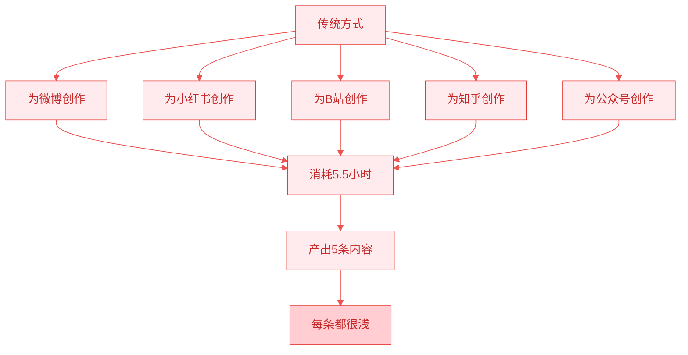
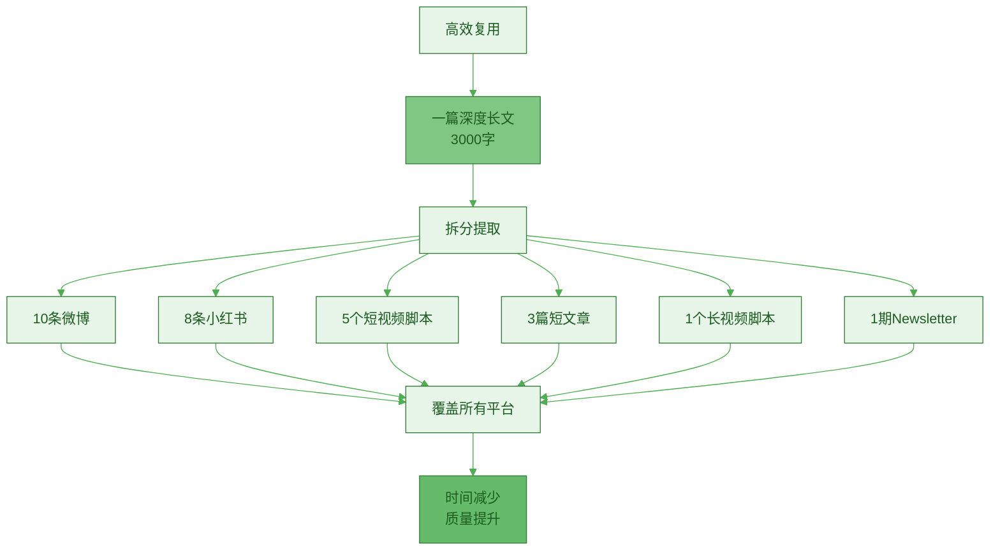
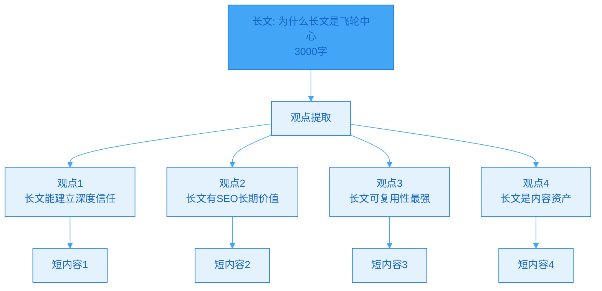
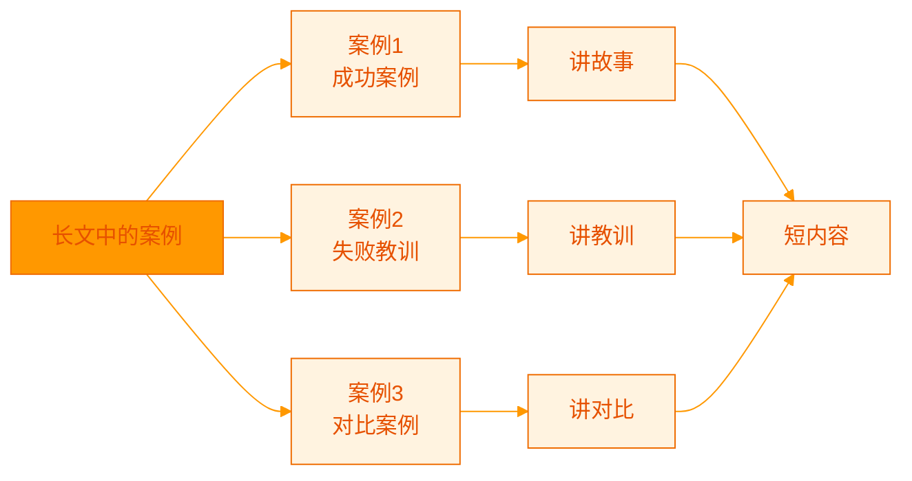
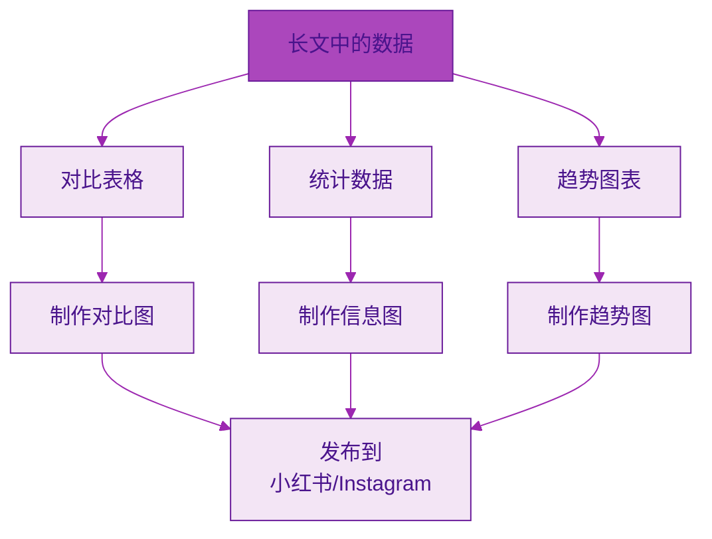
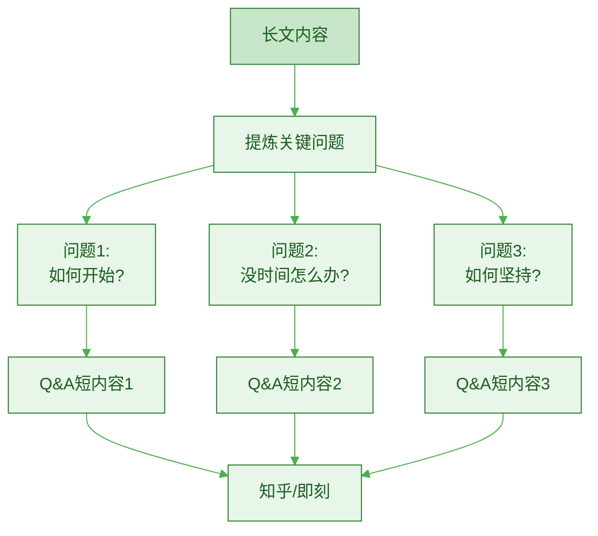
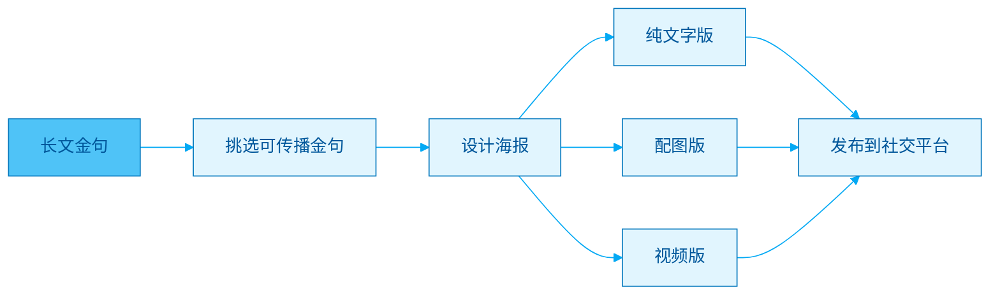
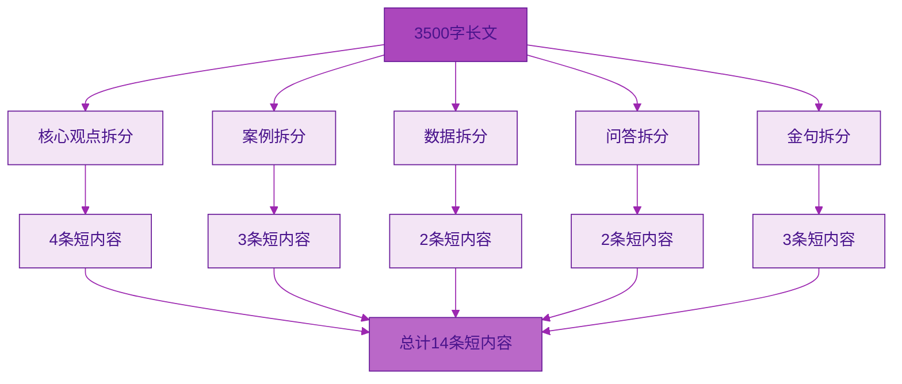
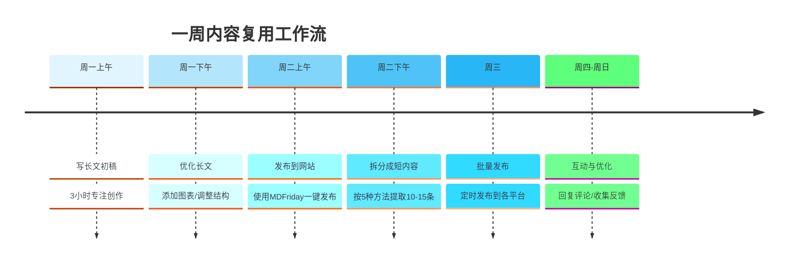

> [!quote] 内容复用的黄金法则
> "一次深度创作,十次高效分发。
> 
> 长文是母体,短内容是子弹。
> 
> 不要为每个平台重新创作,而是从核心资产中提取价值。"
> ——来自 [[3. MDFriday 实战记录/03.网站/Dan Koe/视频笔记/8|内容生态系统]]

## 为什么需要内容复用?

### 创作者的时间困境

> [!danger] 多平台运营的噩梦
> 
> **传统做法**:
> - 微博发一条(30分钟)
> - 小红书发一条(40分钟)
> - B站发一个视频(2小时)
> - 知乎写一篇(1小时)
> - 公众号写一篇(1.5小时)
> 
> **总计**: 每天 5.5 小时,只为产出 5 条内容
> 
> **结果**: 累死累活,内容还很浅



### 内容复用的价值

参考 [[3. MDFriday 实战记录/03.网站/Dan Koe/视频笔记/12|写作的底层逻辑]]:

> [!success] 高效内容复用模型
> 
> **新做法**:
> 1. 花 3 小时写一篇 3000 字深度长文
> 2. 花 1.5 小时拆分成 10+ 条短内容
> 3. 花 0.5 小时分发到各平台
> 
> **总计**: 5 小时产出 10+ 条内容
> 
> **结果**: 时间减少,质量提升,覆盖面更广



**效率对比**:

| 维度 | 传统方式 | 复用模式 |
|-----|---------|---------|
| **时间投入** | 5.5小时/天 | 5小时/周 |
| **内容数量** | 5条/天 | 30+条/周 |
| **内容深度** | 浅 | 深 |
| **可持续性** | 很累 | 轻松 |
| **资产积累** | 无 | 有(长文) |

## 从长文到短内容的五种拆分方法

### 方法1: 观点提取法

> [!tip] 最简单直接的方法
> **从长文中提取核心观点,每个观点独立成文。**



> [!example] 实战示例
> 
> **长文标题**: "为什么长文是内容飞轮的中心"
> 
> **拆分成 5 条短内容**:
> 
> **短内容1 (Twitter/微博)**:
> ```
> 为什么要写长文?
> 
> 短内容:快速传播,快速遗忘
> 长文:慢启动,持续增长
> 
> 短内容是消耗品
> 长文是资产
> 
> 短内容换流量
> 长文换信任
> 
> 你选哪个?
> 
> 完整分析👉 [你的网站链接]
> ```
> 
> **短内容2 (小红书)**:
> ```
> 【长文的SEO优势】
> 
> ❌ 短内容:
> - 500字以下
> - 搜索引擎不友好
> - 7天后归零
> 
> ✅ 长文:
> - 2000+字
> - SEO得分高
> - 3年持续带来流量
> 
> 数据证明:
> 排名前10的文章平均2000+字
> 长文流量是短文的3.7倍
> 
> 想了解完整方法?
> 看我的详细文章👉 [链接]
> ```

**观点提取的原则**:

| 原则 | 说明 | 示例 |
|-----|------|------|
| **独立性** | 每个观点能单独理解 | "长文有SEO价值"可独立存在 |
| **完整性** | 有论点+论据 | 不只说结论,要有支撑 |
| **价值性** | 能解决一个小问题 | 让读者有收获 |
| **引导性** | 引导读者看完整版 | 末尾加链接 |

### 方法2: 案例拆分法

> [!tip] 用故事吸引注意力
> **将长文中的案例独立成文,用故事化方式呈现。**



> [!example] 实战示例
> 
> **长文**: "平台流量的本质"(包含3个案例)
> 
> **拆分成 3 条短内容**:
> 
> **短内容1 (小红书/即刻)**:
> ```
> 【真实案例】10万粉丝一夜归零的教训
> 
> 朋友小李,做公众号3年
> ▪️ 积累10万粉丝
> ▪️ 每月稳定收入3万+
> ▪️ 突然被封号
> ▪️ 申诉无果
> ▪️ 3年心血归零
> 
> 痛的领悟:
> 平台的粉丝,不是你的资产
> 你只是平台的内容供应商
> 
> 如何避免?
> 必须建立自己的数字资产
> 👉 详细方法看我的文章[链接]
> 
> #内容创作 #个人品牌
> ```

### 方法3: 数据可视化法

> [!tip] 用数据说话
> **将长文中的数据、对比表格,转化为视觉化内容。**



> [!example] 实战示例
> 
> **长文中的表格**:
> 
> | 维度 | 短内容 | 长文 |
> |-----|--------|------|
> | 价值周期 | 7天 | 3+年 |
> | 转化率 | 0.5% | 5% |
> | 客单价 | $9-49 | $99-999 |
> 
> **转化为短内容 (小红书图文)**:
> ```
> 【数据对比】短内容 vs 长文,差距惊人!
> 
> [制作精美对比图]
> 
> 📊 数据来源:1000个创作者调研
> 
> 🔍 结论:
> 想要长期稳定收入?
> 必须建立长文资产!
> 
> 💡 完整分析 👉 [链接]
> ```

### 方法4: 问答提炼法

> [!tip] FAQ变短内容
> **将长文中回答的问题,单独成文。**



> [!example] 实战示例
> 
> **长文**: "长文创作的底层框架"
> 
> **拆分成 Q&A 系列**:
> 
> **短内容1 (知乎/即刻)**:
> ```
> Q: 写长文真的有用吗?现在不是短视频时代了吗?
> 
> A: 这是个常见误解。
> 
> 真相是:
> ▪️ 浅层信息:短视频够用
> ▪️ 深度学习:必须长文
> ▪️ 付费人群:更爱长文
> 
> 数据证明:
> - Medium上7分钟阅读文章分享量最高
> - 知乎2000+字回答获赞是短回答的5倍
> - 个人博客长文平均停留时间>8分钟
> 
> 短内容和长文不是竞争,而是协同:
> 短内容引发兴趣→长文建立信任→产生转化
> 
> 详细分析👉 [链接]
> ```

### 方法5: 金句海报法

> [!tip] 可传播的金句
> **提取长文中的金句,制作成视觉海报。**



> [!example] 实战示例
> 
> **从长文中提取金句**:
> 
> **金句1**:
> ```
> 短内容是消耗品,长文是资产。
> 短内容换流量,长文换信任。
> 短内容做引流,长文做沉淀。
> ```
> 
> **制作海报** (小红书/Instagram):
> - 背景:简洁渐变色
> - 文字:大字金句 + 小字来源
> - 底部:你的品牌 logo + 网站链接
> 
> **配文**:
> ```
> 这句话改变了我的创作思路💡
> 
> 以前每天发10条内容,累死累活
> 现在每周写1篇长文,轻松高效
> 
> 更多方法论👉 [链接]
> 
> #内容创作 #一人公司
> ```

## 一篇 3000 字长文的完整拆分示例

### 长文概况

> [!example] 示例长文
> 
> **标题**: "长文为何是飞轮中心"
> **字数**: 3500 字
> **结构**:
> - 开头 (SCQA): 500字
> - 论点1: 完整表达思想 (800字)
> - 论点2: SEO友好 (800字)
> - 论点3: 可复用性强 (800字)
> - 结尾 + 行动指南: 600字

### 拆分策略



### 具体拆分方案

| 序号 | 类型 | 平台 | 内容要点 | 字数 |
|-----|------|------|---------|------|
| **1** | 观点 | Twitter | 为什么长文重要?(总览) | 280 |
| **2** | 观点 | 小红书 | 长文建立深度信任 | 500 |
| **3** | 观点 | 即刻 | 长文的SEO优势 | 400 |
| **4** | 观点 | 知乎 | 长文的可复用性 | 800 |
| **5** | 案例 | 小红书 | 短内容vs长文效果对比 | 600 |
| **6** | 案例 | B站动态 | 我的长文实战经验 | 300 |
| **7** | 数据 | 小红书 | 长文vs短内容数据对比图 | 图+200字 |
| **8** | 数据 | LinkedIn | SEO排名研究数据 | 500 |
| **9** | 问答 | 知乎 | Q:没时间写长文怎么办? | 600 |
| **10** | 问答 | 即刻 | Q:长文没人看怎么办? | 400 |
| **11** | 金句 | 小红书 | 海报:短内容是消耗品 | 图+50字 |
| **12** | 金句 | Instagram | 卡片:长文是资产 | 图+50字 |
| **13** | 视频 | 抖音/B站 | 3分钟讲透长文价值 | 脚本 |
| **14** | Newsletter | 邮件 | 完整长文链接+导读 | 300 |

### 平台分发策略

> [!tip] 不同平台的内容适配
> 
> **Twitter/微博** (简短有力):
> - 核心观点
> - 1-3句金句
> - 结尾引导点击
> 
> **小红书** (视觉+实用):
> - 精美配图
> - 分点说明
> - 实用技巧
> 
> **知乎** (深度+专业):
> - 较长内容(600-1000字)
> - 数据支撑
> - 逻辑严密
> 
> **B站/抖音** (视频化):
> - 口语化脚本
> - 视觉呈现
> - 节奏明快
> 
> **Newsletter** (完整价值):
> - 原文链接
> - 精彩导读
> - 独家补充

## 内容复用的工作流

### 完整流程



### 工具配合

> [!tip] 推荐工具组合
> 
> **创作工具**:
> - [[2. 一人公司实操手册/02.MDFriday 使用指南/|MDFriday]]: 写作+发布
> - Obsidian: 笔记管理
> 
> **拆分工具**:
> - AI助手: 帮助提取要点
> - Notion/飞书: 内容管理
> 
> **设计工具**:
> - Canva: 制作海报
> - Figma: 视觉设计
> 
> **分发工具**:
> - 各平台官方工具
> - 定时发布工具

### 时间分配建议

| 环节 | 时间 | 占比 | 说明 |
|-----|------|------|------|
| **写长文** | 3小时 | 60% | 核心创作时间 |
| **拆分** | 1小时 | 20% | 提取+改写 |
| **发布** | 0.5小时 | 10% | 批量发布 |
| **互动** | 0.5小时 | 10% | 回复评论 |
| **总计** | 5小时/周 | 100% | 高效可持续 |

## 常见问题

### Q1: 拆分后的内容会不会重复?

> [!success] 正确理解
> 
> **误区**: 同一内容不能多次发
> 
> **真相**:
> 1. **不同平台的用户不重叠**
>    - 你的微博粉丝不一定看小红书
>    - 跨平台复用完全没问题
> 
> 2. **呈现形式不同不算重复**
>    - 同一观点用不同角度表达
>    - 加上平台特色
> 
> 3. **时间间隔拉开**
>    - 不要同一天发布到所有平台
>    - 分散在一周内
> 
> **策略**:
> - 同平台: 间隔2-4周重发
> - 跨平台: 可以同时发布

### Q2: 拆分会不会影响长文流量?

> [!success] 实际效果
> 
> **担心**: 大家看了短内容就不看长文了
> 
> **真相**: 正好相反!
> 
> **数据证明**:
> - 发布短内容后,长文流量增加30-50%
> - 短内容起到"预告片"作用
> - 激发读者深度阅读的兴趣
> 
> **关键**:
> - 短内容只给结论,不讲过程
> - 引发好奇,引导点击
> - 在长文中提供完整价值

### Q3: 如何保证拆分后的质量?

> [!check] 质量检查清单
> 
> **每条短内容必须**:
> - [ ] 独立完整(不看长文也能理解)
> - [ ] 有明确价值(解决一个小问题)
> - [ ] 适配平台(符合平台调性)
> - [ ] 有行动指引(引导读者下一步)
> - [ ] 链接到长文(导流)
> 
> **避免**:
> - ❌ 只摘抄一段文字
> - ❌ 没有改写和适配
> - ❌ 缺乏视觉呈现
> - ❌ 没有互动引导

## 行动指南

### 本周实战任务

> [!check] Week 1 实践
> 
> **Day 1-2**: 写一篇长文
> - [ ] 选择主题
> - [ ] 完成3000字长文
> - [ ] 发布到网站
> 
> **Day 3**: 拆分内容
> - [ ] 用5种方法拆分
> - [ ] 产出10-15条短内容
> - [ ] 整理到文档
> 
> **Day 4-7**: 分发与互动
> - [ ] 每天发布2-3条
> - [ ] 定时发布
> - [ ] 回复评论
> - [ ] 收集反馈

### 长期策略

> [!important] 12周计划
> 
> **Month 1**: 建立流程
> - 4篇长文
> - 每篇拆分10条
> - 总计40条短内容
> 
> **Month 2**: 优化效率
> - 缩短拆分时间
> - 提高发布效率
> - 测试不同形式
> 
> **Month 3**: 数据驱动
> - 分析哪种形式效果好
> - 优化拆分策略
> - 形成标准化流程

## 总结

> [!quote] 核心要点
> "内容复用不是偷懒,而是杠杆思维。
> 
> 一次深度思考,十次高效传播。
> 
> 长文是资产,短内容是分销渠道。
> 
> 建立系统,让内容价值最大化。"

### 五种拆分方法

| 方法 | 适用场景 | 产出 | 难度 |
|-----|---------|------|------|
| **观点提取** | 任何长文 | 4-6条 | ⭐ 简单 |
| **案例拆分** | 有案例的长文 | 2-4条 | ⭐⭐ 中等 |
| **数据可视化** | 有数据的长文 | 2-3条 | ⭐⭐⭐ 较难 |
| **问答提炼** | 解决问题的长文 | 3-5条 | ⭐⭐ 中等 |
| **金句海报** | 有金句的长文 | 2-4条 | ⭐⭐ 中等 |

### 关键原则

> [!important] 记住这三点
> 
> 1. **长文是母体,短内容是子弹**
>    - 先有深度,再谈分发
>    - 不要本末倒置
> 
> 2. **复用不是复制**
>    - 需要改写和适配
>    - 匹配平台调性
> 
> 3. **建立系统化流程**
>    - 不要每次重新思考
>    - 固化流程提高效率

### 下一步阅读

- [[b.平台表达差异|平台表达差异]]
- [[c.反馈采集机制|反馈采集机制]]
- [[../08.数据反馈与长文升级/a.高反馈信号识别|高反馈信号识别]]

---

**一次创作,十次分发。让内容价值最大化!**

