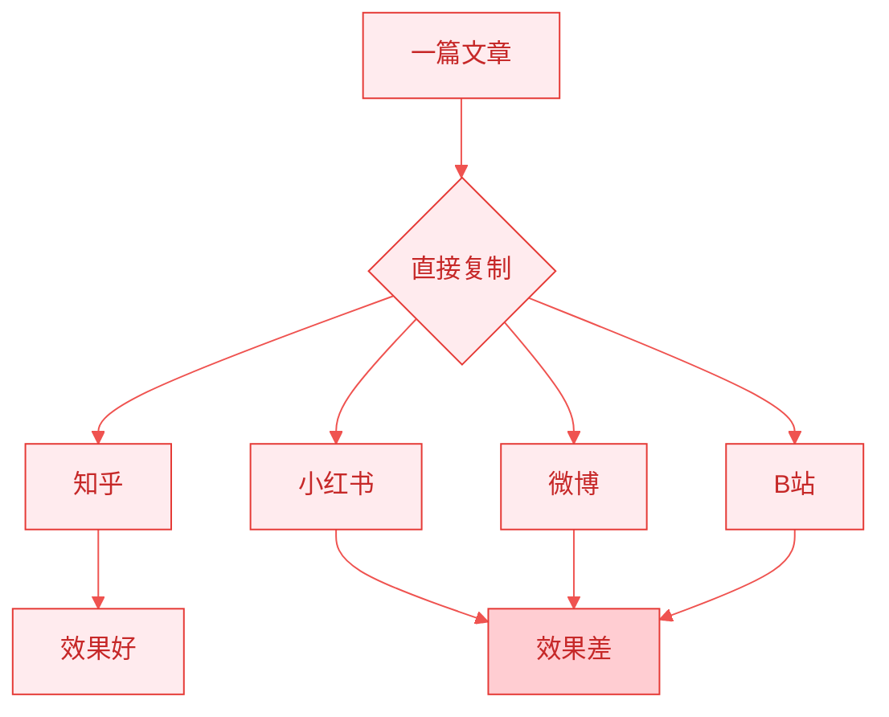
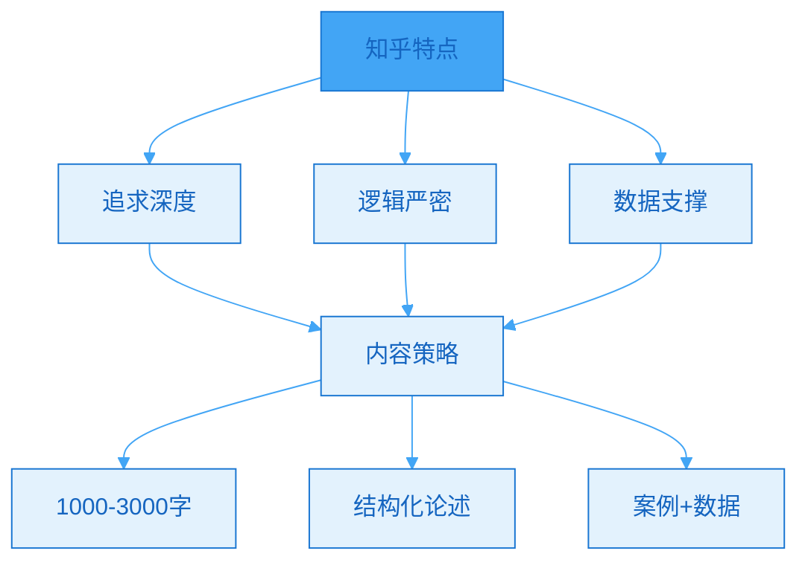
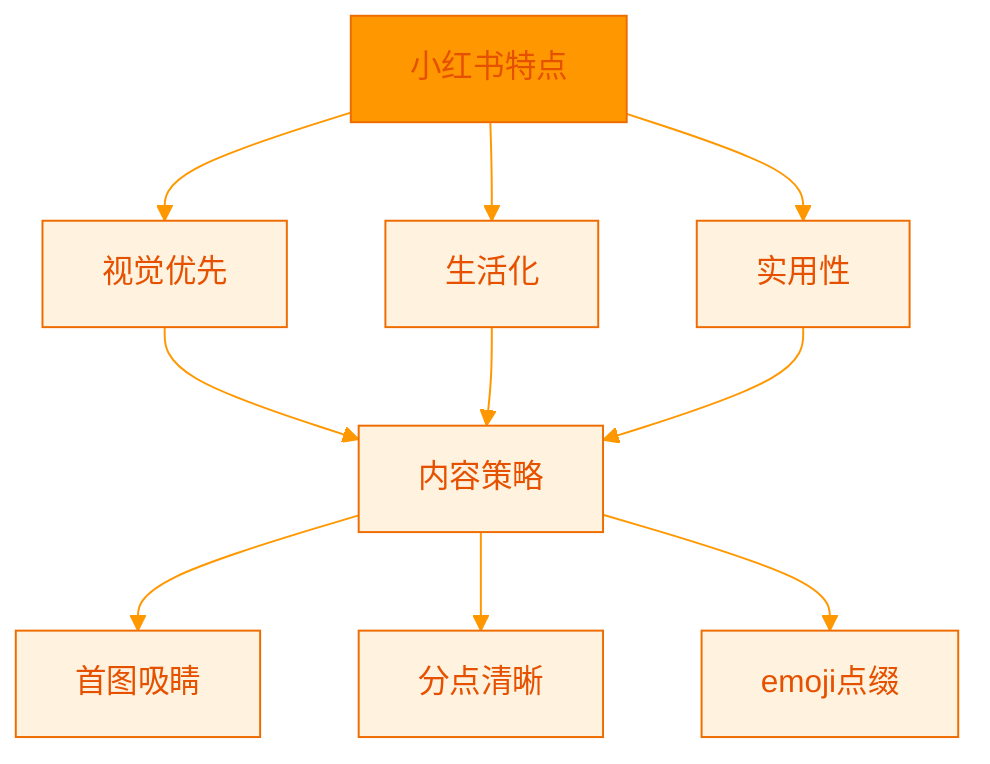
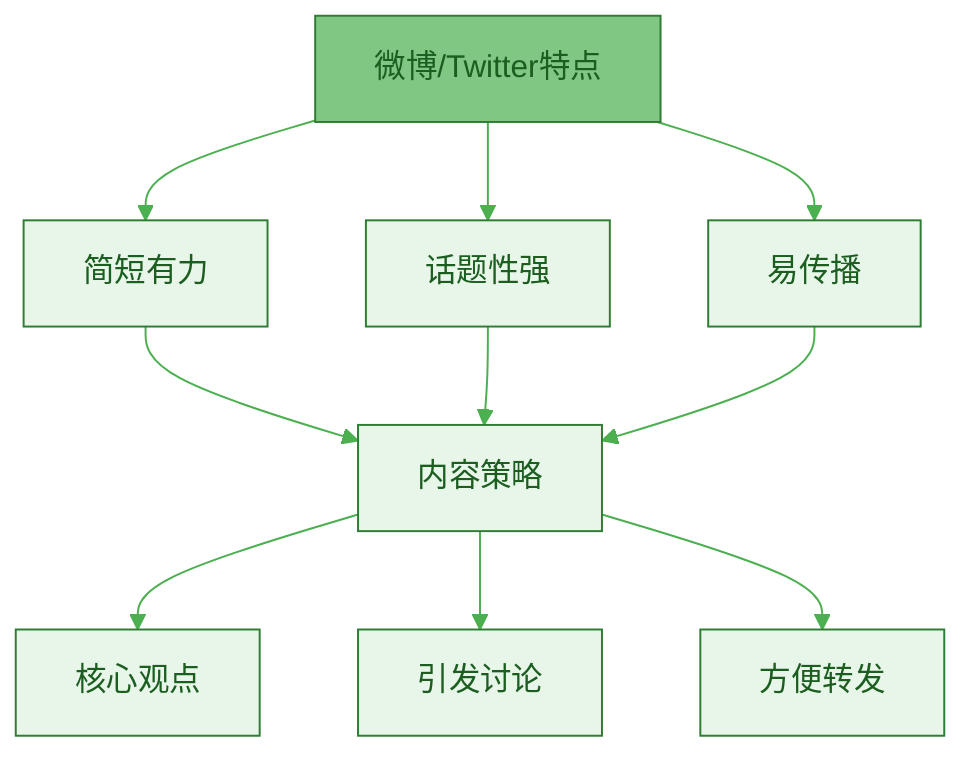
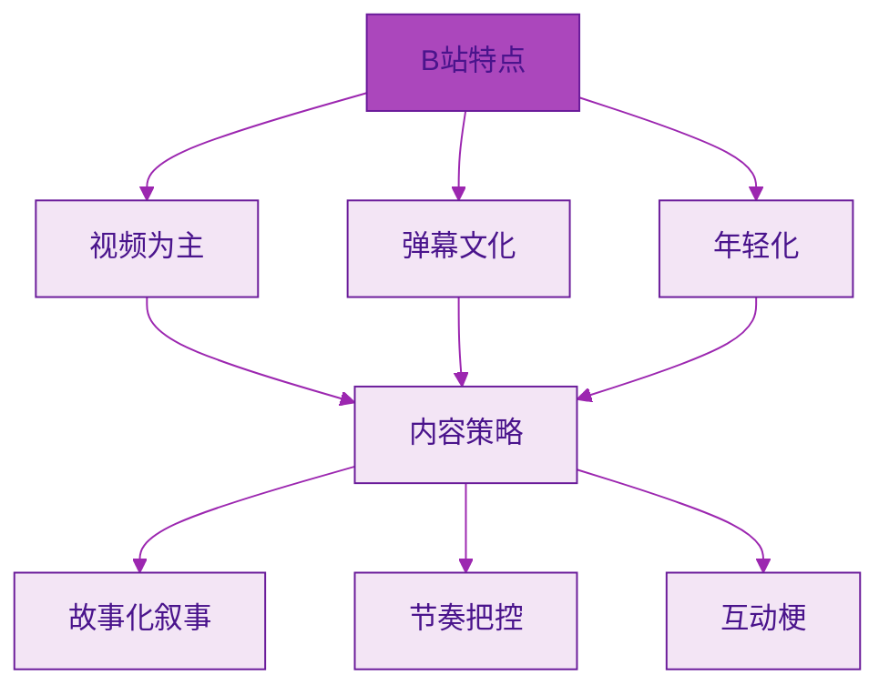
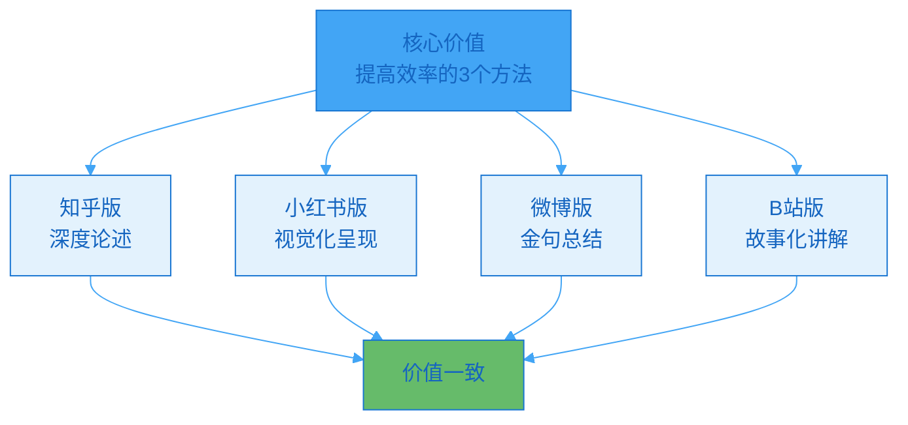
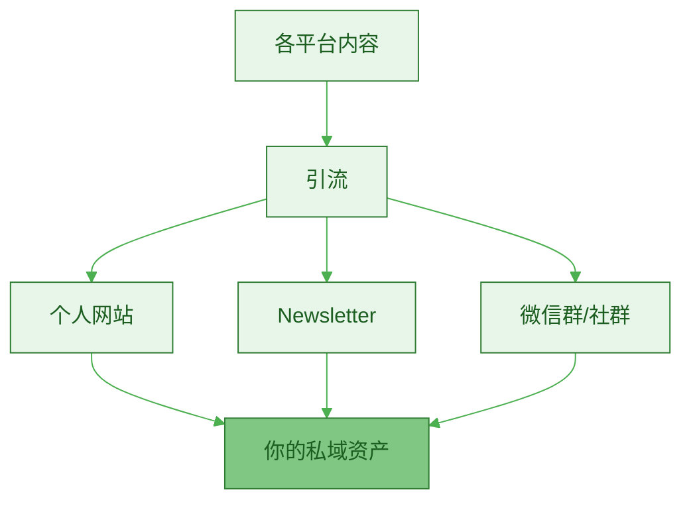
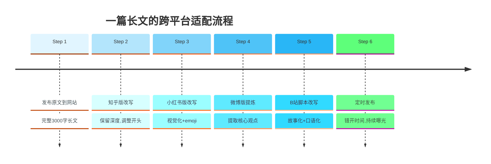

> [!quote] 平台理解的本质
> "不要用同一种方式在所有平台说话。
> 
> 每个平台都有自己的语言、节奏和文化。
> 
> 适配平台,不是迎合算法,而是尊重用户习惯。"
> ——来自 [[3. MDFriday 实战记录/03.网站/Dan Koe/视频笔记/29|智能创作者如何从零增长受众]]

## 为什么同样的内容,不同平台效果天差地别?

### 真实案例

> [!example] 同一内容,截然不同的结果
> 
> **创作者小王的困惑**:
> 
> 写了一篇文章"如何提高工作效率"
> - 知乎发布: 500赞,200收藏 ✅
> - 小红书发布: 10赞,5收藏 ❌
> - 微博发布: 2赞,0转发 ❌
> 
> **问题出在哪?**
> 
> 同样的内容,只是简单复制粘贴到不同平台。
> 没有理解每个平台的特点和用户期待。



### 平台差异的本质

> [!important] 三个维度的差异
> 
> 1. **用户心态不同**
>    - 知乎: 寻找答案
>    - 小红书: 寻找灵感
>    - 微博: 寻找谈资
> 
> 2. **内容形式不同**
>    - 知乎: 长文为主
>    - 小红书: 图文并重
>    - 抖音: 视频为王
> 
> 3. **互动方式不同**
>    - B站: 弹幕文化
>    - 小红书: 笔记收藏
>    - Twitter: 转发引用

## 主要平台的特点与策略

### 知乎: 专业深度型



**平台特征**:

| 特征 | 说明 | 应对策略 |
|-----|------|---------|
| **用户心态** | 寻找专业答案 | 提供深度价值 |
| **内容偏好** | 长文,干货 | 1000-3000字为佳 |
| **展现机制** | 权重算法 | 前100字很重要 |
| **互动特点** | 点赞+感谢 | 鼓励读者赞同 |

> [!tip] 知乎内容公式
> 
> **开头**: 直接回答问题(前100字)
> - ❌ "这是个好问题,让我慢慢说..."
> - ✅ "答案是X,原因有三点..."
> 
> **正文**: 结构化论述
> - 论点1 + 论据 + 案例
> - 论点2 + 论据 + 案例
> - 论点3 + 论据 + 案例
> 
> **结尾**: 总结+延伸
> - 精炼总结
> - 相关阅读推荐

> [!example] 知乎改写示例
> 
> **原文**(博客风格):
> ```
> 今天想和大家聊聊效率这个话题。
> 其实提高效率并不难,关键是找到方法...
> ```
> 
> **知乎改写**:
> ```
> 提高工作效率最有效的3个方法:
> 
> 1. 时间块管理法(Time Blocking)
> 2. 二八法则优先级排序
> 3. 番茄工作法
> 
> 以下详细说明(全文3000字,阅读需7分钟):
> 
> ## 一、时间块管理法
> 
> 这个方法来自Cal Newport的《深度工作》...
> [数据支撑][案例说明][实操步骤]
> 
> ## 二、二八法则...
> ```

### 小红书: 视觉灵感型



**平台特征**:

| 特征 | 说明 | 应对策略 |
|-----|------|---------|
| **用户心态** | 寻找灵感和种草 | 视觉化+实用性 |
| **内容偏好** | 图文并重,颜值高 | 精美封面+清晰排版 |
| **字数限制** | 正文1000字 | 精简浓缩 |
| **展现机制** | 首图决定80% | 前3秒抓住眼球 |

> [!tip] 小红书内容公式
> 
> **封面图**:
> - 🎨 视觉冲击力强
> - 📝 大字标题(痛点或利益)
> - ✨ 统一视觉风格
> 
> **标题**:
> - 带数字: "5个方法"
> - 带情绪: "太绝了!"
> - 带价值: "收藏级"
> 
> **正文结构**:
> ```
> 【前言】(50字)
> 引发共鸣/痛点
> 
> 【正文】(600-800字)
> ▪️ 要点1
>   详细说明
> 
> ▪️ 要点2
>   详细说明
> 
> ▪️ 要点3
>   详细说明
> 
> 【结尾】(100字)
> 总结+互动引导
> 
> 💡Tips: 额外小建议
> ```

> [!example] 小红书改写示例
> 
> **原文**(博客风格):
> ```
> ## 如何提高工作效率
> 
> 工作效率的提升需要系统性方法...
> ```
> 
> **小红书改写**:
> ```
> [封面图: 简洁排版+大字"工作效率提升5倍的秘密"]
> 
> 标题: 我用这3个方法,工作效率提升了5倍!太绝了!✨
> 
> 姐妹们!以前我也是加班狗🐶
> 每天忙到晚上10点,效率还是低...
> 
> 直到我发现了这3个方法👇
> 
> ▪️ 方法1️⃣: 时间块管理
> 把一天分成3个深度工作块
> 每块专注2小时,效率翻倍!
> [配图: 时间块示意图]
> 
> ▪️ 方法2️⃣: 优先级四象限
> 紧急重要的事先做
> 不重要的直接删除
> [配图: 四象限图]
> 
> ▪️ 方法3️⃣: 番茄工作法
> 25分钟专注+5分钟休息
> 保持大脑清醒
> [配图: 番茄钟]
> 
> 💡小tips:
> 早上是黄金时间,千万别刷手机!
> 
> 你们用什么方法提高效率?
> 评论区告诉我~💬
> 
> #效率提升 #时间管理 #职场干货
> ```

### 微博/Twitter: 观点引爆型



**平台特征**:

| 特征 | 说明 | 应对策略 |
|-----|------|---------|
| **用户心态** | 寻找谈资和热点 | 观点鲜明 |
| **字数限制** | 140-280字 | 精炼表达 |
| **传播机制** | 转发为主 | 易于传播的观点 |
| **内容偏好** | 金句、对比、争议 | 制造话题 |

> [!tip] 微博/Twitter 内容公式
> 
> **公式1: 对比型**
> ```
> 以前我以为X
> 后来才发现Y
> 
> [对比说明]
> 
> 结论: [金句]
> ```
> 
> **公式2: 数据型**
> ```
> 数据: [惊人的数据]
> 
> 为什么? [简短解释]
> 
> 怎么做? [行动建议]
> ```
> 
> **公式3: 金句型**
> ```
> [核心金句]
> 
> - 论据1
> - 论据2  
> - 论据3
> 
> 你怎么看?
> ```

> [!example] Twitter/微博改写示例
> 
> **原文** (博客风格):
> ```
> 工作效率的提升需要方法论...
> ```
> 
> **微博改写**:
> ```
> 工作效率低的人 vs 工作效率高的人
> 
> ❌ 效率低:
> - 随时处理信息
> - 同时做多件事
> - 没有计划
> 
> ✅ 效率高:
> - 批量处理信息
> - 专注单一任务
> - 提前规划
> 
> 区别不是能力,是方法。
> 
> 完整方法论👉 [链接]
> ```

### B站: 故事娱乐型



**平台特征**:

| 特征 | 说明 | 应对策略 |
|-----|------|---------|
| **用户心态** | 娱乐+学习 | 寓教于乐 |
| **内容形式** | 视频为主 | 口语化脚本 |
| **时长偏好** | 8-15分钟为佳 | 节奏紧凑 |
| **互动特点** | 弹幕文化 | 设置互动点 |

> [!tip] B站视频脚本公式
> 
> **开场**(前30秒):
> ```
> 【钩子】惊人事实/夸张对比
> "你知道吗?XX方法可以让效率提升5倍!"
> 
> 【自我介绍】简短
> "我是XX,今天教你..."
> 
> 【价值预告】
> "这个视频你将学会3个方法..."
> ```
> 
> **正文** (结构化+故事化):
> ```
> 【故事引入】
> "之前我也是加班狗,直到..."
> 
> 【方法1】
> - 是什么
> - 为什么有效  
> - 怎么做
> - 案例演示
> 
> 【方法2】
> [重复结构]
> 
> 【方法3】
> [重复结构]
> ```
> 
> **结尾**:
> ```
> 【总结】3句话回顾
> 【行动】"现在就去试试吧!"
> 【互动】"一键三连支持UP主!"
> ```

> [!example] B站脚本改写示例
> 
> **原文**(博客风格):
> ```
> 提高工作效率的方法有很多...
> ```
> 
> **B站脚本**:
> ```
> [开场]
> (画面: UP主坐在办公桌前)
> 
> "你每天加班到晚上10点,
> 但工作还是做不完?
> 
> 别慌!今天教你3个方法,
> 让你效率提升5倍,
> 准时下班不是梦!
> 
> 我是[UP主名],
> 这个视频分享我从加班狗到准时下班的秘密。
> 
> [画面切换: 标题卡片]
> 
> [正文]
> 先说说我之前有多惨...
> (讲述个人故事,建立共鸣)
> 
> 直到我学会了第一个方法:
> 时间块管理!
> 
> (画面: 动画演示时间块)
> 
> 简单来说就是...
> (口语化解释)
> 
> 我自己的实践是这样的...
> (展示自己的时间表)
> 
> [结尾]
> 好了,今天的3个方法讲完了,
> 回顾一下:
> 1. XX
> 2. XX  
> 3. XX
> 
> 现在就去试试吧!
> 记得一键三连支持UP主哦~
> 
> 详细文字版在我的公众号/网站,
> 简介有链接!
> 
> 下期见,拜拜~
> ```

## 跨平台适配的三大原则

### 原则1: 保持核心价值不变

> [!important] 核心不变,形式可变
> 
> **什么不变**:
> - 核心观点
> - 底层逻辑
> - 价值主张
> 
> **什么可变**:
> - 表达方式
> - 内容长度
> - 呈现形式



### 原则2: 尊重平台文化和用户习惯

> [!tip] 入乡随俗
> 
> **不要**:
> - 把知乎长文直接复制到小红书
> - 把小红书emoji风复制到知乎
> - 把微博短文直接发B站视频
> 
> **而要**:
> - 研究平台TOP内容
> - 学习平台语言风格
> - 适应平台用户偏好

| 平台 | 语言风格 | emoji使用 | 语气 |
|-----|---------|----------|------|
| **知乎** | 书面语为主 | 少用 | 严谨专业 |
| **小红书** | 口语化 | 大量使用 | 亲切活泼 |
| **微博** | 简洁有力 | 适度使用 | 观点鲜明 |
| **B站** | 口语化+梗 | 弹幕文化 | 轻松幽默 |

### 原则3: 引导用户到自己的阵地

> [!important] 最终目标
> **所有平台的内容,都应该引导用户到你的私域。**



> [!tip] 引流策略
> 
> **软性引流** (推荐):
> - "完整版在我的网站/公众号"
> - "更多内容关注我"
> - "加入我的学习社群"
> 
> **硬性引流** (谨慎使用):
> - 直接放链接(可能被限流)
> - 过度营销(用户反感)

## 平台适配实战工作流

### 完整流程



### 改写时间分配

| 平台 | 改写难度 | 所需时间 | 产出 |
|-----|---------|---------|------|
| **知乎** | ⭐⭐ 较低 | 20分钟 | 1篇 |
| **小红书** | ⭐⭐⭐ 中等 | 30分钟 | 1篇+配图 |
| **微博** | ⭐ 简单 | 10分钟 | 2-3条 |
| **B站** | ⭐⭐⭐⭐ 较高 | 60分钟 | 1个脚本 |
| **总计** | | 2小时 | 覆盖5个平台 |

## 常见问题

### Q1: 所有平台都要做吗?

> [!tip] 聚焦策略
> 
> **不要贪多,选择 2-3 个主平台即可。**
> 
> **选择标准**:
> 1. 你的目标用户在哪里?
> 2. 哪个平台你更擅长?
> 3. 哪个平台性价比更高?
> 
> **推荐组合**:
> - 组合1: 个人网站 + 知乎 + 小红书
> - 组合2: 个人网站 + B站 + 微博
> - 组合3: 个人网站 + Newsletter + 知乎

### Q2: 改写后会不会被判定为抄袭?

> [!success] 正确理解
> 
> **不会,前提是**:
> 1. 内容是你原创的
> 2. 只是改变表达形式
> 3. 适配不同平台
> 
> **这不是抄袭,而是**:
> - 内容的合理复用
> - 价值的多次传播
> - 效率的提升

### Q3: 如何快速学会平台风格?

> [!check] 学习方法
> 
> **3步快速上手**:
> 
> **Step 1**: 研究TOP内容 (2小时)
> - 找该平台10篇爆款内容
> - 分析标题、结构、语言风格
> - 总结共性特征
> 
> **Step 2**: 模仿练习 (1周)
> - 选1-2篇优质内容
> - 尝试用同样风格改写
> - 对比差异,持续优化
> 
> **Step 3**: 形成自己的风格 (1个月)
> - 在平台风格基础上
> - 加入个人特色
> - 形成独特表达

## 行动指南

### 本周实战任务

> [!check] Week 1 实践
> 
> **Day 1**: 平台研究
> - [ ] 选择2-3个主打平台
> - [ ] 研究每个平台TOP10内容
> - [ ] 总结平台风格特点
> 
> **Day 2-3**: 改写练习
> - [ ] 选一篇长文
> - [ ] 改写成知乎版
> - [ ] 改写成小红书版
> - [ ] 改写成微博版
> 
> **Day 4-7**: 发布与优化
> - [ ] 定时发布到各平台
> - [ ] 观察数据反馈
> - [ ] 根据反馈优化
> - [ ] 总结改进点

### 平台风格模板库

> [!tip] 建立自己的模板
> 
> **为每个平台建立标准模板**:
> 
> **知乎模板**:
> ```markdown
> ## [直接回答问题]
> 
> 核心观点阐述(100-200字)
> 
> ## 详细说明
> 
> ### 论点1
> [论证+案例+数据]
> 
> ### 论点2
> [论证+案例+数据]
> 
> ### 论点3
> [论证+案例+数据]
> 
> ## 总结
> 
> 精炼总结 + 延伸阅读
> ```
> 
> **小红书模板**:
> ```markdown
> [封面图设计说明]
> 
> 标题: [数字+情绪+价值]
> 
> 【前言】(50字)
> [引发共鸣]
> 
> ▪️ 要点1
> [说明] [配图]
> 
> ▪️ 要点2
> [说明] [配图]
> 
> ▪️ 要点3
> [说明] [配图]
> 
> 💡Tips: [额外建议]
> 
> [互动引导]
> 
> #标签1 #标签2 #标签3
> ```

## 总结

> [!quote] 核心要点
> "理解平台差异,不是为了迎合算法,而是为了更好地服务用户。
> 
> 每个平台都有自己的语言和文化,尊重这些差异,才能真正发挥内容价值。
> 
> 核心价值不变,表达形式万变。"

### 主要平台对比

| 平台 | 核心特点 | 最佳字数 | 适配难度 | 用户心态 |
|-----|---------|---------|---------|---------|
| **知乎** | 专业深度 | 1000-3000 | ⭐⭐ | 寻求答案 |
| **小红书** | 视觉生活 | 600-1000 | ⭐⭐⭐ | 寻找灵感 |
| **微博** | 观点简短 | 140-280 | ⭐ | 寻找谈资 |
| **B站** | 视频故事 | 8-15分钟 | ⭐⭐⭐⭐ | 娱乐学习 |

### 关键原则

> [!important] 记住这三点
> 
> 1. **核心价值不变,形式万变**
>    - 适配不是妥协
>    - 而是更好的传达
> 
> 2. **尊重平台文化**
>    - 研究平台特点
>    - 学习平台语言
>    - 适应用户习惯
> 
> 3. **建立标准化流程**
>    - 制作平台模板
>    - 固化改写流程
>    - 提高适配效率

### 下一步阅读

- [[c.反馈采集机制|反馈采集机制]]
- [[../08.数据反馈与长文升级/a.高反馈信号识别|高反馈信号识别]]
- [[../08.数据反馈与长文升级/b.内容迭代方法|内容迭代方法]]

---

**理解平台差异,让内容价值最大化!**
