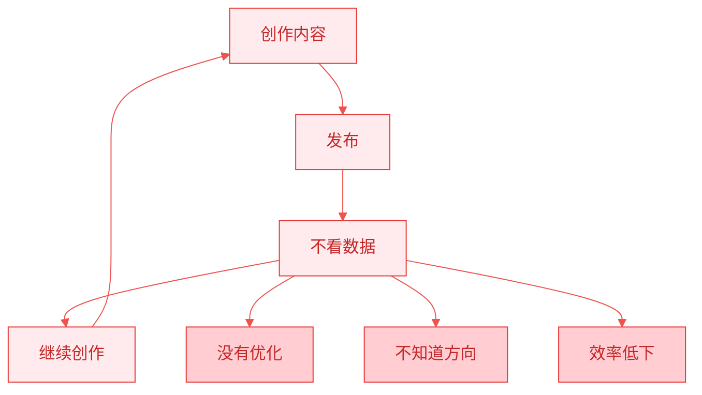
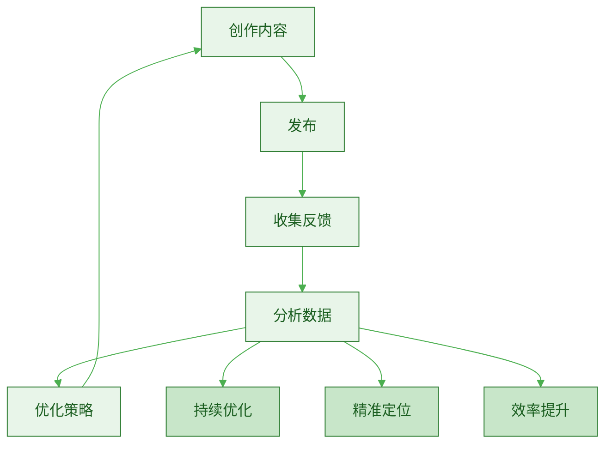
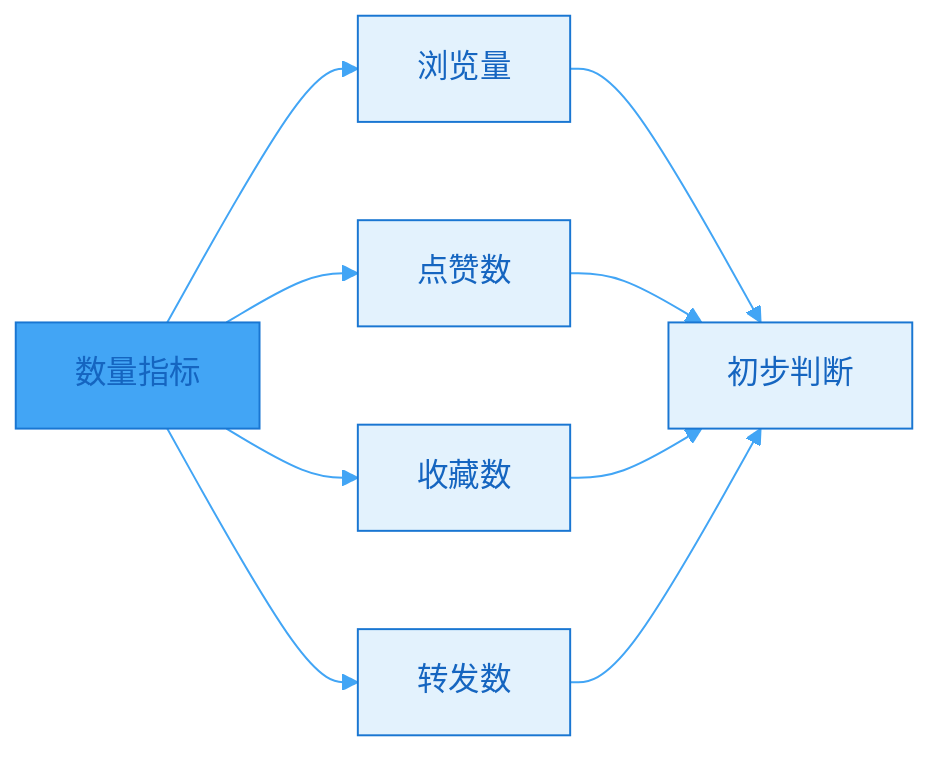
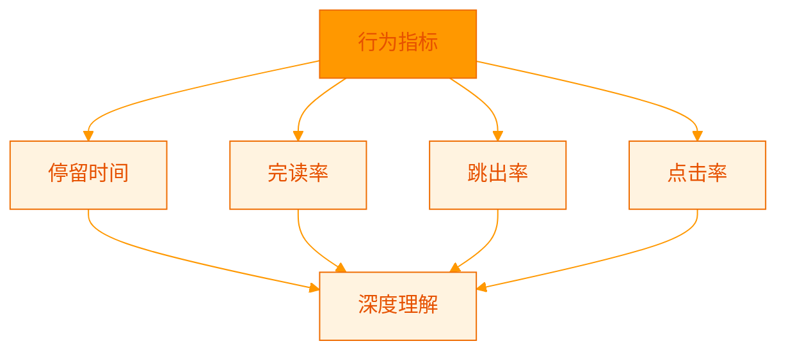
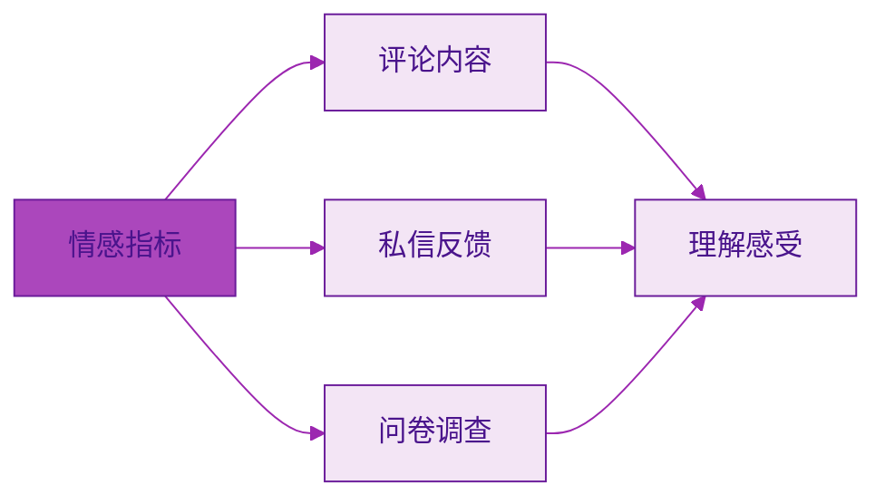
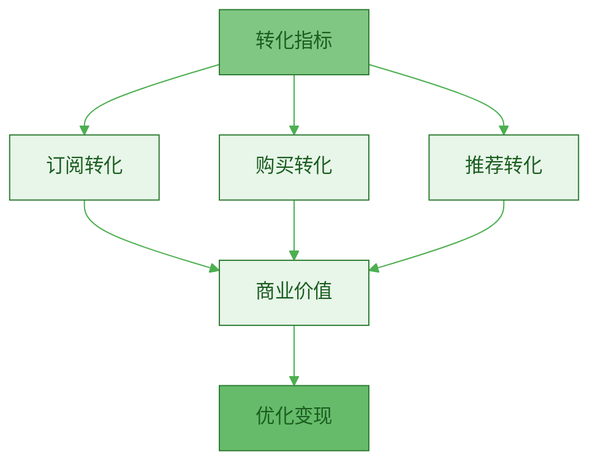
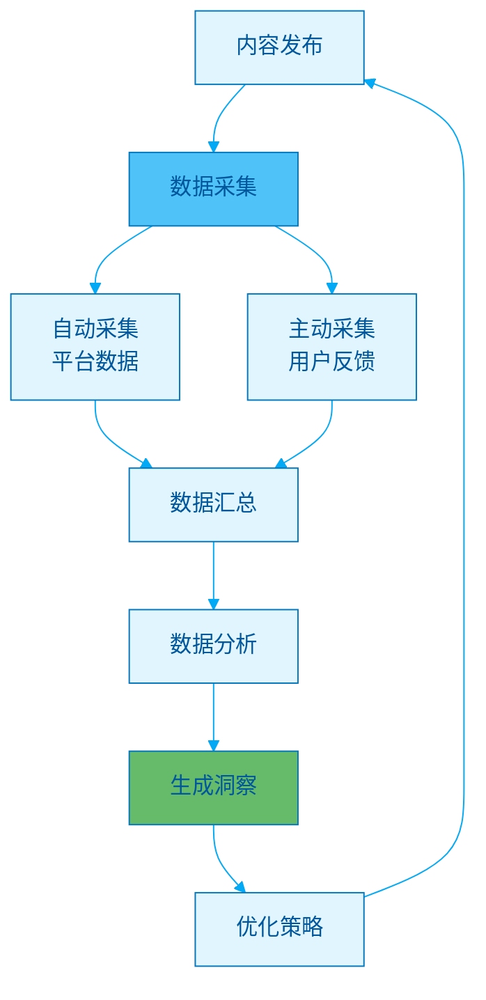
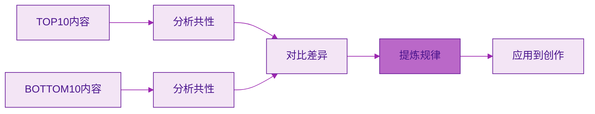
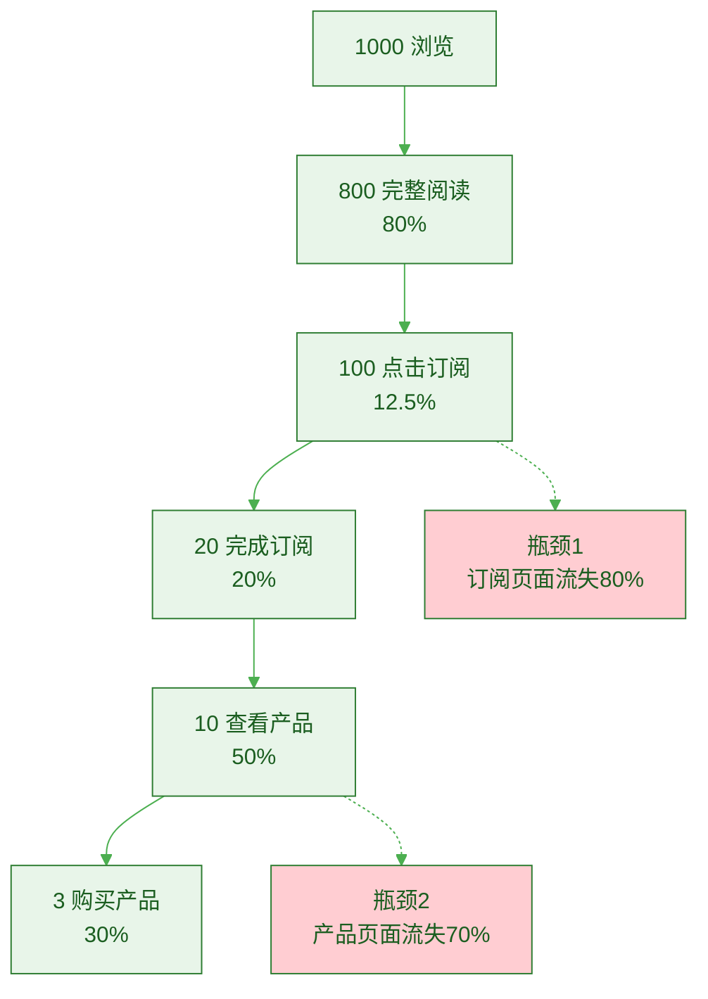
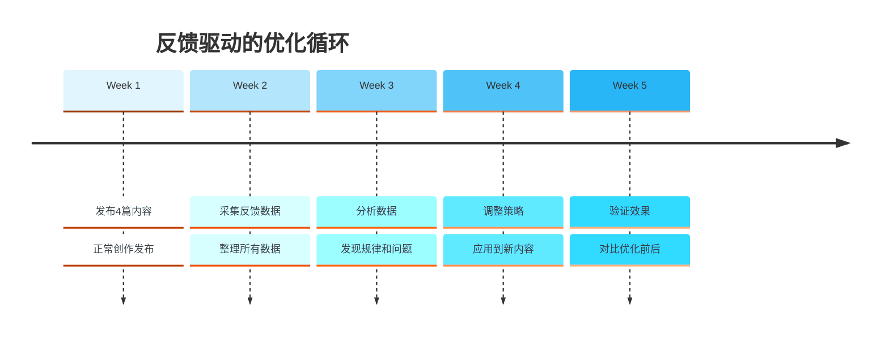

> [!quote] 反馈的价值
> "不追踪数据的内容创作,就像闭着眼睛开车。
> 
> 反馈不是虚荣指标,而是优化指南。
> 
> 用户告诉你什么有效,什么无效,你只需要倾听。"
> ——来自 [[3. MDFriday 实战记录/03.网站/Dan Koe/视频笔记/8|内容生态系统]]

## 为什么需要反馈机制?

### 没有反馈的困境

> [!danger] 盲目创作的问题
> 
> **典型场景**:
> - 写了100篇文章,不知道哪些受欢迎
> - 发了50个视频,不清楚用户真正想要什么
> - 改变内容方向,完全凭感觉
> - 投入大量时间,但不知道是否有效



### 反馈机制的价值

参考 [[3. MDFriday 实战记录/03.网站/Dan Koe/视频笔记/29|智能创作者如何从零增长受众]]:

> [!success] 数据驱动的创作
> 
> **有反馈机制后**:
> - ✅ 知道哪些内容受欢迎
> - ✅ 理解用户真实需求
> - ✅ 优化内容策略
> - ✅ 提高创作效率
> - ✅ 持续改进质量



## 反馈的四个层次

### 层次1: 数量指标(What)

> [!tip] 基础数据
> **告诉你"发生了什么",但不告诉你"为什么"。**



**关键指标**:

| 指标 | 含义 | 参考标准 | 局限性 |
|-----|------|---------|--------|
| **浏览量** | 有多少人看到 | 越高越好 | 不代表质量 |
| **点赞数** | 有多少人认可 | >3%浏览量 | 可能只是随手点 |
| **收藏数** | 有多少人想再看 | >1%浏览量 | 更有价值 |
| **转发数** | 有多少人推荐 | >0.5%浏览量 | 最有价值 |

> [!example] 数据案例
> 
> **文章A**:
> - 浏览量: 10,000
> - 点赞: 100 (1%)
> - 收藏: 50 (0.5%)
> - 转发: 10 (0.1%)
> 
> **文章B**:
> - 浏览量: 5,000
> - 点赞: 200 (4%)
> - 收藏: 100 (2%)
> - 转发: 50 (1%)
> 
> **结论**: 虽然A浏览量更高,但B的质量更高!

### 层次2: 行为指标(How)

> [!tip] 深度数据
> **告诉你用户"如何"与内容互动。**



**关键指标**:

| 指标 | 含义 | 优质标准 | 如何获取 |
|-----|------|---------|---------|
| **停留时间** | 用户阅读多久 | >2分钟(文章) | Google Analytics |
| **完读率** | 读完的比例 | >40% | 页面滚动追踪 |
| **跳出率** | 立即离开的比例 | <60% | GA数据 |
| **点击率** | 点击链接的比例 | >5% | 链接追踪 |

> [!success] 这些数据更有价值
> 
> **为什么?**
> - 浏览量可能是误点
> - 停留时间证明真正阅读
> - 完读率证明内容吸引人
> - 点击率证明产生行动

### 层次3: 情感指标(Feel)

> [!tip] 定性反馈
> **告诉你用户"感受"如何。**



**收集方式**:

| 方式 | 优点 | 缺点 | 适用场景 |
|-----|------|------|---------|
| **评论区** | 主动反馈,真实 | 可能偏负面 | 所有内容 |
| **私信** | 深度反馈 | 数量少 | 重要用户 |
| **问卷** | 结构化数据 | 回收率低 | 定期调研 |
| **社群讨论** | 深度交流 | 样本偏差 | 核心用户 |

> [!example] 情感反馈的价值
> 
> **评论**: "这篇文章解决了我困扰3个月的问题!"
> - **价值**: 证明解决了痛点
> - **行动**: 围绕这类痛点多创作
> 
> **评论**: "讲得太理论了,能不能更实操一些?"
> - **价值**: 发现内容方向问题
> - **行动**: 增加实操案例和步骤
> 
> **私信**: "能不能专门写一篇关于X的文章?"
> - **价值**: 发现新的内容需求
> - **行动**: 加入主题库

### 层次4: 转化指标(Convert)

> [!tip] 商业价值
> **告诉你内容的"变现能力"。**



**关键指标**:

| 指标 | 含义 | 计算方法 | 优质标准 |
|-----|------|---------|---------|
| **邮件订阅率** | 转化为订阅者 | 订阅数/浏览量 | >2% |
| **产品点击率** | 点击产品链接 | 点击数/浏览量 | >5% |
| **购买转化率** | 实际购买 | 购买数/点击数 | >3% |
| **推荐率** | 主动推荐 | 新用户/老用户 | >10% |

> [!important] 转化漏斗
> 
> ```
> 1000 浏览量
>   ↓ 2% 订阅率
>  20 订阅者
>   ↓ 10% 产品查看率
>   2 查看产品
>   ↓ 50% 购买率
>   1 购买
> 
> 总转化率: 0.1%
> ```
> 
> **优化思路**: 提升每个环节的转化率

## 建立反馈采集系统

### 系统架构



### 工具配置

> [!tip] 推荐工具组合
> 
> **网站分析**:
> - Google Analytics: 流量分析
> - Hotjar: 用户行为录制
> - Plausible: 隐私友好的分析
> 
> **社交媒体**:
> - 平台自带数据: 基础数据
> - Social Blade: 跨平台对比
> 
> **邮件营销**:
> - ConvertKit/Mailchimp: 打开率、点击率
> 
> **数据汇总**:
> - Notion/飞书: 数据看板
> - Google Sheets: 数据整理

### 数据采集清单

> [!check] 每篇内容发布后采集
> 
> **基础数据**(发布后1天):
> - [ ] 浏览量
> - [ ] 点赞数
> - [ ] 收藏数
> - [ ] 转发数
> - [ ] 评论数
> 
> **深度数据**(发布后3天):
> - [ ] 平均停留时间
> - [ ] 完读率
> - [ ] 跳出率
> - [ ] 来源渠道
> 
> **转化数据**(发布后7天):
> - [ ] 邮件订阅数
> - [ ] 产品页面点击数
> - [ ] 实际购买数
> 
> **定性反馈**(持续):
> - [ ] 精选评论(正面3条+负面3条)
> - [ ] 私信反馈
> - [ ] 社群讨论

## 数据分析方法

### 方法1: 对比分析法

> [!tip] 找到高效内容的规律
> **对比表现好的和表现差的内容,找出差异。**



> [!example] 对比分析示例
> 
> **TOP5文章特征**:
> - 平均字数: 3200字
> - 标题格式: "如何X" 或 "X个方法"
> - 内容类型: 实操指南
> - 配图数量: 5-8张
> - 有数据支撑: 100%
> 
> **BOTTOM5文章特征**:
> - 平均字数: 1500字
> - 标题格式: "关于X的思考"
> - 内容类型: 观点分享
> - 配图数量: 0-2张
> - 有数据支撑: 20%
> 
> **结论**:
> - ✅ 多写实操指南
> - ✅ 保持3000+字
> - ✅ 增加数据和配图
> - ❌ 减少纯观点文章

### 方法2: 趋势分析法

> [!tip] 发现内容方向
> **追踪长期数据变化,发现趋势。**

| 月份 | 文章数 | 平均浏览 | 平均互动率 | 订阅转化 |
|-----|--------|---------|-----------|---------|
| **1月** | 4 | 500 | 2% | 1% |
| **2月** | 4 | 800 | 3% | 1.5% |
| **3月** | 4 | 1200 | 4% | 2% |
| **4月** | 4 | 1800 | 5% | 2.5% |

> [!success] 趋势洞察
> 
> **发现**:
> - ✅ 浏览量持续增长(SEO起效)
> - ✅ 互动率持续提升(内容质量提高)
> - ✅ 转化率稳定增长(信任建立)
> 
> **结论**:
> - 继续当前策略
> - 长文飞轮已启动
> - 保持创作节奏

### 方法3: 漏斗分析法

> [!tip] 优化转化路径
> **找到转化过程中的瓶颈。**



> [!check] 优化方向
> 
> **针对瓶颈1(订阅流失80%)**:
> - [ ] 简化订阅流程
> - [ ] 增加订阅诱饵(免费电子书)
> - [ ] 优化订阅文案
> - [ ] A/B测试不同方案
> 
> **针对瓶颈2(产品流失70%)**:
> - [ ] 优化产品页面
> - [ ] 增加社会证明(testimonials)
> - [ ] 提供更多价值说明
> - [ ] 设置紧迫感

### 方法4: 用户访谈法

> [!tip] 深度理解用户
> **定期与核心用户深度交流。**

**访谈问题清单**:

> [!check] 用户访谈问题
> 
> **内容相关**:
> - 你最喜欢我的哪篇文章?为什么?
> - 哪些内容对你最有帮助?
> - 你希望看到哪方面的内容?
> - 什么样的内容你会分享给朋友?
> 
> **产品相关**:
> - 你为什么订阅我的Newsletter?
> - 你会购买什么类型的产品?
> - 什么价格你觉得合理?
> - 购买决策的关键因素是什么?
> 
> **改进建议**:
> - 我的内容有什么可以改进的?
> - 你觉得我应该增加什么?
> - 你觉得我应该减少什么?

## 从反馈到优化的行动循环

### 完整循环



### 优化决策矩阵

| 数据表现 | 行动策略 | 优先级 |
|---------|---------|--------|
| **高浏览+高互动** | 继续这个方向,深挖同类主题 | ⭐⭐⭐⭐⭐ |
| **高浏览+低互动** | 内容不够深度,需要优化质量 | ⭐⭐⭐⭐ |
| **低浏览+高互动** | 小众但精准,保持但不主攻 | ⭐⭐⭐ |
| **低浏览+低互动** | 方向有问题,停止或大幅调整 | ⭐⭐ |

> [!example] 实际应用
> 
> **数据发现**:
> "关于工具使用的文章"高浏览高互动
> "关于人生哲学的文章"低浏览低互动
> 
> **优化行动**:
> - ✅ 增加工具类内容比例(从20%到40%)
> - ✅ 深挖工具类的子主题
> - ⚠️ 减少哲学类内容(从30%到10%)
> - ⚠️ 保留一些哲学内容体现深度
> 
> **结果**(1个月后):
> - 平均浏览量提升50%
> - 互动率提升30%
> - 订阅转化率提升40%

## 常见误区

### 误区1: 只看虚荣指标

> [!danger] 错误做法
> 
> **只关注**:
> - 粉丝数
> - 浏览量
> - 点赞数
> 
> **忽略**:
> - 完读率
> - 转化率
> - 实际收入

> [!success] 正确做法
> 
> **记住**: 
> - 10万泛粉不如1000精准粉
> - 10万浏览不如100个订阅
> - 1000点赞不如10个购买

### 误区2: 过度迎合数据

> [!warning] 平衡数据与初心
> 
> **错误**:
> - 数据显示搞笑内容最火
> - 就完全放弃专业内容
> - 变成纯娱乐号
> 
> **结果**:
> - 短期流量上升
> - 长期定位模糊
> - 无法实现高价值变现

> [!success] 正确做法
> 
> **平衡策略**:
> - 70%数据驱动(做有效的内容)
> - 30%坚持初心(做你想做的内容)
> - 在擅长领域内优化
> - 不跨界追逐热点

### 误区3: 数据收集过于复杂

> [!danger] 分析瘫痪
> 
> **过度追求**:
> - 追踪50个指标
> - 每天花3小时看数据
> - 用10个工具
> 
> **结果**:
> - 没时间创作
> - 陷入分析瘫痪
> - 效率反而下降

> [!success] 正确做法
> 
> **简化原则**:
> - 只追踪5-8个核心指标
> - 每周看1次数据(30分钟)
> - 用2-3个工具足够
> - **创作永远是第一位**

## 行动指南

### 立即建立反馈系统

> [!check] 本周行动
> 
> **Day 1**: 工具配置
> - [ ] 安装Google Analytics
> - [ ] 配置邮件追踪
> - [ ] 创建数据看板
> 
> **Day 2**: 确定指标
> - [ ] 选择5-8个核心指标
> - [ ] 设定目标值
> - [ ] 制作追踪表格
> 
> **Day 3-6**: 数据采集
> - [ ] 记录每篇内容数据
> - [ ] 整理用户反馈
> 
> **Day 7**: 分析与优化
> - [ ] 对比分析TOP内容
> - [ ] 发现规律
> - [ ] 制定下周优化策略

### 数据看板模板

> [!tip] Notion/飞书看板结构
> 
> ```
> # 内容数据看板
> 
> ## 本月概览
> - 发布文章数: X
> - 总浏览量: X
> - 新增订阅: X
> - 订阅转化率: X%
> 
> ## TOP5内容
> | 标题 | 浏览 | 互动率 | 订阅数 |
> |-----|------|--------|--------|
> | ... | ... | ... | ... |
> 
## 本月洞察
> 1. [发现1]
> 2. [发现2]
> 3. [发现3]
> 
> ## 下月优化
> - [ ] 行动1
> - [ ] 行动2
> - [ ] 行动3
> ```

## 总结

> [!quote] 核心要点
> "反馈是最诚实的老师,数据是最客观的指南。
> 
> 建立反馈机制,不是为了追逐数字,而是为了更好地服务用户。
> 
> 用数据驱动优化,用初心坚守方向。"

### 反馈四层次

| 层次 | 关注点 | 价值 | 获取难度 |
|-----|--------|------|---------|
| **数量指标** | 发生了什么 | ⭐⭐ | 简单 |
| **行为指标** | 如何发生的 | ⭐⭐⭐ | 中等 |
| **情感指标** | 用户感受 | ⭐⭐⭐⭐ | 较难 |
| **转化指标** | 商业价值 | ⭐⭐⭐⭐⭐ | 难 |

### 关键原则

> [!important] 记住这三点
> 
> 1. **简单高效**
>    - 不要追踪太多指标
>    - 每周30分钟看数据
>    - 创作优先于分析
> 
> 2. **持续迭代**
>    - 发布→反馈→优化→再发布
>    - 每个月都要进步
>    - 长期坚持才有效
> 
> 3. **平衡数据与初心**
>    - 70%数据驱动
>    - 30%坚持初心
>    - 不为数据丢失方向

### 下一步阅读

- [[../08.数据反馈与长文升级/a.高反馈信号识别|高反馈信号识别]]
- [[../08.数据反馈与长文升级/b.内容迭代方法|内容迭代方法]]
- [[../08.数据反馈与长文升级/c.数据反向优化长文|数据反向优化长文]]

---

**建立反馈系统,让数据指引方向!**
