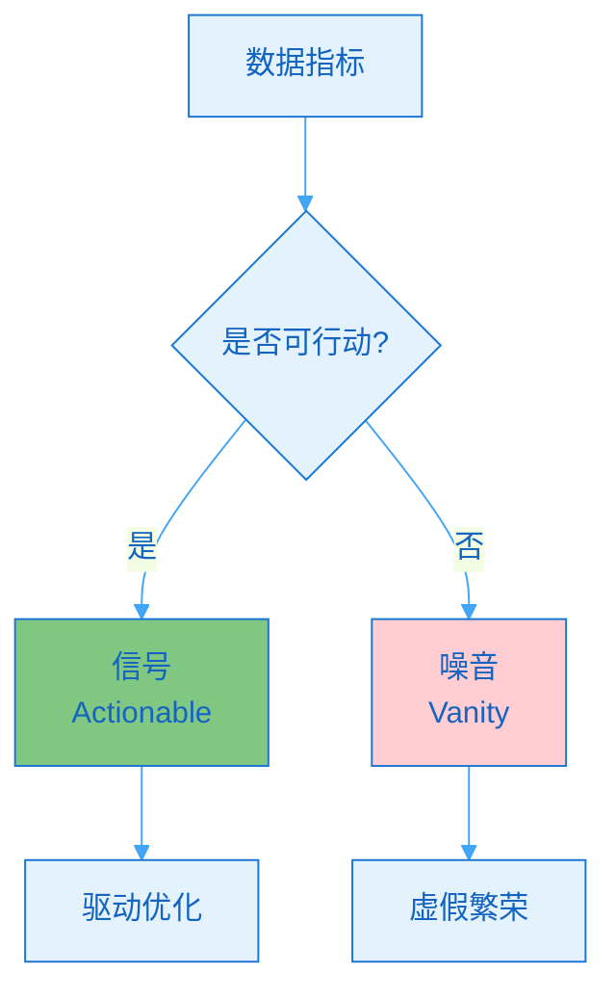
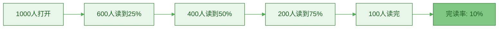
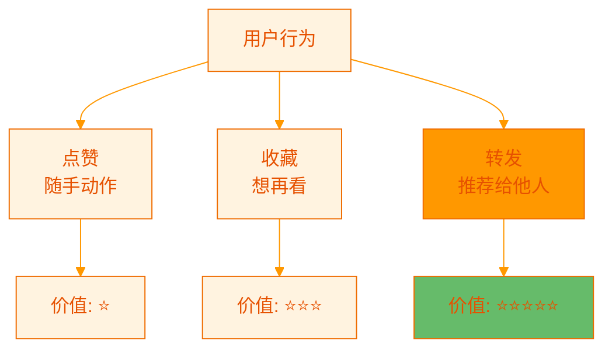
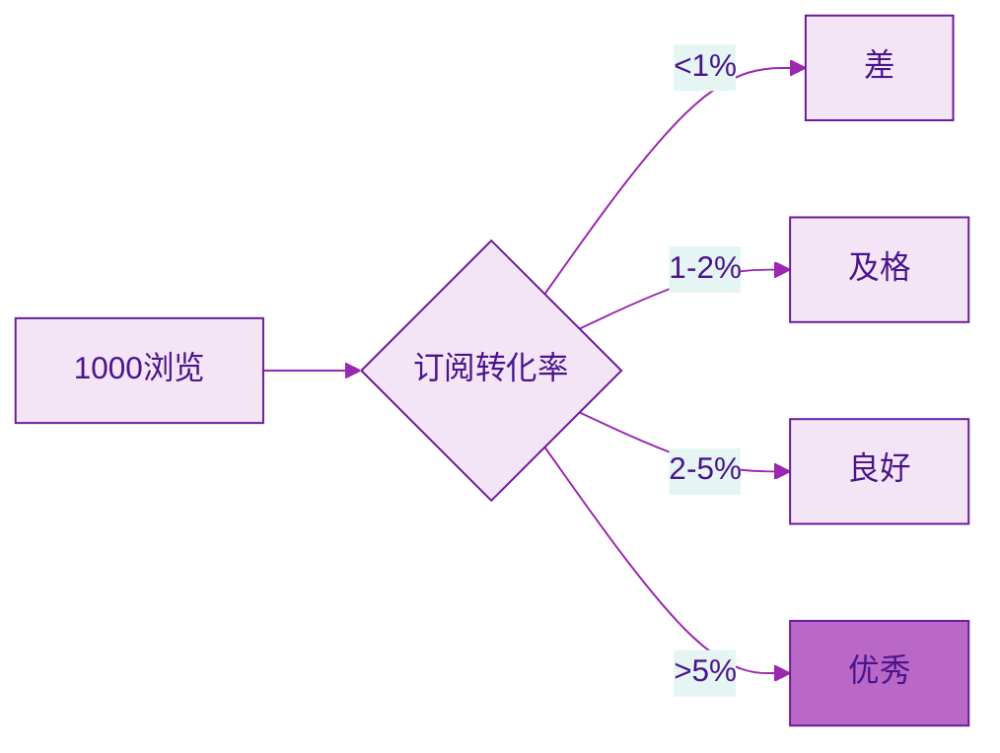
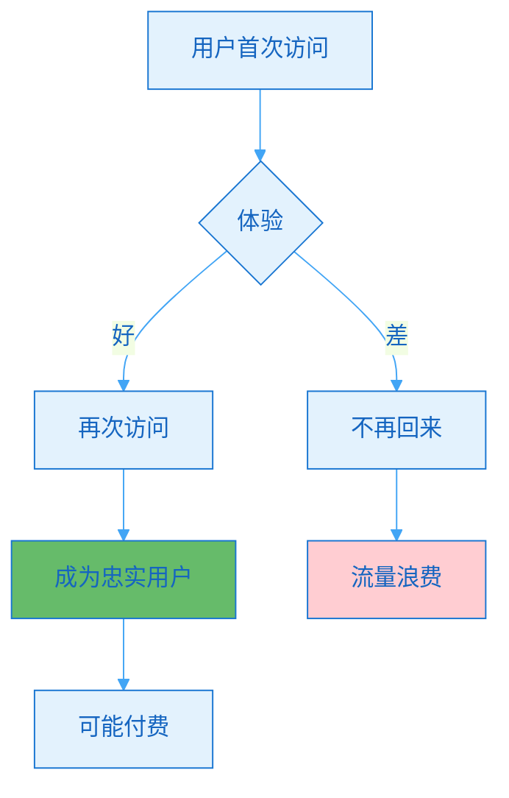
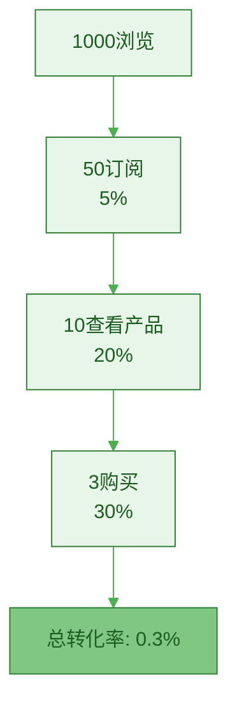
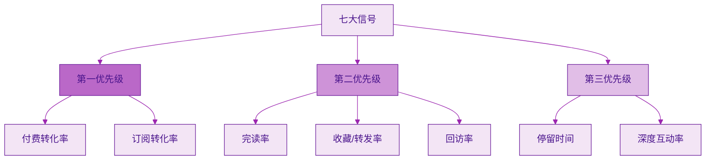

> [!quote] 信号 vs 噪音
> "大部分数据是噪音,只有少数是信号。
> 
> 学会识别高反馈信号,才能做出正确决策。
> 
> 不要被虚荣指标迷惑,要追踪真正重要的指标。"
> ——来自 [[3. MDFriday 实战记录/03.网站/Dan Koe/视频笔记/8|内容生态系统]]

## 什么是高反馈信号?

### 信号 vs 噪音

> [!important] 核心区别
> 
> **噪音(Vanity Metrics)**:
> - 看起来很好,但不能指导行动
> - 不能预测商业成功
> - 容易被虚假繁荣迷惑
> 
> **信号(Actionable Metrics)**:
> - 能够指导优化方向
> - 与商业目标直接相关
> - 可以驱动实际行动



### 真实案例对比

> [!example] 案例A: 被噪音误导
> 
> **创作者小李**:
> - 关注指标: 粉丝数、浏览量
> - 数据表现: 粉丝10万,月浏览100万
> - 实际收入: 月入2000元
> 
> **问题**: 关注了错误的指标
> - ❌ 粉丝多但不精准
> - ❌ 浏览高但停留时间短
> - ❌ 无法转化为收入

> [!example] 案例B: 识别正确信号
> 
> **创作者小王**:
> - 关注指标: 完读率、订阅转化率、购买率
> - 数据表现: 粉丝2万,月浏览10万
> - 实际收入: 月入2万元
> 
> **成功**: 关注了正确的信号
> - ✅ 粉丝少但精准
> - ✅ 浏览不高但深度互动
> - ✅ 高转化率

## 七大高反馈信号

### 信号1: 完读率(Completion Rate)

> [!tip] 最重要的内容质量指标
> **完读率 = 读完文章的人数 / 开始阅读的人数**



**为什么重要?**

| 完读率 | 说明 | 行动 |
|-------|------|------|
| **>40%** | 优质内容 | 继续这个方向 |
| **20-40%** | 中等质量 | 可以优化 |
| **<20%** | 质量问题 | 需要大改 |

> [!check] 如何提升完读率?
> 
> **开头**: 前100字抓住读者
> - 直接给价值
> - 引发好奇
> - 建立共鸣
> 
> **正文**: 保持节奏
> - 分段清晰
> - 有小标题
> - 适度配图
> 
> **结尾**: 强化价值
> - 总结要点
> - 行动指南
> - 延伸阅读

> [!example] 完读率优化案例
> 
> **优化前**:
> - 开头500字背景铺垫
> - 长段落(200字+)
> - 完读率: 15%
> 
> **优化后**:
> - 开头直接给核心观点(100字)
> - 短段落(80-150字)
> - 增加小标题和配图
> - 完读率: 45%
> 
> **提升**: 3倍!

### 信号2: 停留时间(Dwell Time)

> [!tip] 用户真实投入的时间
> **停留时间 = 用户在页面停留的总时长**

**参考标准**:

| 内容类型 | 字数 | 理想停留 | 及格线 |
|---------|------|---------|--------|
| **短文章** | 500-1000字 | 2-3分钟 | 1分钟 |
| **中文章** | 1000-2000字 | 3-5分钟 | 2分钟 |
| **长文** | 2000-5000字 | 6-10分钟 | 4分钟 |
| **深度长文** | 5000+字 | 12-20分钟 | 8分钟 |

> [!important] 停留时间的商业价值
> 
> **Google研究发现**:
> - 停留时间>3分钟的用户,转化率是<1分钟用户的5倍
> - 停留时间与SEO排名正相关
> - 停留时间是信任建立的关键指标

> [!example] 停留时间数据分析
> 
> **文章A**: "10个效率工具"
> - 浏览量: 5000
> - 平均停留: 45秒
> - 转化率: 0.5%
> - **问题**: 用户快速浏览,没有深度阅读
> 
> **文章B**: "我如何通过时间管理改变生活"
> - 浏览量: 1000
> - 平均停留: 8分钟
> - 转化率: 5%
> - **成功**: 用户深度阅读,建立信任

### 信号3: 收藏/转发比(Save/Share Ratio)

> [!tip] 内容价值的终极证明
> **比点赞更有价值的指标**



**价值层级**:

| 行为 | 门槛 | 含义 | 参考比例 |
|-----|------|------|---------|
| **浏览** | 最低 | 偶然看到 | 100% |
| **点赞** | 低 | 还不错 | 3-5% |
| **收藏** | 中 | 有价值,想再看 | 1-2% |
| **转发** | 高 | 非常有价值,推荐 | 0.5-1% |

> [!success] 收藏/转发的商业意义
> 
> **收藏**:
> - 证明内容有lasting value
> - 用户认可这是"资产型"内容
> - 未来可能多次阅读
> 
> **转发**:
> - 用户用信誉为你背书
> - 免费的口碑传播
> - 精准的受众扩展

> [!example] 收藏率优化案例
> 
> **低收藏率内容**(<0.5%):
> - 观点类: "我对X的看法"
> - 情绪类: "太生气了"
> - 热点类: "今天发生了X"
> 
> **高收藏率内容**(>2%):
> - 方法论: "完整的X指南"
> - 清单类: "X的checklist"
> - 深度分析: "X的底层逻辑"
> 
> **启示**: 多创作"可收藏"的资产型内容

### 信号4: 订阅转化率(Subscribe Conversion)

> [!tip] 从流量到资产的关键
> **订阅转化率 = 新订阅数 / 浏览量**



**转化率基准**:

| 水平 | 转化率 | 说明 | 优化空间 |
|-----|--------|------|---------|
| **差** | <1% | 内容或CTA有问题 | 巨大 |
| **及格** | 1-2% | 基本水平 | 中等 |
| **良好** | 2-5% | 有吸引力 | 较小 |
| **优秀** | >5% | 极具价值 | 微调 |

> [!check] 提升订阅转化率的方法
> 
> **优化内容**:
> - 提供超预期价值
> - 解决实际问题
> - 建立专业形象
> 
> **优化CTA(Call to Action)**:
> - 明确的价值主张
> - 降低订阅门槛
> - 提供订阅诱饵
> 
> **优化订阅流程**:
> - 简化表单(只要邮箱)
> - 减少步骤
> - 即时反馈

> [!example] CTA优化案例
> 
> **优化前**:
> ```
> "如果你喜欢我的内容,
> 可以订阅我的Newsletter"
> 
> [订阅按钮]
> ```
> 转化率: 0.8%
> 
> **优化后**:
> ```
> "🎁 免费获取《一人公司启动清单》
> 
> 订阅Newsletter,立即收到:
> ✅ 详细的启动步骤
> ✅ 可复用的模板
> ✅ 每周深度内容
> 
> [立即获取免费清单]
> 
> (已有2000+创作者订阅)
> ```
> 转化率: 4.5%
> 
> **提升**: 5.6倍!

### 信号5: 回访率(Return Rate)

> [!tip] 用户忠诚度指标
> **回访率 = 回访用户数 / 总用户数**



**回访率标准**:

| 时间窗口 | 优秀 | 良好 | 及格 | 差 |
|---------|------|------|------|-----|
| **7天内** | >40% | 30-40% | 20-30% | <20% |
| **30天内** | >30% | 20-30% | 10-20% | <10% |
| **90天内** | >20% | 10-20% | 5-10% | <5% |

> [!important] 回访率的商业意义
> 
> **高回访率意味着**:
> - 内容有持续价值
> - 建立了习惯
> - 信任度高
> - 转化率高
> 
> **获取新用户的成本是留住老用户的5倍**

> [!check] 提升回访率的策略
> 
> **内容策略**:
> - 发布系列内容(让人期待下一篇)
> - 保持更新节奏(形成习惯)
> - 内文之间互相链接
> 
> **产品策略**:
> - Newsletter定期推送
> - RSS订阅
> - 社群运营
> 
> **数据策略**:
> - 追踪用户行为
> - 个性化推荐
> - 提醒机制

### 信号6: 深度互动率(Deep Engagement)

> [!tip] 超越点赞的真实互动
> **深度互动 = 评论 + 私信 + 问题 + 讨论**

**互动层次**:

| 层次 | 行为 | 投入 | 价值 |
|-----|------|------|------|
| **L0** | 浏览 | 0秒 | ⭐ |
| **L1** | 点赞 | 1秒 | ⭐⭐ |
| **L2** | 收藏/转发 | 3秒 | ⭐⭐⭐ |
| **L3** | 评论 | 30秒 | ⭐⭐⭐⭐ |
| **L4** | 私信/提问 | 2分钟 | ⭐⭐⭐⭐⭐ |

> [!success] 深度互动的价值
> 
> **评论**:
> - 证明认真阅读
> - 提供优化方向
> - 形成社区氛围
> 
> **私信**:
> - 极高的兴趣
> - 潜在付费客户
> - 深度需求挖掘

> [!example] 深度互动数据
> 
> **文章A**: "10个工具推荐"
> - 浏览: 5000
> - 点赞: 200
> - 评论: 10
> - 私信: 0
> - **深度互动率**: 0.2%
> 
> **文章B**: "我如何从0到1建立一人公司"
> - 浏览: 1000
> - 点赞: 100
> - 评论: 50
> - 私信: 20
> - **深度互动率**: 7%
> 
> **启示**: 深度内容带来深度互动

### 信号7: 付费转化率(Purchase Conversion)

> [!tip] 终极商业指标
> **付费转化率 = 购买人数 / 浏览人数**



**转化率基准**:

| 产品类型 | 低价($9-49) | 中价($50-199) | 高价($200+) |
|---------|------------|--------------|------------|
| **及格** | 1% | 0.5% | 0.1% |
| **良好** | 3% | 1% | 0.3% |
| **优秀** | 5%+ | 2%+ | 0.5%+ |

> [!important] 影响转化率的因素
> 
> **内容因素**:
> - 建立了多少信任?
> - 展示了多少价值?
> - 解决了什么问题?
> 
> **产品因素**:
> - 产品与内容匹配度
> - 价格是否合理
> - 价值主张是否清晰
> 
> **流程因素**:
> - 购买流程是否顺畅
> - 支付方式是否便捷
> - 是否有退款保障

## 信号识别矩阵

### 优先级矩阵



**优先级说明**:

| 优先级 | 信号 | 原因 | 追踪频率 |
|-------|------|------|---------|
| **P0** | 付费转化、订阅转化 | 直接影响商业目标 | 每周 |
| **P1** | 完读率、收藏率、回访率 | 影响长期价值 | 每两周 |
| **P2** | 停留时间、深度互动 | 辅助优化指标 | 每月 |

### 决策矩阵

> [!check] 基于信号的决策框架
> 
> **场景1**: 完读率高但转化率低
> - **问题**: 内容好但CTA弱
> - **行动**: 优化转化路径,增强CTA
> 
> **场景2**: 转化率高但流量低
> - **问题**: 内容精准但覆盖面小
> - **行动**: 扩大推广,保持质量
> 
> **场景3**: 收藏率高但回访率低
> - **问题**: 内容有价值但缺少连续性
> - **行动**: 建立系列,增加内链
> 
> **场景4**: 所有指标都低
> - **问题**: 内容方向或质量有问题
> - **行动**: 重新定位,大幅调整

## 常见误区

### 误区1: 只看单一指标

> [!danger] 片面判断
> 
> **错误**:
> - "我的浏览量很高,说明内容很好"
> - 忽略了完读率、转化率
> 
> **真相**:
> - 高浏览可能只是标题党
> - 必须综合多个指标判断

> [!success] 正确做法
> 
> **综合评估**:
> ```
> 内容质量得分 = 
>   浏览量权重20% +
>   完读率权重30% +
>   收藏率权重20% +
>   转化率权重30%
> ```

### 误区2: 忽视滞后指标

> [!warning] 短视决策
> 
> **错误**:
> - 只看即时数据
> - 1天内没效果就放弃
> 
> **真相**:
> - SEO效果需要3-6个月
> - 信任建立需要时间
> - 复利需要积累

> [!success] 正确做法
> 
> **追踪长期指标**:
> - 7天数据
> - 30天数据
> - 90天数据
> - 1年数据

### 误区3: 过度优化单个信号

> [!danger] 失衡优化
> 
> **错误**:
> - 为了提高完读率,文章越写越短
> - 为了提高转化率,全文都在推销
> 
> **结果**:
> - 失去内容深度
> - 用户反感

> [!success] 正确做法
> 
> **平衡优化**:
> - 保持内容质量
> - 自然植入CTA
> - 价值优先,转化其次

## 行动指南

### 建立信号追踪系统

> [!check] 本周行动
> 
> **Day 1**: 确定核心信号
> - [ ] 选择3-5个核心信号
> - [ ] 设定目标值
> 
> **Day 2**: 配置追踪工具
> - [ ] Google Analytics设置
> - [ ] 自定义事件追踪
> 
> **Day 3-6**: 数据采集
> - [ ] 记录每篇内容的信号数据
> 
> **Day 7**: 分析与优化
> - [ ] 识别高信号内容
> - [ ] 总结规律
> - [ ] 制定优化计划

### 信号追踪模板

> [!tip] 内容信号追踪表
> 
> | 标题 | 发布日期 | 完读率 | 收藏率 | 订阅转化 | 综合得分 |
> |-----|---------|--------|--------|---------|---------|
> | 文章A | 2026-03-01 | 45% | 2.1% | 3.5% | 85分 |
> | 文章B | 2026-03-08 | 35% | 1.5% | 2.0% | 70分 |
> | 文章C | 2026-03-15 | 50% | 3.0% | 5.0% | 95分 |
> 
> **分析**:
> - 文章C表现最好,分析其特点
> - 文章B需要优化,找出问题
> - 下周内容参考文章C的风格

## 总结

> [!quote] 核心要点
> "不是所有数据都是信号,大部分是噪音。
> 
> 学会识别高反馈信号,才能做出正确决策。
> 
> 追踪正确的指标,比追踪更多指标更重要。"

### 七大高反馈信号

| 信号 | 含义 | 优先级 | 目标值 |
|-----|------|--------|--------|
| **完读率** | 内容质量 | ⭐⭐⭐⭐ | >40% |
| **停留时间** | 深度阅读 | ⭐⭐⭐ | >3分钟 |
| **收藏/转发率** | 内容价值 | ⭐⭐⭐⭐ | >1.5% |
| **订阅转化率** | 建立资产 | ⭐⭐⭐⭐⭐ | >2% |
| **回访率** | 用户忠诚 | ⭐⭐⭐⭐ | >30% |
| **深度互动率** | 真实兴趣 | ⭐⭐⭐ | >3% |
| **付费转化率** | 商业价值 | ⭐⭐⭐⭐⭐ | >1% |

### 关键原则

> [!important] 记住这三点
> 
> 1. **关注信号,忽略噪音**
>    - 虚荣指标看看就好
>    - 可行动指标才重要
> 
> 2. **综合评估,不看单一**
>    - 多个指标综合判断
>    - 避免片面决策
> 
> 3. **长期追踪,持续优化**
>    - 建立追踪系统
>    - 每周分析一次
>    - 持续迭代改进

### 下一步阅读

- [[b.内容迭代方法|内容迭代方法]]
- [[c.数据反向优化长文|数据反向优化长文]]
- [[../09.视频表达的二次杠杆/a.长文到视频脚本|长文到视频脚本]]

---

**识别正确的信号,让优化有的放矢!**
