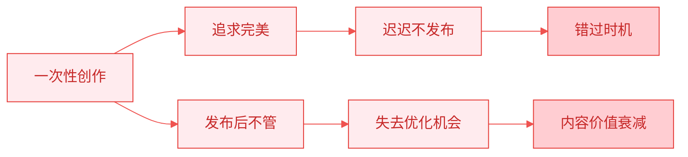
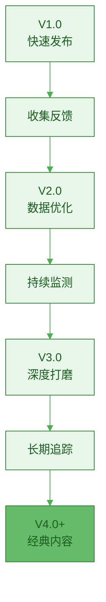
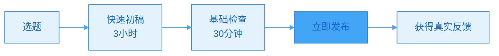
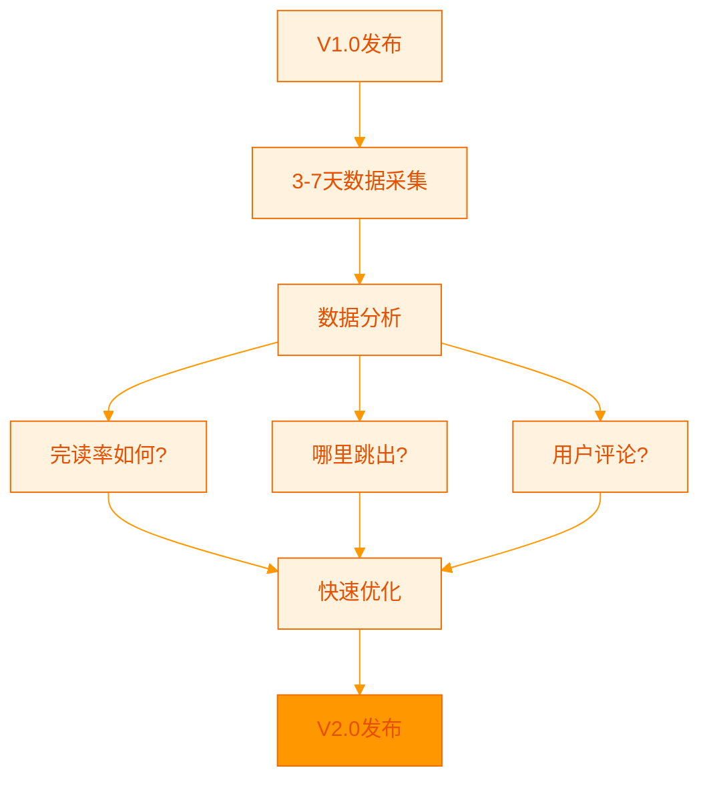
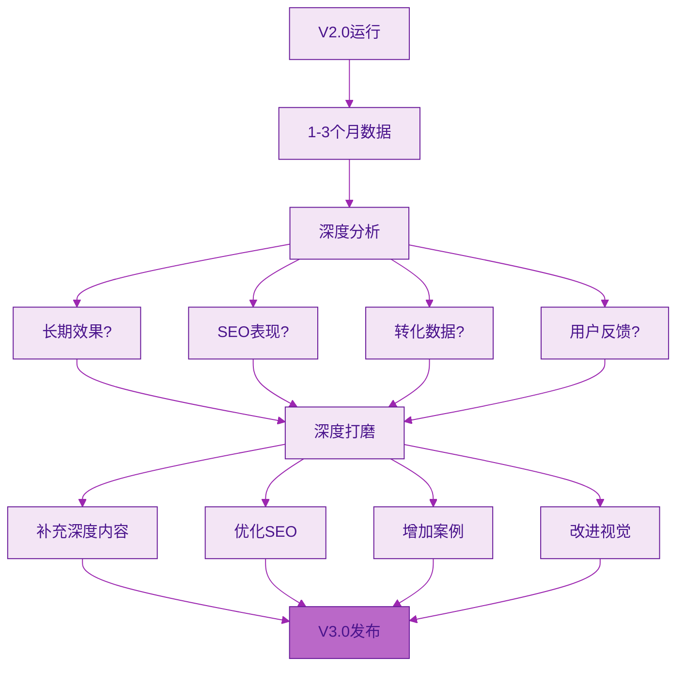
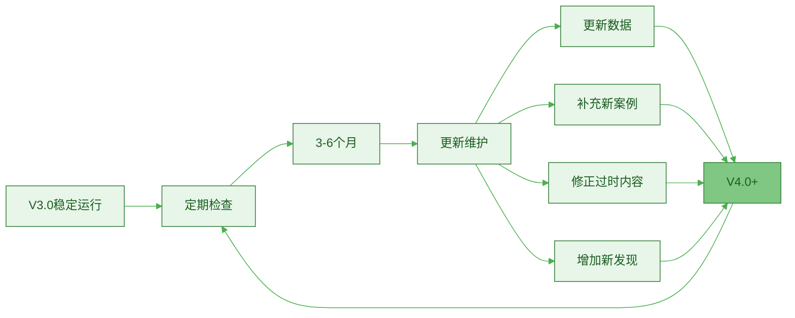
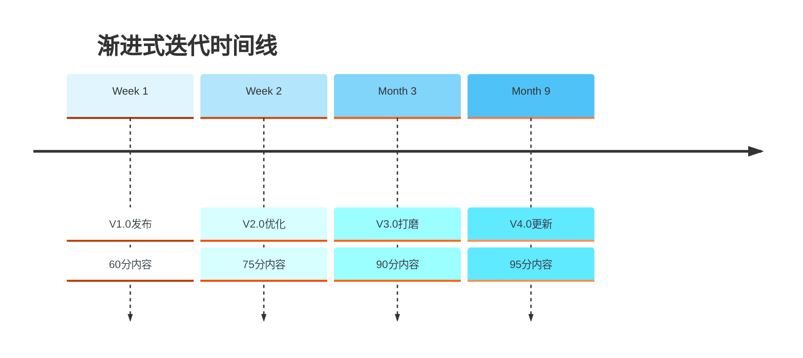
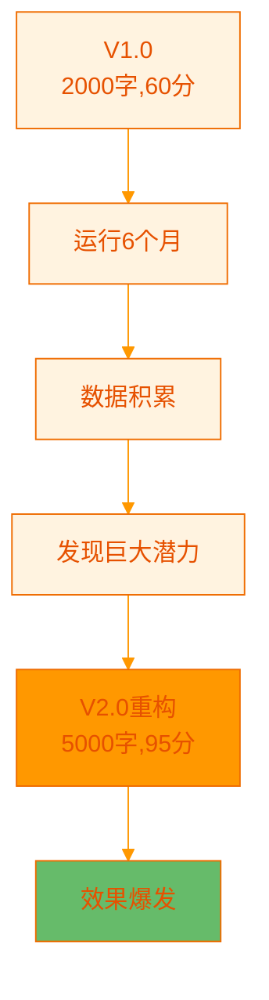
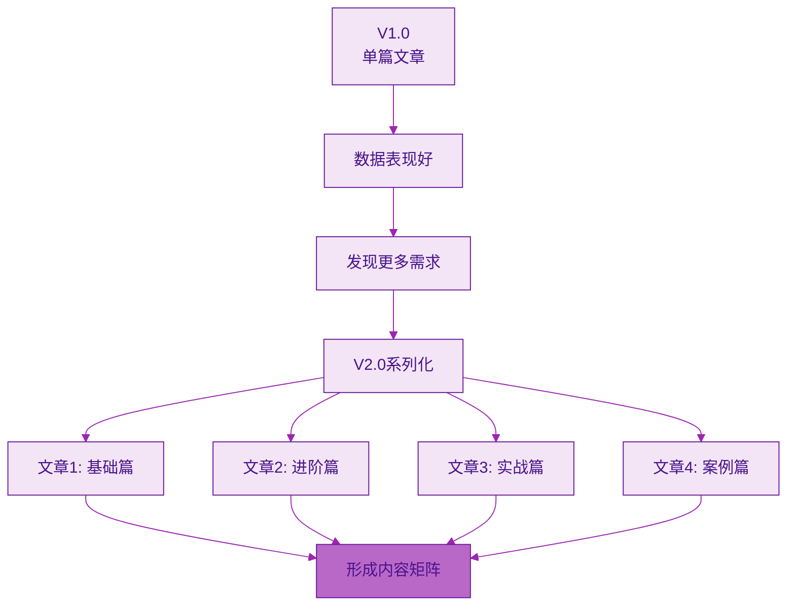

> [!quote] 迭代的力量
> "优秀的内容不是一次写成的,而是多次迭代优化的结果。
> 
> 第一版只需要完成,后续版本才追求完美。
> 
> 持续迭代,让好内容变成伟大内容。"
> ——来自 [[3. MDFriday 实战记录/03.网站/Dan Koe/视频笔记/14|一人商业的未来]]

## 为什么需要内容迭代?

### 一次性创作的局限

> [!danger] 完美主义的陷阱
> 
> **典型困境**:
> - 想一次写出完美内容
> - 反复修改,迟迟不发布
> - 发布后就不再碰
> - 错过优化机会



### 迭代的价值

参考 [[3. MDFriday 实战记录/03.网站/Dan Koe/视频笔记/12|写作的底层逻辑]]:

> [!success] 持续迭代的优势
> 
> **Version 1.0**: 完成(60分)
> - 快速发布
> - 获得初始反馈
> - 开始产生价值
> 
> **Version 2.0**: 优化(75分)
> - 根据反馈调整
> - 补充遗漏内容
> - 优化结构
> 
> **Version 3.0**: 精品(90分)
> - 深度打磨
> - 数据验证
> - 接近完美
> 
> **Version 4.0+**: 经典(95+分)
> - 持续更新
> - 长期价值
> - 成为权威



## 内容迭代的四个阶段

### 阶段1: MVP发布(Version 1.0)

> [!tip] 最小可行版本
> **目标: 快速发布,获得初始反馈**



**MVP标准**:

| 要素 | 最低要求 | 不必追求 |
|-----|---------|---------|
| **字数** | 1500-2000字 | 5000字长文 |
| **结构** | 清晰的3-5个要点 | 完美的逻辑 |
| **案例** | 1-2个基础案例 | 大量案例 |
| **配图** | 2-3张关键图 | 精美配图 |
| **完成度** | 60-70% | 100%完美 |

> [!check] MVP发布清单
> 
> **必须有**:
> - [ ] 清晰的标题
> - [ ] 核心观点明确
> - [ ] 基本结构完整
> - [ ] 语句通顺
> - [ ] 没有明显错误
> 
> **可以没有**:
> - ⚠️ 完美的文笔
> - ⚠️ 大量的配图
> - ⚠️ 所有的细节
> - ⚠️ 深度的案例

> [!example] MVP vs 完美主义
> 
> **完美主义者**:
> - 写作: 2周
> - 反复修改无数次
> - 终于发布(已错过最佳时机)
> - 发现方向有误,白费力气
> 
> **MVP迭代者**:
> - 写作: 3小时
> - 基础检查30分钟
> - 立即发布
> - 3天后根据反馈优化
> - 1周后发布2.0版本

### 阶段2: 快速优化(Version 2.0)

> [!tip] 数据驱动的第一次优化
> **时间: 发布后3-7天**



**优化重点**:

| 发现的问题 | 优化方法 | 预计时间 |
|-----------|---------|---------|
| **完读率<30%** | 优化开头,重新组织结构 | 1小时 |
| **某段落跳出率高** | 简化该段,增加小标题 | 30分钟 |
| **评论反馈不清楚** | 增加案例和说明 | 1小时 |
| **转化率低** | 优化CTA | 30分钟 |

> [!check] V2.0优化清单
> 
> **基于数据优化**:
> - [ ] 检查完读率,优化结构
> - [ ] 查看跳出点,改进内容
> - [ ] 分析停留时间,调整节奏
> 
> **基于反馈优化**:
> - [ ] 阅读所有评论
> - [ ] 回答常见问题
> - [ ] 补充遗漏内容
> - [ ] 修正错误理解
> 
> **技术优化**:
> - [ ] 修正错别字
> - [ ] 优化排版
> - [ ] 增加必要配图

> [!example] V2.0优化案例
> 
> **原V1.0标题**: "内容创作的方法"
> - 完读率: 25%
> - 问题: 标题不够吸引人
> 
> **V2.0优化后**: "我如何用这3个方法,让内容效率提升5倍"
> - 完读率: 42%
> - 提升: 68%
> 
> **优化内容**:
> - 开头增加个人故事(200字)
> - 每个方法补充实操步骤
> - 增加数据对比图表
> - 优化CTA文案

### 阶段3: 深度打磨(Version 3.0)

> [!tip] 结构化的深度优化
> **时间: 发布后1-3个月**



**深度优化维度**:

| 维度 | 优化内容 | 预计时间 |
|-----|---------|---------|
| **内容深度** | 增加更多细节,补充高级内容 | 2-3小时 |
| **SEO优化** | 优化关键词,增加内链 | 1小时 |
| **视觉呈现** | 制作精美配图,优化排版 | 2小时 |
| **案例丰富** | 增加2-3个深度案例 | 2小时 |
| **互动优化** | 增加问题引导,评论区FAQ | 1小时 |
| **总计** | | **8-10小时** |

> [!check] V3.0打磨清单
> 
> **内容层面**:
> - [ ] 字数增加到3000-5000字
> - [ ] 增加3个以上深度案例
> - [ ] 补充数据支撑
> - [ ] 增加对比分析
> 
> **结构层面**:
> - [ ] 优化标题层级
> - [ ] 增加目录导航
> - [ ] 改进段落衔接
> - [ ] 增加总结回顾
> 
> **视觉层面**:
> - [ ] 制作5-8张配图
> - [ ] 增加数据可视化
> - [ ] 优化排版样式
> - [ ] 统一视觉风格
> 
> **SEO层面**:
> - [ ] 优化meta描述
> - [ ] 增加3-5个内链
> - [ ] 优化图片alt标签
> - [ ] 增加相关文章推荐

> [!example] V3.0深度打磨案例
> 
> **V2.0数据**(运行2个月):
> - 月浏览: 3000
> - 完读率: 42%
> - 转化率: 2%
> - 反馈: "希望有更多实操案例"
> 
> **V3.0优化**:
> - 字数: 2000字 → 4500字
> - 案例: 2个 → 5个深度案例
> - 配图: 3张 → 8张信息图
> - 增加"常见问题"章节
> - 增加"行动清单"章节
> - 优化SEO(增加长尾关键词)
> 
> **V3.0效果**(运行1个月):
> - 月浏览: 5000 (提升67%)
> - 完读率: 48% (提升14%)
> - 转化率: 3.5% (提升75%)
> - 搜索流量占比: 20% → 45%

### 阶段4: 持续更新(Version 4.0+)

> [!tip] 长期维护,保持鲜活
> **频率: 每3-6个月**



**持续更新的内容**:

| 更新类型 | 内容 | 频率 |
|---------|------|------|
| **数据更新** | 更新统计数据,研究结论 | 6个月 |
| **案例补充** | 增加最新案例 | 3个月 |
| **过时清理** | 删除过时信息 | 6个月 |
| **趋势补充** | 增加行业新趋势 | 3个月 |
| **问答更新** | 补充新的FAQ | 持续 |

> [!success] 持续更新的价值
> 
> **SEO价值**:
> - Google偏爱"新鲜"内容
> - 定期更新提升排名
> - 增加长尾关键词覆盖
> 
> **用户价值**:
> - 内容保持相关性
> - 体现专业度
> - 建立长期信任
> 
> **商业价值**:
> - 老文章持续带来流量
> - 转化率稳定提升
> - 复利效应显现

> [!example] 持续更新案例
> 
> **一篇关于工具的文章**:
> 
> **V1.0**(2024年1月): 介绍5个工具
> **V2.0**(2024年2月): 优化结构,增加对比
> **V3.0**(2024年4月): 深度打磨,8个工具
> **V4.0**(2024年10月): 更新工具版本,增加新工具
> **V5.0**(2025年4月): 删除停更工具,增加AI工具
> **V6.0**(2025年10月): 补充实战案例
> 
> **效果**:
> - 2年持续带来流量
> - 成为该主题的权威文章
> - Google首页排名
> - 累计转化超过200人

## 迭代的三种模式

### 模式1: 渐进式迭代

> [!tip] 适合大部分内容
> **特点: 稳步优化,逐步完善**



**适用场景**:
- 常规主题文章
- 教程类内容
- 方法论分享

**优势**:
- 风险低
- 成本可控
- 效果稳定

### 模式2: 爆发式重构

> [!tip] 适合高价值内容
> **特点: 大规模重写,质的飞跃**



**适用场景**:
- 数据表现极好的文章
- 核心主题内容
- 品牌代表作品

**重构信号**:
- 持续高流量但转化不够
- 主题重要但内容浅薄
- 竞品出现更好内容

> [!example] 爆发式重构案例
> 
> **V1.0**: "5个提升效率的方法"
> - 2000字
> - 月浏览: 5000
> - 转化率: 1.5%
> 
> **数据发现**:
> - 搜索流量占80%(SEO潜力大)
> - 评论区大量深度提问
> - 竞品文章更详细
> 
> **V2.0重构**:
> - 标题改为"完整效率提升指南"
> - 字数: 2000 → 8000字
> - 5个方法 → 15个方法+系统框架
> - 增加10个深度案例
> - 制作可下载的PDF清单
> 
> **效果**:
> - 月浏览: 5000 → 15000 (3倍)
> - 转化率: 1.5% → 5% (3.3倍)
> - 成为Google首页第1名
> - 被多个网站引用

### 模式3: 系列化扩展

> [!tip] 适合体系化内容
> **特点: 单篇扩展成系列**



**适用场景**:
- 话题有深度可挖
- 用户需求多样化
- 可形成完整体系

**扩展路径**:

| 原文章 | 扩展方向 | 新系列 |
|-------|---------|--------|
| **工具推荐** | 深度展开 | 每个工具详细教程 |
| **方法论** | 阶段拆分 | 入门→进阶→高级 |
| **案例分享** | 行业细分 | 不同行业的应用 |

> [!example] 系列化扩展案例
> 
> **原文章**: "个人网站搭建指南"(3000字)
> - 表现: 月浏览8000,高互动
> - 评论: 大量细节问题
> 
> **系列化扩展**:
> 1. "个人网站搭建指南(总览篇)"
> 2. "选择合适的建站工具"
> 3. "网站设计的5个原则"
> 4. "SEO优化完全指南"
> 5. "网站运营与维护"
> 6. "10个优秀个人网站案例分析"
> 
> **效果**:
> - 6篇文章相互链接
> - 形成完整知识体系
> - 总流量提升5倍
> - 建立该领域权威性
> - 可组合成电子书/课程

## 迭代的最佳实践

### 实践1: 建立版本管理系统

> [!tip] 追踪每次迭代
> **用Obsidian/Notion记录版本历史**

**版本记录模板**:

```markdown
# 文章标题

## 版本历史

### V1.0 (2026-01-15)
- 初始发布
- 字数: 2000
- 核心内容: XXX

**数据**(2周):
- 浏览: 500
- 完读率: 35%
- 转化率: 1.2%

### V2.0 (2026-02-01)
**优化内容**:
- 重写开头(增加故事)
- 补充2个案例
- 优化CTA

**数据**(1个月):
- 浏览: 1200
- 完读率: 45%
- 转化率: 2.8%

**提升**: 浏览+140%, 转化+133%

### V3.0 (2026-04-01)
**优化内容**:
- 字数扩展到4000字
- 增加5张配图
- 新增FAQ章节
- SEO优化

**数据**(2个月):
- 浏览: 3500
- 完读率: 50%
- 转化率: 4.2%

**提升**: 浏览+191%, 转化+50%
```

### 实践2: 设定迭代触发条件

> [!check] 何时需要迭代?
> 
> **必须迭代**(立即):
> - 发现明显错误
> - 数据表现差(<30%完读率)
> - 大量负面反馈
> 
> **应该迭代**(1周内):
> - 完读率<40%
> - 转化率<1%
> - 用户提出改进建议
> 
> **可以迭代**(1-3个月):
> - 数据表现好但有优化空间
> - 有新案例可补充
> - 行业有新发展
> 
> **定期维护**(3-6个月):
> - 所有重要文章
> - 保持内容新鲜度

### 实践3: 批量迭代日

> [!tip] 固定时间集中优化
> **每月设定1天为"内容迭代日"**

**迭代日流程**:

| 时间 | 任务 | 产出 |
|-----|------|------|
| **09:00-10:00** | 数据回顾 | 找出需要优化的TOP5文章 |
| **10:00-12:00** | 快速优化 | 完成2-3篇V2.0优化 |
| **13:00-15:00** | 深度打磨 | 完成1篇V3.0打磨 |
| **15:00-16:00** | 版本发布 | 更新所有优化内容 |
| **16:00-17:00** | 记录总结 | 更新版本历史,制定下月计划 |

> [!success] 批量迭代的好处
> 
> **效率提升**:
> - 集中时间,减少切换成本
- 批量操作,提高效率
> 
> **质量保证**:
> - 专注状态,优化质量高
> - 统一风格,体验一致
> 
> **可持续性**:
> - 固定节奏,不会遗忘
> - 持续改进,长期复利

## 常见问题

### Q1: 迭代会不会影响SEO?

> [!success] 正确理解
> 
> **不会,反而有利!**
> 
> **Google官方说明**:
> - 偏爱"新鲜"的内容
> - 定期更新提升排名
> - 内容质量提升更受欢迎
> 
> **注意事项**:
> - ✅ 保持URL不变
> - ✅ 不要大改标题(微调可以)
> - ✅ 保留核心主题
> - ❌ 不要完全重写成新主题

### Q2: 应该迭代多少次?

> [!tip] 因文而异
> 
> **普通文章**: 2-3次迭代足够
> - V1.0: MVP发布
> - V2.0: 快速优化
> - V3.0: 深度打磨
> 
> **核心文章**: 持续迭代
> - 每3-6个月更新一次
> - 保持5年以上价值
> - 成为"常青内容"
> 
> **判断标准**:
> - 仍有流量 → 继续迭代
> - 流量归零 → 停止迭代

### Q3: 迭代太累怎么办?

> [!tip] 简化策略
> 
> **80/20原则**:
> - 80%文章: 只做V1.0+V2.0(基础优化)
> - 20%文章: 做到V3.0+持续更新(重点打磨)
> 
> **选择标准**:
> - TOP20%流量的文章
> - 核心主题文章
> - 转化率高的文章
> 
> **时间分配**:
> - 每月只迭代3-5篇
> - 新内容优先于迭代
> - 创作:迭代 = 70:30

## 行动指南

### 本月迭代计划

> [!check] 4周迭代行动
> 
> **Week 1**: 数据分析
> - [ ] 列出所有已发布文章
> - [ ] 整理关键数据
> - [ ] 识别需要迭代的文章
> - [ ] 制定迭代优先级
> 
> **Week 2**: 快速优化
> - [ ] 选择5篇文章做V2.0优化
> - [ ] 根据数据和反馈调整
> - [ ] 重新发布
> 
> **Week 3**: 深度打磨
> - [ ] 选择2篇核心文章做V3.0打磨
> - [ ] 深度补充内容
> - [ ] 优化视觉和SEO
> 
> **Week 4**: 回顾与规划
> - [ ] 对比优化前后数据
> - [ ] 总结经验教训
> - [ ] 规划下月迭代

### 迭代检查清单

> [!tip] 通用迭代清单
> 
> **数据检查**:
> - [ ] 完读率是否<40%?
> - [ ] 跳出率在哪里高?
> - [ ] 转化率是否达标?
> 
> **内容检查**:
> - [ ] 开头是否吸引人?
> - [ ] 结构是否清晰?
> - [ ] 案例是否充足?
> - [ ] 是否有遗漏内容?
> 
> **技术检查**:
> - [ ] 是否有错别字?
> - [ ] 排版是否舒适?
> - [ ] 配图是否恰当?
> - [ ] 链接是否有效?
> 
> **SEO检查**:
> - [ ] 标题是否优化?
> - [ ] 关键词是否合理?
> - [ ] 内链是否充足?
> - [ ] meta描述是否吸引?

## 总结

> [!quote] 核心要点
> "优秀的内容是迭代出来的,不是一次写成的。
> 
> Version 1.0 = 完成 > 完美
> Version 2.0 = 数据优化
> Version 3.0 = 深度打磨
> Version 4.0+ = 持续更新
> 
> 迭代让好内容变成伟大内容。"

### 四个迭代阶段

| 阶段 | 时机 | 目标 | 时间投入 |
|-----|------|------|---------|
| **V1.0** | 立即 | 快速发布,获得反馈 | 3-4小时 |
| **V2.0** | 3-7天后 | 数据驱动优化 | 1-2小时 |
| **V3.0** | 1-3个月后 | 深度打磨 | 8-10小时 |
| **V4.0+** | 3-6个月 | 持续更新 | 2-3小时/次 |

### 关键原则

> [!important] 记住这三点
> 
> 1. **完成>完美**
>    - V1.0只需60分
>    - 快速发布获得反馈
>    - 不要追求一次完美
> 
> 2. **数据驱动迭代**
>    - 根据真实数据优化
>    - 不要凭感觉修改
>    - 持续追踪效果
> 
> 3. **聚焦核心内容**
>    - 20%文章值得深度打磨
>    - 不要平均用力
>    - 让好内容更好

### 下一步阅读

- [[c.数据反向优化长文|数据反向优化长文]]
- [[../09.视频表达的二次杠杆/a.长文到视频脚本|长文到视频脚本]]
- [[../10.建立个人网站/a.为什么必需拥有自己的阵地|为什么必需拥有自己的阵地]]

---

**Version 1.0是开始,持续迭代是成功!**
