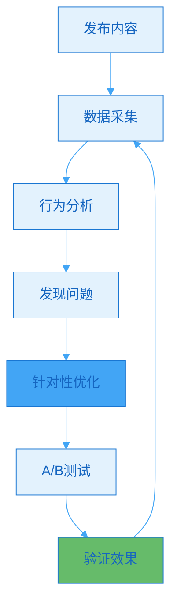
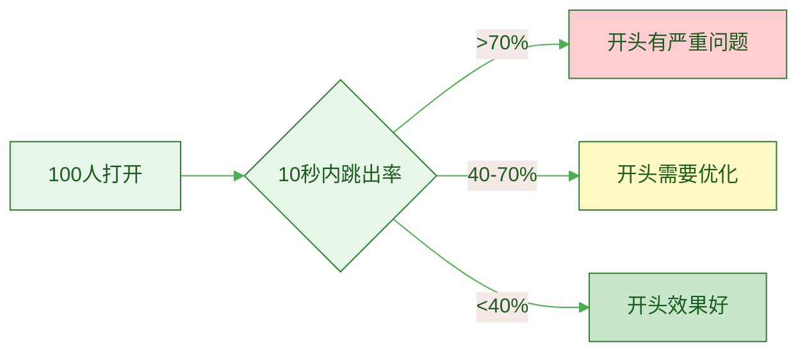
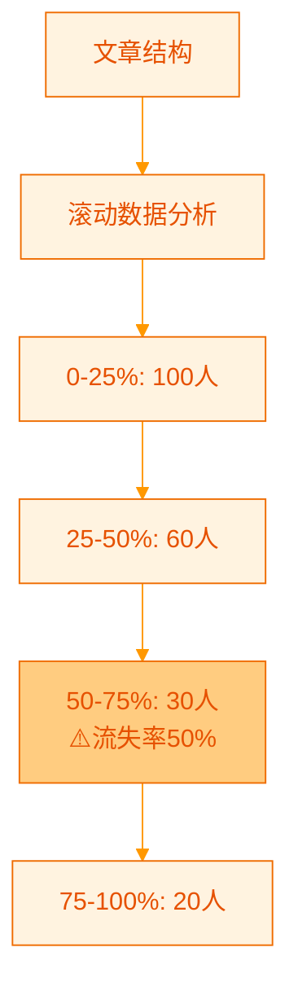
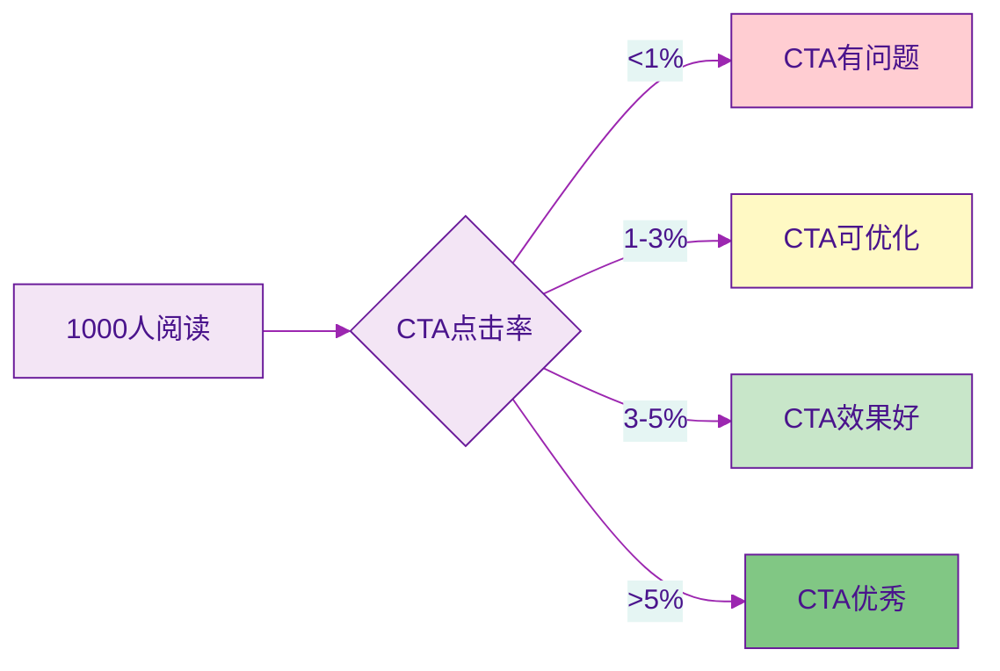
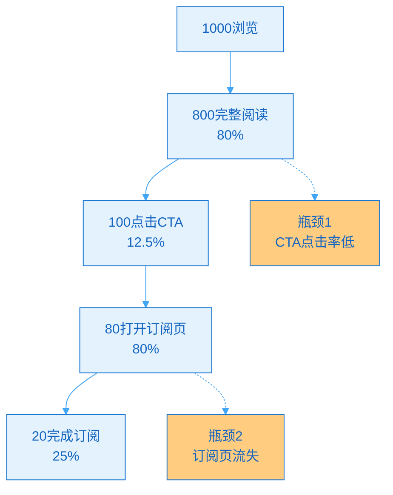
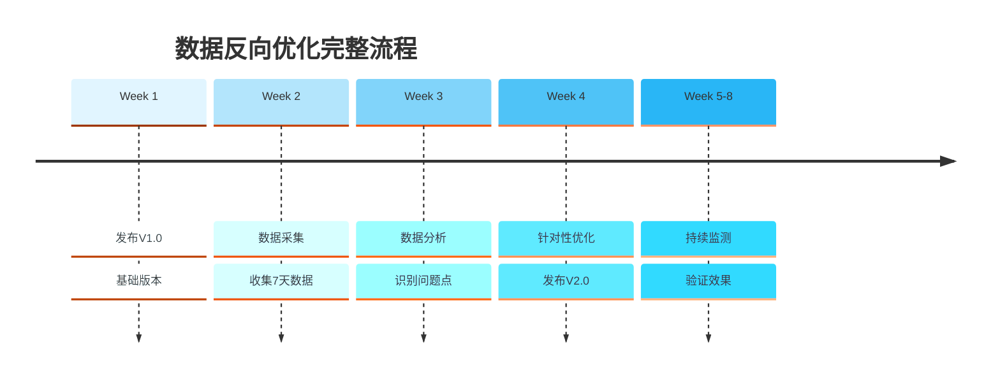

> [!quote] 让数据说话
> "数据不会撒谎,用户行为是最诚实的反馈。
> 
> 不要猜测用户想要什么,让数据告诉你。
> 
> 数据反向优化,让内容精准击中用户需求。"
> ——来自 [[3. MDFriday 实战记录/03.网站/Dan Koe/视频笔记/29|智能创作者如何从零增长受众]]

## 什么是数据反向优化?

### 传统vs数据驱动

> [!important] 思维模式的转变
> 
> **传统创作流程**:
> ```
> 我觉得用户需要X
>   ↓
> 创作关于X的内容
>   ↓
> 发布
>   ↓
> 祈祷效果好
> ```
> 
> **数据反向优化流程**:
> ```
> 发布初版内容
>   ↓
> 收集用户行为数据
>   ↓
> 分析数据发现问题
>   ↓
> 针对性优化
>   ↓
> 再次验证效果
> ```



### 数据反向优化的价值

| 对比维度 | 传统方式 | 数据驱动 |
|---------|---------|---------|
| **决策依据** | 主观感觉 | 客观数据 |
| **优化方向** | 凭经验猜测 | 数据指引 |
| **成功率** | 30-40% | 70-80% |
| **效率** | 反复试错 | 精准优化 |
| **可预测性** | 低 | 高 |

> [!success] 真实案例对比
> 
> **创作者A**(传统方式):
> - 写了10篇文章
> - 凭感觉选题和优化
> - 2篇效果好,8篇效果差
> - 成功率: 20%
> 
> **创作者B**(数据驱动):
> - 写了10篇文章
> - 根据数据持续优化
> - 7篇效果好,3篇效果中等
> - 成功率: 70%

## 数据反向优化的六大维度

### 维度1: 开头优化(前100字黄金区)

> [!tip] 数据信号
> **查看: 10秒内跳出率**



**诊断方法**:

| 跳出率 | 问题诊断 | 优化方向 |
|-------|---------|---------|
| **>80%** | 开头完全不吸引 | 重写开头 |
| **60-80%** | 开头缺少亮点 | 增加钩子 |
| **40-60%** | 开头偏长 | 精简内容 |
| **<40%** | 开头效果好 | 保持或微调 |

> [!check] 开头优化清单
> 
> **必须做到**:
> - [ ] 前50字直击痛点
> - [ ] 100字内给出价值预期
> - [ ] 避免冗长铺垫
> - [ ] 使用具体数字
> - [ ] 制造好奇心
> 
> **应该避免**:
> - ❌ "今天想和大家聊聊..."
> - ❌ 长篇背景介绍
> - ❌ 模糊的价值承诺
> - ❌ 过于学术的开场

> [!example] 开头优化案例
> 
> **原开头**(跳出率75%):
> ```
> 在当今这个信息爆炸的时代,
> 内容创作已经成为了一个热门话题。
> 越来越多的人开始关注如何提高创作效率。
> 今天我想和大家分享一些我的经验...
> ```
> 
> **数据显示**:
> - 10秒跳出率: 75%
> - 平均停留: 25秒
> - 问题: 太啰嗦,没有价值点
> 
> **优化后**(跳出率35%):
> ```
> 我用这3个方法,
> 让内容创作效率提升了5倍。
> 
> 从每周只能写1篇,到每周轻松产出10篇。
> 
> 本文3000字,阅读需7分钟。
> 你将学会:
> 1. 长文拆分的5种方法
> 2. 平台适配的核心技巧
> 3. 自动化发布流程
> ```
> 
> **效果**:
> - 10秒跳出率: 35% (降低53%)
> - 平均停留: 6分钟 (提升14倍)
> - 完读率: 22% → 45%

### 维度2: 结构优化(滚动热力图)

> [!tip] 数据信号
> **查看: 页面滚动深度分析**



**问题识别**:

| 滚动位置 | 流失率 | 可能原因 | 优化方向 |
|---------|-------|---------|---------|
| **0-25%** | >50% | 开头不吸引 | 优化前100字 |
| **25-50%** | >40% | 中间拖沓 | 精简内容,增加小标题 |
| **50-75%** | >50% | 内容冗余 | 删除次要内容 |
| **75-100%** | >30% | 结尾弱 | 强化结尾价值 |

> [!example] 滚动数据优化案例
> 
> **问题文章**:
> 
> **滚动数据**:
> - 0-25%: 1000人
> - 25-50%: 800人 (流失20%)
> - 50-75%: 300人 (流失62%!) ⚠️
> - 75-100%: 200人
> 
> **分析**:
> 在50%位置有巨大流失,查看该位置内容:
> 一段800字的理论阐述,没有小标题,没有配图
> 
> **优化**:
> - 将800字拆分成3个小段
> - 每段增加小标题
> - 插入2张配图
> - 增加一个案例
> 
> **效果**:
> - 50-75%流失率: 62% → 35%
> - 完读率: 20% → 42%

### 维度3: 段落优化(停留时间分析)

> [!tip] 数据信号
> **查看: 每个段落的平均停留时间**

**停留时间与内容质量**:

| 段落类型 | 预期停留 | 实际停留 | 诊断 |
|---------|---------|---------|------|
| **开头段** | 20-30秒 | <10秒 | 不够吸引 |
| **正文段** | 30-60秒 | <15秒 | 太枯燥 |
| **案例段** | 60-90秒 | <30秒 | 不够生动 |
| **总结段** | 20-30秒 | <10秒 | 价值不足 |

> [!check] 段落优化方法
> 
> **高停留段落的特征**:
> - ✅ 有具体案例或故事
> - ✅ 有数据支撑
> - ✅ 有可视化内容
> - ✅ 解决实际问题
> 
> **低停留段落的特征**:
> - ❌ 纯理论阐述
> - ❌ 大段文字无分段
> - ❌ 抽象概念多
> - ❌ 缺少实用价值

> [!example] 段落优化案例
> 
> **低停留段落**(平均10秒):
> ```
> 内容创作的本质是价值传递。
> 创作者需要理解用户需求,
> 然后用合适的方式表达出来。
> 这需要持续学习和实践,
> 不断提升自己的能力。
> ```
> 
> **问题**: 太抽象,没有实际指导
> 
> **优化后**(平均45秒):
> ```
> 内容创作的本质是价值传递。
> 
> 举个例子:
> 
> 小李写了一篇"如何提高效率"。
> ❌ 错误做法:
> "要合理安排时间,提高专注力..."
> 结果:没人看完
> 
> ✅ 正确做法:
> "我用番茄工作法,3个月多赚2万"
> - 具体方法: 25分钟工作+5分钟休息
> - 实际效果: 每天多完成3小时工作
> - 收入提升: 接单量从2个/月到8个/月
> 
> 结果: 2000人收藏,50人购买课程
> 
> 看到差别了吗?
> 具体>抽象,案例>理论。
> ```

### 维度4: CTA优化(点击率分析)

> [!tip] 数据信号
> **查看: CTA(Call to Action)点击率**



**CTA优化维度**:

| 优化点 | 差 | 好 | 优秀 |
|-------|-----|-----|------|
| **位置** | 只在文末 | 文中+文末 | 开头+文中+文末 |
| **文案** | "订阅我" | "获取更多内容" | "免费获取XX清单" |
| **视觉** | 纯文字 | 按钮 | 高亮框+按钮 |
| **价值** | 无 | 有 | 非常清晰 |

> [!check] CTA优化清单
> 
> **文案优化**:
> - [ ] 明确价值主张
> - [ ] 使用行动动词
> - [ ] 降低心理门槛
> - [ ] 制造紧迫感(可选)
> 
> **视觉优化**:
> - [ ] 使用对比色
> - [ ] 足够大的按钮
> - [ ] 清晰的视觉层级
> - [ ] 周围留白
> 
> **位置优化**:
> - [ ] 首屏有CTA提示
> - [ ] 文中自然植入
> - [ ] 文末强化CTA

> [!example] CTA优化案例
> 
> **原CTA**(点击率0.8%):
> ```
> 如果你喜欢这篇文章,
> 可以订阅我的Newsletter。
> 
> [订阅]
> ```
> 
> **问题**:
> - 没有明确价值
> - 语气被动
> - 视觉不突出
> 
> **优化后**(点击率4.2%):
> ```
> 🎁 免费获取《一人公司启动清单》
> 
> 订阅Newsletter,立即收到:
> ✅ 30天行动计划
> ✅ 可复用的模板
> ✅ 每周深度内容
> 
> [立即免费获取] ← 高亮按钮
> 
> 💬 已有3,247位创作者订阅
> ```
> 
> **效果**:
> - 点击率: 0.8% → 4.2% (提升425%)
> - 转化率: 0.6% → 3.2% (提升433%)

### 维度5: 关键词优化(搜索数据)

> [!tip] 数据信号
> **查看: Google Search Console数据**

**关键数据指标**:

| 指标 | 含义 | 优化目标 |
|-----|------|---------|
| **展示次数** | 在搜索结果出现的次数 | 越多越好 |
| **点击次数** | 实际点击数 | 越多越好 |
| **CTR(点击率)** | 点击/展示 | >3% |
| **平均排名** | 搜索结果位置 | TOP10 |

> [!important] 搜索数据的价值
> 
> **发现机会**:
> - 哪些关键词带来流量?
> - 哪些关键词排名在11-20?(优化可进前10)
> - 用户真正搜索什么?
> 
> **优化方向**:
> - 强化高流量关键词
> - 优化接近前10的关键词
> - 补充用户真实搜索的长尾词

> [!example] 关键词优化案例
> 
> **文章**: "个人网站搭建指南"
> 
> **搜索数据**(优化前):
> | 关键词 | 排名 | 展示 | 点击 | CTR |
> |--------|------|------|------|-----|
> | 个人网站 | 15 | 1000 | 20 | 2% |
> | 网站搭建 | 12 | 800 | 15 | 1.9% |
> | 免费建站 | 8 | 500 | 30 | 6% |
> 
> **分析**:
> - "免费建站"排名最好,但展示少
> - "个人网站"排名15,有优化空间
> 
> **优化动作**:
> 1. 标题加入"免费"
>    - 原: "个人网站搭建指南"
>    - 新: "免费个人网站搭建完整指南"
> 
> 2. 增加"免费建站"相关内容
>    - 新增章节:"5个免费建站工具对比"
> 
> 3. 优化"个人网站"关键词密度
>    - 在小标题和正文中增加出现次数
> 
> **效果**(优化后1个月):
> | 关键词 | 排名 | 展示 | 点击 | CTR |
> |--------|------|------|------|-----|
> | 个人网站 | 6 ↑ | 3000 | 180 | 6% |
> | 网站搭建 | 7 ↑ | 2000 | 140 | 7% |
> | 免费建站 | 3 ↑ | 1500 | 120 | 8% |
> 
> **总提升**:
> - 总流量: 65次/月 → 440次/月 (6.8倍)
> - 平均排名: 11.7 → 5.3

### 维度6: 转化路径优化(漏斗分析)

> [!tip] 数据信号
> **查看: 从阅读到转化的完整路径**



**漏斗优化策略**:

| 环节 | 正常转化率 | 低于标准时优化 |
|-----|-----------|--------------|
| **完整阅读率** | >40% | 优化内容质量和结构 |
| **CTA点击率** | >3% | 优化CTA文案和视觉 |
| **页面到达率** | >80% | 检查链接,优化加载速度 |
| **订阅完成率** | >30% | 简化表单,增加信任元素 |

> [!example] 转化路径优化案例
> 
> **原始漏斗**:
> ```
> 1000浏览
>   ↓ 40%完读
> 400读完
>   ↓ 2%点击
> 8点击CTA
>   ↓ 50%到达
> 4到达订阅页
>   ↓ 50%完成
> 2完成订阅
> 
> 总转化率: 0.2%
> ```
> 
> **问题识别**:
> 1. CTA点击率太低(2%)
> 2. 订阅页完成率低(50%)
> 
> **优化动作**:
> 
> **CTA优化**:
> - 增加明确价值主张
> - 提供免费资源诱饵
> - 优化视觉呈现
> 
> **订阅页优化**:
> - 只要邮箱,删除其他字段
> - 增加社会证明("已有3000+人订阅")
> - 增加隐私保护说明
> - 优化页面加载速度
> 
> **优化后漏斗**:
> ```
> 1000浏览
>   ↓ 45%完读(优化内容)
> 450读完
>   ↓ 5%点击(CTA优化)
> 23点击CTA
>   ↓ 90%到达(速度优化)
> 21到达订阅页
>   ↓ 70%完成(表单简化)
> 15完成订阅
> 
> 总转化率: 1.5%
> ```
> 
> **提升**: 0.2% → 1.5% (7.5倍!)

## 数据优化的完整工作流

### 完整流程



### 数据分析看板模板

> [!tip] 建立数据分析看板
> 
> **文章数据看板**:
> 
> ```markdown
> # 文章标题: XXXX
> 
> ## 基础数据(Week 1)
> - 浏览量: 1,000
> - 完读率: 35%
> - 平均停留: 2分30秒
> - 跳出率: 65%
> 
> ## 详细分析
> 
> ### 开头效果
> - 10秒跳出率: 45%
> - **问题**: 偏高,开头不够吸引
> - **优化**: 重写前100字
> 
> ### 结构分析
> - 0-25%: 1000人
> - 25-50%: 600人 (流失40%)
> - 50-75%: 300人 (流失50%) ⚠️
> - 75-100%: 200人
> - **问题**: 50%位置大量流失
> - **优化**: 精简中间段落,增加案例
> 
> ### CTA效果
> - 点击率: 1.2%
> - **问题**: 低于标准
> - **优化**: 重新设计CTA,增加价值主张
> 
> ### SEO表现
> - 主关键词排名: 18
> - **机会**: 可优化进前10
> - **优化**: 增加关键词密度,优化标题
> 
> ## 优化计划
> - [ ] 重写开头(1小时)
> - [ ] 精简50%位置段落(30分钟)
> - [ ] 重新设计CTA(30分钟)
> - [ ] SEO优化(1小时)
> 
> ## V2.0效果(Week 4)
> - 浏览量: 1,500 (+50%)
> - 完读率: 48% (+37%)
> - CTA点击率: 3.5% (+192%)
> - 排名: 18 → 8
> ```

## 常见问题

### Q1: 数据量不够怎么办?

> [!tip] 小流量也能优化
> 
> **如果浏览量<100/周**:
> - 重点看定性反馈(评论、私信)
> - 使用A/B测试对比
> - 参考同类高流量文章
> 
> **如果浏览量100-1000/周**:
> - 数据已经有参考价值
> - 重点看完读率、停留时间
> - 2周后可开始优化
> 
> **如果浏览量>1000/周**:
> - 数据完全可信
> - 可以进行细致优化
> - 1周后即可开始

### Q2: 优化后效果不明显?

> [!success] 正确理解效果
> 
> **不要期待立竿见影**:
> - 优化需要时间验证(至少2周)
> - SEO优化需要1-3个月
> - 持续优化才有复利效应
> 
> **判断标准**:
> - 单次优化提升10-30%即为成功
> - 多次优化累计效果显著
> - 对比优化前后3个月数据

### Q3: 数据和直觉冲突怎么办?

> [!important] 相信数据,但保持思考
> 
> **原则**:
> - 70%时候相信数据
> - 30%时候相信直觉
> - 数据+直觉=最优决策
> 
> **案例**:
> - 数据显示某段落跳出率高
> - 但你觉得这段很重要
> - 解决方案: 不删除,但改写得更生动

## 行动指南

### 本周数据优化实践

> [!check] Week 1 行动
> 
> **Day 1-2**: 数据采集
> - [ ] 选择1篇已发布的文章
> - [ ] 安装必要的追踪工具
> - [ ] 等待7天数据积累
> 
> **Day 3**: 数据分析
> - [ ] 整理基础数据
> - [ ] 识别问题点
> - [ ] 制定优化计划
> 
> **Day 4-5**: 执行优化
> - [ ] 按计划优化6个维度
> - [ ] 重新发布
> 
> **Day 6-7**: 验证效果
> - [ ] 对比优化前后数据
> - [ ] 记录经验教训

### 数据优化工具包

> [!tip] 推荐工具
> 
> **必备工具**:
> - Google Analytics: 流量分析
> - Hotjar: 用户行为录制
> - Google Search Console: SEO数据
> 
> **辅助工具**:
> - Ahrefs/Semrush: 关键词研究
> - 平台自带数据: 基础数据
> - Notion/飞书: 数据整理

## 总结

> [!quote] 核心要点
> "数据不会撒谎,用户行为是最诚实的反馈。
> 
> 六大优化维度:
> 1. 开头优化(10秒跳出率)
> 2. 结构优化(滚动热力图)
> 3. 段落优化(停留时间)
> 4. CTA优化(点击率)
> 5. 关键词优化(搜索数据)
> 6. 转化路径优化(漏斗分析)
> 
> 数据驱动,精准优化,持续迭代。"

### 六大优化维度

| 维度 | 关键数据 | 优化目标 | 优先级 |
|-----|---------|---------|--------|
| **开头** | 10秒跳出率 | <40% | ⭐⭐⭐⭐⭐ |
| **结构** | 滚动深度 | 平滑下降 | ⭐⭐⭐⭐ |
| **段落** | 停留时间 | >30秒/段 | ⭐⭐⭐ |
| **CTA** | 点击率 | >3% | ⭐⭐⭐⭐⭐ |
| **SEO** | 搜索排名 | TOP10 | ⭐⭐⭐⭐ |
| **转化** | 漏斗转化率 | >1% | ⭐⭐⭐⭐⭐ |

### 关键原则

> [!important] 记住这三点
> 
> 1. **数据驱动,不靠猜测**
>    - 收集真实数据
>    - 分析用户行为
>    - 针对性优化
> 
> 2. **小步快跑,持续迭代**
>    - 不要一次改太多
>    - 每次优化1-2个维度
>    - 验证效果后再继续
> 
> 3. **长期追踪,复利效应**
>    - 建立数据看板
>    - 定期回顾优化
>    - 持续改进

### 下一步阅读

- [[../09.视频表达的二次杠杆/a.长文到视频脚本|长文到视频脚本]]
- [[../10.建立个人网站/a.为什么必需拥有自己的阵地|为什么必需拥有自己的阵地]]
- [[../11.内容产品化路径/a.电子书|电子书]]

---

**让数据说话,精准优化,持续增长!**
