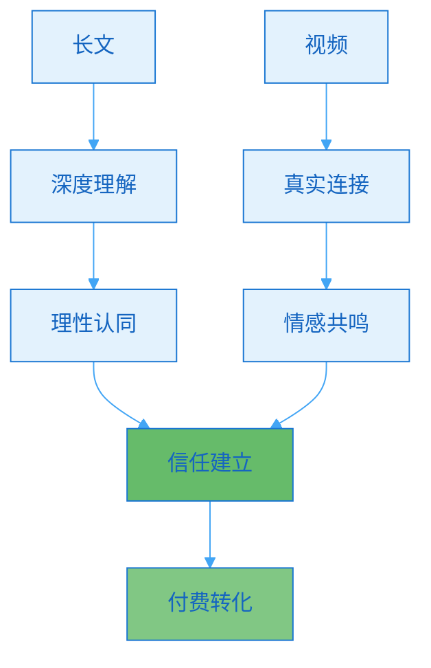
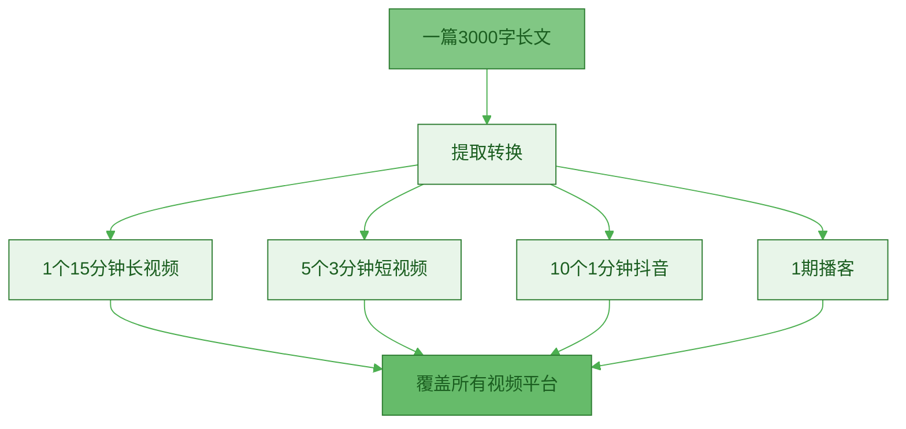
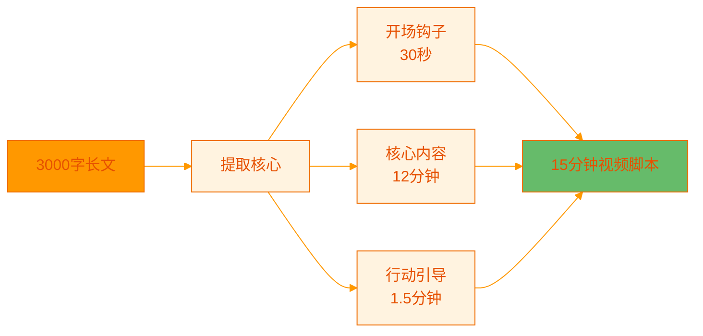
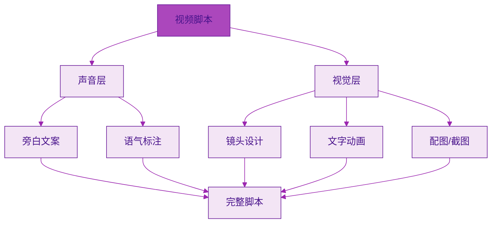
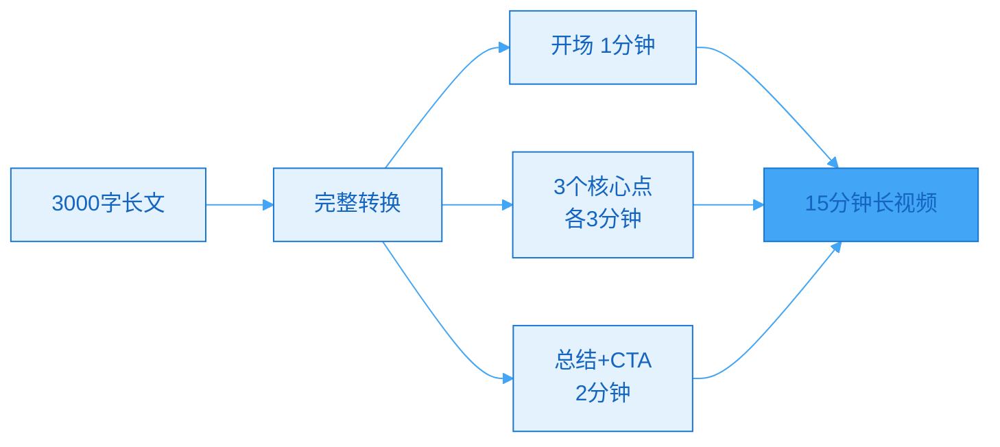
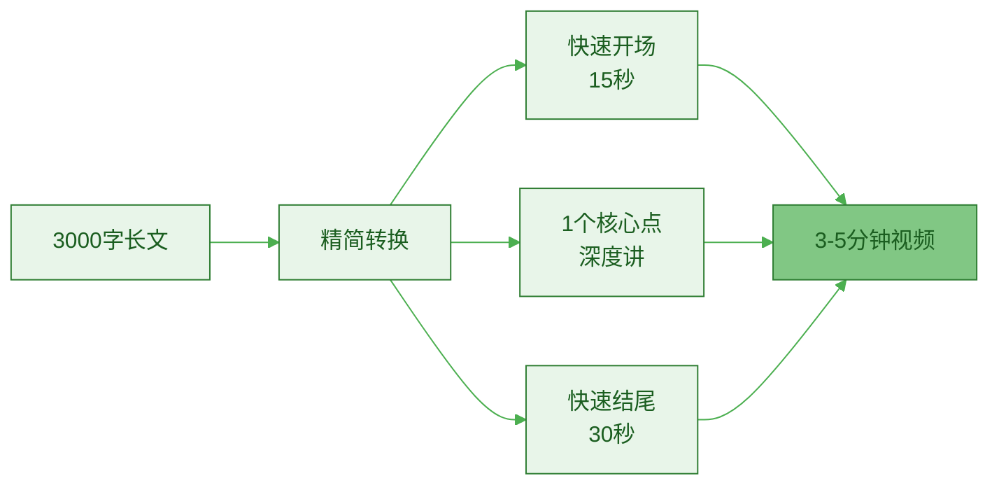
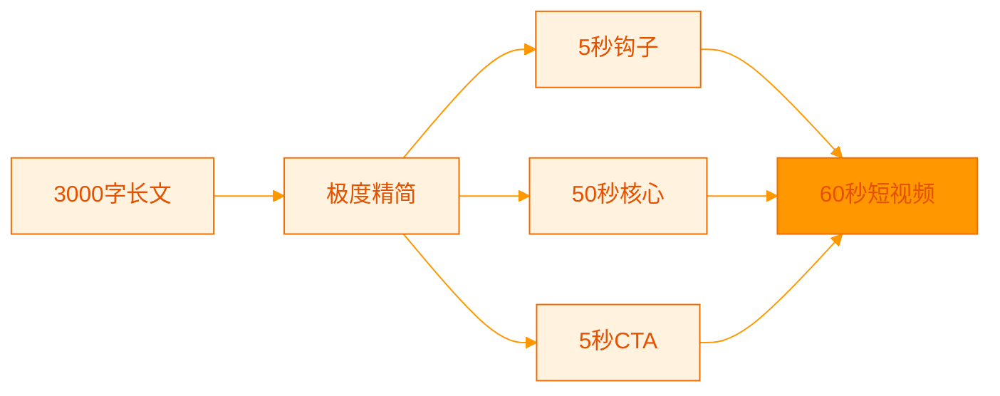

> [!quote] 视频是长文的放大器
> "长文建立深度，视频建立信任。
> 
> 文字让人理解，视频让人相信。
> 
> 一篇长文可以衍生出10个视频，这是二次杠杆。"
> ——来自 [[3. MDFriday 实战记录/03.网站/Dan Koe/视频笔记/8|内容生态系统]]

## 为什么要从长文转视频？

### 视频的独特价值

> [!important] 视频vs文字的差异
> 
> **文字的优势**：
> - 深度表达
> - 易于搜索
> - 可快速浏览
> - SEO友好
> 
> **视频的优势**：
> - 建立真实连接
> - 情感传递强
> - 降低理解门槛
> - 更容易传播



**数据支持**：

| 维度 | 纯文字 | 文字+视频 | 提升 |
|-----|--------|----------|------|
| **信任度** | 60分 | 85分 | +42% |
| **记忆留存** | 10% | 65% | +550% |
| **转化率** | 2% | 5% | +150% |
| **分享率** | 3% | 8% | +167% |

> [!success] 内容组合的力量
> 
> **创作者A**（只有长文）：
> - 月浏览：10,000
> - 转化率：2%
> - 月收入：$2,000
> 
> **创作者B**（长文+视频）：
> - 月浏览：10,000
> - 转化率：5%
> - 月收入：$5,000
> 
> **同样流量，2.5倍收入！**

### 长文到视频的效率优势

> [!tip] 一次创作，多次复用
> **不要为视频单独创作，从长文中提取。**



**时间对比**：

| 方式 | 创作时间 | 产出 | 效率 |
|-----|---------|------|------|
| **单独创作** | 3小时/视频 × 5 = 15小时 | 5个视频 | 1x |
| **长文转换** | 3小时长文 + 2小时转换 = 5小时 | 1篇长文 + 5个视频 | 3x |

## 长文到视频的五步转换法

### Step 1: 选择合适的长文

> [!tip] 不是所有长文都适合转视频
> **选择标准：有画面感、有故事性、有情感点**

**适合转视频的长文类型**：

| 类型 | 特点 | 转换难度 | 视频效果 |
|-----|------|---------|---------|
| **方法论** | 有步骤、可演示 | ⭐⭐ 简单 | ⭐⭐⭐⭐ |
| **个人故事** | 有情节、有转折 | ⭐ 简单 | ⭐⭐⭐⭐⭐ |
| **案例分析** | 有数据、有对比 | ⭐⭐⭐ 中等 | ⭐⭐⭐⭐ |
| **工具推荐** | 可展示、可演示 | ⭐⭐ 简单 | ⭐⭐⭐⭐ |
| **纯理论** | 抽象、难可视化 | ⭐⭐⭐⭐ 困难 | ⭐⭐ |

> [!check] 长文评估清单
> 
> **这篇长文适合转视频吗？**
> - [ ] 有明确的3-5个要点？
> - [ ] 有具体的案例或故事？
> - [ ] 有可展示的内容（截图、演示）？
> - [ ] 有情感点或痛点共鸣？
> - [ ] 标题有吸引力？
> 
> **如果满足3项以上，适合转视频**

> [!example] 长文选择案例
> 
> **文章A**："论内容创作的本质"
> - 纯理论阐述
> - 抽象概念多
> - 缺少具体案例
> - **评分**：不适合（2/5）
> 
> **文章B**："我如何用3个方法让效率提升5倍"
> - 有具体方法
> - 有个人故事
> - 有数据对比
> - 可演示步骤
> - **评分**：非常适合（5/5）

### Step 2: 提取核心结构

> [!tip] 视频需要更紧凑的结构
> **长文的详细 → 视频的精炼**



**结构转换对比**：

| 部分 | 长文结构 | 视频结构 | 时长 |
|-----|---------|---------|------|
| **开头** | 500字（背景+问题） | 钩子+价值预告 | 30秒 |
| **论点1** | 800字（详细论证） | 核心+案例 | 3分钟 |
| **论点2** | 800字（详细论证） | 核心+案例 | 3分钟 |
| **论点3** | 800字（详细论证） | 核心+案例 | 3分钟 |
| **结尾** | 300字（总结+延伸） | 回顾+CTA | 1.5分钟 |
| **总计** | 3000字 | 15分钟脚本 | |

> [!check] 结构提取清单
> 
> **从长文中提取**：
> - [ ] 最吸引人的开场（故事/数据/问题）
> - [ ] 3个核心要点（不要超过5个）
> - [ ] 每个要点的最佳案例（1个即可）
> - [ ] 关键数据或对比
> - [ ] 最强CTA
> 
> **删减内容**：
> - 次要论证
> - 过多案例
> - 细枝末节
> - 延伸阅读

### Step 3: 改写成口语化脚本

> [!tip] 视频脚本≠书面文字
> **写给耳朵听，不是写给眼睛看**

**书面语 vs 口语化**：

| 书面语 | 口语化 | 效果 |
|--------|--------|------|
| "首先，我们需要理解..." | "先说第一点..." | 更自然 |
| "根据研究数据显示..." | "你知道吗？数据发现..." | 更亲切 |
| "综上所述..." | "简单说就是..." | 更易懂 |
| "进行操作" | "去做" | 更直接 |

> [!check] 口语化改写清单
> 
> **语言调整**：
> - [ ] 使用短句（每句≤15字）
> - [ ] 删除书面语词汇
> - [ ] 增加口语连接词（"然后"、"接着"）
> - [ ] 使用问句增加互动
> - [ ] 加入个人化表达
> 
> **节奏控制**：
> - [ ] 每3-5句一个停顿点
> - [ ] 重点内容重复说明
> - [ ] 适当留白（思考时间）

> [!example] 改写案例对比
> 
> **原长文**（书面语）：
> ```
> 根据我的实践经验，时间块管理法是提升
> 工作效率最有效的方法之一。该方法的核心
> 理念是将一天的工作时间划分为若干个独立
> 的时间块，每个时间块专注于单一任务，
> 从而避免多任务切换带来的效率损失。
> ```
> 
> **视频脚本**（口语化）：
> ```
> 今天教你一个超实用的方法，
> 叫"时间块管理法"。
> 
> 什么意思呢？
> 
> 就是把你的一天，
> 切成一块一块的。
> 
> 比如说，
> 上午9点到11点，只写文章，
> 下午2点到4点，只回邮件。
> 
> 一次只做一件事，
> 别乱跳。
> 
> 这样效率会高很多。
> 
> 我自己用这个方法，
> 每天多完成3小时工作。
> ```

### Step 4: 增加视觉元素标注

> [!tip] 视频=声音+画面
> **在脚本中标注视觉呈现**



**视觉元素类型**：

| 元素 | 作用 | 使用时机 | 示例 |
|-----|------|---------|------|
| **文字动画** | 强调重点 | 关键观点 | "3个方法" 飞入 |
| **配图/图表** | 数据可视化 | 数据说明 | 对比图表 |
| **截图/录屏** | 实操演示 | 工具教学 | 软件操作录屏 |
| **场景切换** | 保持节奏 | 话题转换 | 不同拍摄场景 |
| **B-roll** | 增加丰富度 | 故事讲述 | 工作场景素材 |

> [!tip] 脚本标注格式
> 
> ```markdown
> ## 视频脚本：时间块管理法
> 
> ### 【开场】(0:00-0:30)
> 
> **[镜头：近景，看镜头]**
> 你每天忙到晚上10点，
> 但还是觉得啥都没干完？
> 
> **[文字动画：问题痛点]**
> - 事情很多
> - 时间不够
> - 效率很低
> 
> **[镜头：特写]**
> 今天教你一招，
> 让效率提升5倍！
> 
> **[文字动画：标题卡]**
> "时间块管理法"
> 
> ### 【正文】(0:30-3:00)
> 
> **[镜头：中景，自然交流]**
> 这个方法很简单。
> 
> **[切换：白板讲解]**
> 把你的一天，切成块。
> 
> **[动画：时间块示意图]**
> - 9-11点：深度工作
> - 11-12点：邮件处理
> - 2-4点：会议
> 
> **[镜头：回到主镜头]**
> 为什么这样有效？
> 
> **[录屏：展示工具]**
> 我用这个工具...
> ```

### Step 5: 制作拍摄提纲

> [!tip] 脚本≠一字不差念稿
> **脚本是地图，拍摄时可灵活调整**

**拍摄提纲模板**：

```markdown
# 视频拍摄提纲

## 基本信息
- 标题：《3个方法让效率提升5倍》
- 时长目标：12-15分钟
- 拍摄场景：书房+白板区
- 需要道具：iPad（演示）、白板、马克笔

## 镜头清单

### 主镜头（70%）
- 位置：书桌前
- 景别：中景+特写
- 用途：主要讲解

### 辅助镜头（30%）
- 白板讲解（方法演示）
- iPad录屏（工具演示）
- B-roll素材（工作场景）

## 分段拍摄计划

### Part 1：开场（0:00-0:30）
**核心信息**：
- 提出问题（效率低）
- 承诺价值（提升5倍）
- 预告内容（3个方法）

**拍摄要点**：
- 能量要高
- 语速适中
- 看镜头

### Part 2：方法1（0:30-3:00）
**核心信息**：
- 时间块管理法
- 为什么有效
- 如何操作

**拍摄要点**：
- 切换到白板
- 边说边画
- 展示时间块示意图

（以此类推...）

## 后期清单
- [ ] 添加背景音乐
- [ ] 插入文字动画
- [ ] 配图/数据可视化
- [ ] 字幕
- [ ] 封面制作
```

## 三种视频长度的转换策略

### 长视频（10-15分钟）

> [!tip] 深度讲解，完整价值
> **适合：YouTube、B站**



**转换策略**：
- 保留完整框架
- 每个要点详细展开
- 包含案例和演示
- 可以深入讲解

**内容分配**：

| 部分 | 时长 | 内容 |
|-----|------|------|
| **开场** | 1分钟 | 钩子+问题+价值预告 |
| **论点1** | 3-4分钟 | 方法+原理+案例 |
| **论点2** | 3-4分钟 | 方法+原理+案例 |
| **论点3** | 3-4分钟 | 方法+原理+案例 |
| **总结** | 2分钟 | 回顾+行动+CTA |

### 中视频（3-5分钟）

> [!tip] 核心精华，快速价值
> **适合：B站、小红书、视频号**



**转换策略**：
- 只讲1个核心要点
- 删减次要信息
- 保留最佳案例
- 节奏更快

**一篇长文 → 3个中视频**：
- 视频1：讲论点1
- 视频2：讲论点2
- 视频3：讲论点3

### 短视频（60-90秒）

> [!tip] 单一金句，引流导流
> **适合：抖音、快手、Instagram Reels**



**转换策略**：
- 只讲1个点的1个面
- 开场3秒抓住注意力
- 节奏极快
- 引导看完整版

**一篇长文 → 10个短视频**：
- 最震撼的数据
- 最反直觉的观点
- 最实用的技巧
- 最有趣的案例
- ...

> [!example] 短视频脚本示例
> 
> **标题**：你的效率为什么这么低？
> 
> **脚本**（60秒）：
> ```
> [0-3秒] [特写] [语速快]
> 你知道为什么你效率低吗？
> 
> [3-8秒] [数据动画]
> 研究发现，
> 每次切换任务，
> 需要15分钟恢复专注。
> 
> [8-15秒] [镜头] [强调]
> 也就是说，
> 你每天切换20次，
> 就浪费5小时！
> 
> [15-45秒] [快速讲解]
> 解决方法：
> 时间块管理法。
> 
> 把任务分块，
> 一次只做一件事。
> 
> 我自己实践后，
> 每天多完成3小时工作。
> 
> [45-55秒] [展示结果]
> 从每周只能写1篇文章，
> 到每周轻松产出5篇。
> 
> [55-60秒] [CTA]
> 想学完整方法？
> 看我主页长视频！
> ```

## 常见问题

### Q1: 不会拍视频怎么办？

> [!success] 从最简单的开始
> 
> **Level 1**：纯口述+字幕
> - 只需手机+稳定器
> - 对着镜头说
> - 后期加字幕
> 
> **Level 2**：口述+PPT
> - 录制PPT演示
> - 配音讲解
> - 简单剪辑
> 
> **Level 3**：真人出镜+辅助画面
> - 主镜头+B-roll
> - 动画+文字
> - 专业剪辑
> 
> **建议**：从Level 1开始，完成>完美

### Q2: 口播总是忘词怎么办？

> [!tip] 提词器+分段拍摄
> 
> **工具**：
> - 手机提词器App
- iPad作为提词器
> - 电脑屏幕提词器软件
> 
> **技巧**：
> - 不要背诵整段
> - 记住要点，自由发挥
> - 每段1-2分钟，分开拍
> - NG就重拍，不要怕

### Q3: 一篇长文应该转几个视频？

> [!important] 根据平台和目标
> 
> **最小配置**（节省时间）：
> - 1个长视频（YouTube/B站）
> - 3个短视频（引流）
> 
> **标准配置**（效果平衡）：
> - 1个长视频
> - 3个中视频（拆分3个要点）
> - 5个短视频
> 
> **完整配置**（价值最大化）：
> - 1个长视频
> - 5个中视频
> - 10个短视频

## 行动指南

### 本周视频转换实践

> [!check] Week 1 行动
> 
> **Day 1**: 选择长文
> - [ ] 从已发布长文中选择1篇
> - [ ] 评估是否适合转视频
> 
> **Day 2**: 提取结构
> - [ ] 提取3个核心要点
> - [ ] 选择最佳案例
> 
> **Day 3**: 改写脚本
> - [ ] 口语化改写
> - [ ] 标注视觉元素
> 
> **Day 4-5**: 拍摄
> - [ ] 准备拍摄场地
> - [ ] 分段拍摄
> 
> **Day 6**: 剪辑
> - [ ] 基础剪辑
> - [ ] 添加字幕
> 
> **Day 7**: 发布
> - [ ] 上传到平台
> - [ ] 引导到长文

### 脚本转换模板

> [!tip] 可复用的转换模板
> 
> ```markdown
> # 视频脚本模板
> 
> ## 【开场】(0:00-0:30)
> 
> ### 钩子（3-5秒）
> [震撼数据/反直觉观点/痛点共鸣]
> 
> ### 价值预告（10秒）
> 今天教你[具体方法]
> 让你[具体结果]
> 
> ### 自我介绍（5秒）
> 我是XX，[简短定位]
> 
> ### 内容预告（10秒）
> 这个视频你将学会：
> 1. XX
> 2. XX
> 3. XX
> 
> ## 【正文】(0:30-12:00)
> 
> ### 要点1（3-4分钟）
> - 是什么
> - 为什么有效
> - 怎么做
> - 案例演示
> 
> ### 要点2（3-4分钟）
> [重复结构]
> 
> ### 要点3（3-4分钟）
> [重复结构]
> 
> ## 【结尾】(12:00-13:30)
> 
> ### 回顾（30秒）
> 总结3个要点
> 
> ### 行动引导（30秒）
> 现在就去试试吧
> 
> ### CTA（30秒）
> - 点赞收藏
> - 关注获取更多
> - 评论区交流
> - 看我主页长文
> ```

## 总结

> [!quote] 核心要点
> "长文建立深度，视频建立信任。
> 
> 一篇长文可以转换成10+个视频：
> 1个长视频 + 3个中视频 + 10个短视频
> 
> 五步转换法：
> 1. 选择合适长文
> 2. 提取核心结构
> 3. 改写口语化脚本
> 4. 增加视觉标注
> 5. 制作拍摄提纲
> 
> 从简单开始，持续优化。"

### 转换效率对比

| 方式 | 时间投入 | 产出 | ROI |
|-----|---------|------|-----|
| **单独创作** | 3小时/视频 × 10 = 30小时 | 10个视频 | 1x |
| **长文转换** | 3小时长文 + 5小时转换 = 8小时 | 1长文 + 10视频 | 3.75x |

### 关键原则

> [!important] 记住这三点
> 
> 1. **不要从零开始**
>    - 长文是视频的素材库
>    - 提取比创作更高效
> 
> 2. **口语化是关键**
>    - 写给耳朵听
>    - 不是写给眼睛看
> 
> 3. **从简单开始**
>    - Level 1: 手机+口述
>    - 完成>完美
>    - 持续迭代

### 下一步阅读

- [[b.视频的信任增强作用|视频的信任增强作用]]
- [[c.内容形式层级模型|内容形式层级模型]]
- [[../10.建立个人网站/a.为什么必需拥有自己的阵地|为什么必需拥有自己的阵地]]

---

**让长文的价值通过视频放大10倍！**
