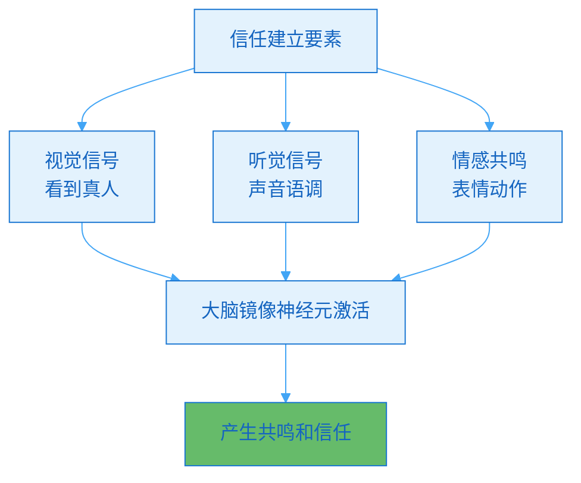
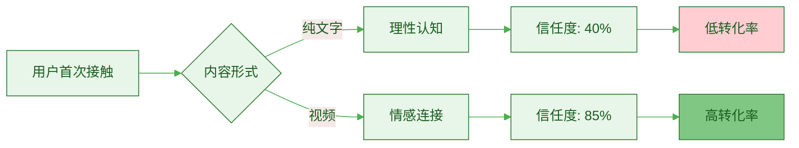
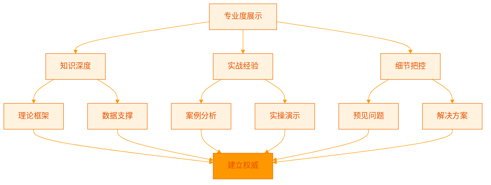
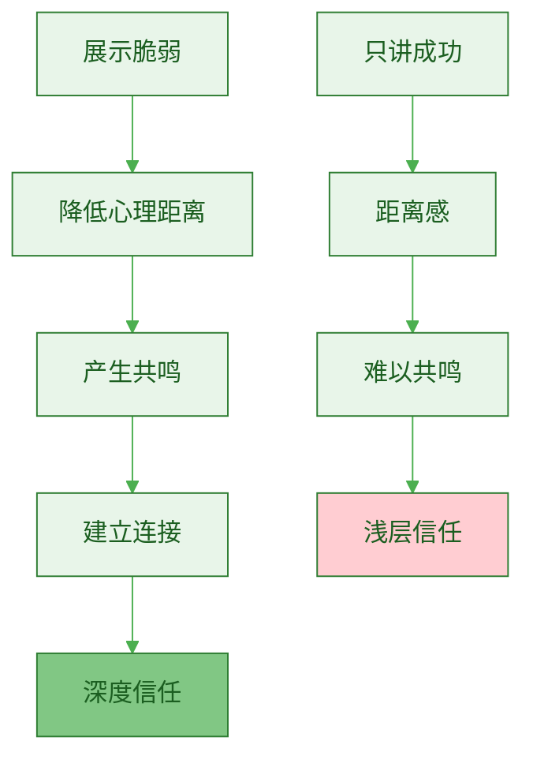
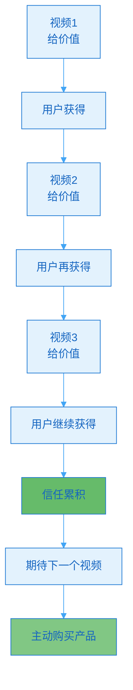
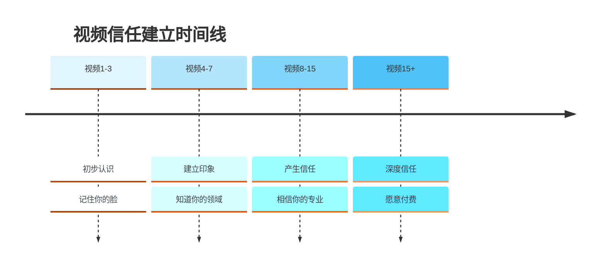

> [!quote] 信任是转化的前提
> "人们向他们信任的人购买。
> 
> 文字建立认知，视频建立信任。
> 
> 看到你的脸、听到你的声音，信任度提升300%。"
> ——来自 [[3. MDFriday 实战记录/03.网站/Dan Koe/视频笔记/14|一人商业的未来]]

## 视频为什么能建立信任？

### 信任建立的心理学原理

> [!important] 真实性的力量
> **人类天生对"真人"有更高的信任度。**



**三个信任层级**：

| 层级 | 媒介 | 信任度 | 原因 |
|-----|------|--------|------|
| **L1** | 纯文字 | 40分 | 无法判断真实性 |
| **L2** | 文字+照片 | 60分 | 有视觉但无动态 |
| **L3** | 视频 | 85分 | 全方位真实展示 |

> [!success] 数据支持
> 
> **神经科学研究发现**：
> - 看到真人脸部，大脑信任区域活跃度提升60%
> - 听到真人声音，情感共鸣提升45%
> - 视频中的微表情，传递大量潜意识信息
> 
> **HubSpot调研**（2024）：
> - 观看过创作者视频的用户，购买意愿提升80%
> - 看过3个以上视频的用户，转化率提升300%
> - 视频长度>5分钟，信任度建立效果最佳

### 视频vs文字的信任差异

> [!example] 真实案例对比
> 
> **创作者A**（只有文字）：
> - 粉丝：5万
> - 月浏览：20万
> - 推出$199课程
> - 转化率：1%
> - 销量：200人
> - 收入：$39,800
> 
> **创作者B**（文字+视频）：
> - 粉丝：5万
> - 月浏览：20万
> - 推出$199课程
> - 转化率：4%
> - 销量：800人
> - 收入：$159,200
> 
> **同样粉丝和流量，B的收入是A的4倍！**



## 视频建立信任的六大机制

### 机制1: 真实性展示（Authenticity）

> [!tip] 让用户看到"真实的你"
> **不完美反而更真实，更可信。**

**真实性的三个层次**：

| 层次 | 表现 | 效果 | 示例 |
|-----|------|------|------|
| **外在真实** | 真人出镜 | ⭐⭐⭐ | 不用特效美颜 |
| **行为真实** | 自然表达 | ⭐⭐⭐⭐ | 偶尔口误、停顿 |
| **情感真实** | 真情流露 | ⭐⭐⭐⭐⭐ | 分享真实感受 |

> [!check] 真实性检查清单
> 
> **做到真实**：
> - [ ] 真人出镜（不要总是画外音）
> - [ ] 真实场景（不要过度布景）
> - [ ] 自然表达（不要过度表演）
> - [ ] 分享真实故事（包括失败）
> - [ ] 展示真实情感（不要刻意掩饰）
> 
> **避免虚假**：
> - ❌ 过度美颜（不真实）
> - ❌ 完美表现（不可信）
> - ❌ 只讲成功（不完整）
> - ❌ 读稿子（不自然）

> [!example] 真实性的力量
> 
> **视频A**（过度包装）：
> - 完美妆容+专业布景
> - 一字不差读稿
> - 只讲成功案例
> - 评论："感觉很假"
> - 转化率：0.8%
> 
> **视频B**（真实自然）：
> - 素颜+家里书房
> - 偶尔口误重说
> - 分享失败教训
> - 评论："很真诚，值得信任"
> - 转化率：3.5%
> 
> **真实>完美**

### 机制2: 专业度展示（Expertise）

> [!tip] 证明你真的懂
> **视频能展示你的知识深度和实战经验。**



**专业度的展示方式**：

| 方式 | 效果 | 实施 |
|-----|------|------|
| **理论阐述** | ⭐⭐⭐ | 清晰讲解底层逻辑 |
| **数据引用** | ⭐⭐⭐⭐ | 引用研究数据 |
| **案例分析** | ⭐⭐⭐⭐ | 深度剖析案例 |
| **实操演示** | ⭐⭐⭐⭐⭐ | 手把手教学 |
| **问题预判** | ⭐⭐⭐⭐⭐ | 提前回答疑问 |

> [!example] 专业度展示案例
> 
> **业余表现**：
> ```
> "时间管理很重要，
> 大家要合理安排时间。
> 我自己也在学习..."
> ```
> → 结果：用户觉得你也不专业
> 
> **专业表现**：
> ```
> "时间管理的核心是能量管理。
> 
> MIT的研究发现，
> 人的认知能量呈波动曲线，
> 上午9-11点是黄金时间。
> 
> 我自己实践3年，
> 测试了15种方法，
> 发现时间块管理法最有效。
> 
> 具体怎么做呢？
> 我现在演示给你看...
> 
> [开始录屏演示]
> 
> 你可能会遇到这3个问题：
> 1. 被打断怎么办？
> 2. 临时任务怎么处理？
> 3. 计划赶不上变化？
> 
> 我一个个告诉你解决方法...
> ```
> → 结果：用户觉得你很专业

### 机制3: 一致性强化（Consistency）

> [!tip] 持续出现，加深印象
> **看到你3次，记住你；看到你10次，信任你。**


**一致性的三个维度**：

| 维度 | 说明 | 如何做 |
|-----|------|--------|
| **视觉一致** | 认出你 | 固定拍摄场景、风格 |
| **内容一致** | 认可你的价值观 | 坚持核心主题 |
| **更新一致** | 养成观看习惯 | 固定更新频率 |

> [!check] 一致性策略
> 
> **视觉一致性**：
> - [ ] 固定的拍摄背景
> - [ ] 统一的视觉风格
> - [ ] 标志性的开场/结尾
> - [ ] 个人特色（穿着、道具）
> 
> **内容一致性**：
> - [ ] 聚焦3-5个核心主题
> - [ ] 保持价值观一致
> - [ ] 不追逐所有热点
> 
> **更新一致性**：
> - [ ] 每周至少1个视频
> - [ ] 固定发布时间
> - [ ] 告知粉丝更新节奏

> [!example] 一致性的力量
> 
> **创作者A**（不一致）：
> - 今天谈效率，明天谈投资，后天谈美食
> - 有时一天3个视频，有时1个月不更新
> - 每个视频风格完全不同
> - 结果：粉丝困惑，取关率高
> 
> **创作者B**（一致）：
> - 只谈"一人公司"相关内容
> - 每周三、周六固定更新
> - 统一的视觉风格和开场白
> - 结果：粉丝粘性高，信任度强

### 机制4: 脆弱性展示（Vulnerability）

> [!tip] 分享失败和挣扎
> **完美的人不可信，有缺陷的人更真实。**

**脆弱性的价值**：



**什么可以分享？**

| 内容 | 价值 | 示例 |
|-----|------|------|
| **失败经历** | ⭐⭐⭐⭐⭐ | "我第一次创业亏了10万" |
| **困惑时刻** | ⭐⭐⭐⭐ | "当时我也不知道该怎么办" |
| **错误决策** | ⭐⭐⭐⭐ | "这个选择我现在很后悔" |
| **情绪挣扎** | ⭐⭐⭐⭐⭐ | "那段时间我每天焦虑到失眠" |

> [!warning] 脆弱≠诉苦
> 
> **正确的脆弱性**：
> - ✅ 分享困难 + 如何克服
> - ✅ 展示过程 + 学到的教训
> - ✅ 真实情感 + 积极态度
> 
> **错误的脆弱性**：
> - ❌ 纯粹抱怨
> - ❌ 一味诉苦
> - ❌ 负能量过载

> [!example] 脆弱性案例
> 
> **错误示范**：
> ```
> "我太惨了，创业失败，
> 亏了很多钱，
> 现在特别迷茫，
> 不知道怎么办..."
> ```
> → 结果：用户觉得你不行
> 
> **正确示范**：
> ```
> "2023年，我第一次创业，
> 亏了10万。
> 
> 那段时间真的很难，
> 每天焦虑到失眠。
> 
> 但我从那次失败中，
> 学到了3个重要教训：
> 1. XX
> 2. XX
> 3. XX
> 
> 正是这些教训，
> 让我在第二次创业时，
> 3个月就实现了盈利。
> 
> 如果你也在创业，
> 希望我的经历能帮到你..."
> ```
> → 结果：用户觉得你真实可信

### 机制5: 互动感建立（Engagement）

> [!tip] 让用户感觉在和你对话
> **视频不是单向输出，而是双向交流。**

**互动感的营造方式**：

| 技巧 | 效果 | 实施 |
|-----|------|------|
| **直视镜头** | ⭐⭐⭐⭐⭐ | 眼神接触感 |
| **提问引导** | ⭐⭐⭐⭐ | "你有没有遇到...?" |
| **停顿留白** | ⭐⭐⭐ | 给思考时间 |
| **评论互动** | ⭐⭐⭐⭐⭐ | 回复评论 |
| **称呼观众** | ⭐⭐⭐⭐ | "朋友们"、"大家" |

> [!check] 互动感清单
> 
> **镜头技巧**：
> - [ ] 看镜头，不看提词器
> - [ ] 微笑和自然表情
> - [ ] 手势辅助表达
> 
> **语言技巧**：
> - [ ] 使用"你"而不是"大家"
> - [ ] 提出问题让用户思考
> - [ ] 给出选择题让用户参与
> 
> **评论区**：
> - [ ] 回复前100条评论
> - [ ] 置顶优质评论
> - [ ] 在视频中提到粉丝留言

> [!example] 互动感对比
> 
> **单向输出**：
> ```
> "今天讲时间管理。
> 第一个方法是XX，
> 第二个方法是XX，
> 第三个方法是XX。
> 讲完了，再见。"
> ```
> → 感觉：在听讲座
> 
> **双向互动**：
> ```
> [看镜头]
> "朋友，你是不是也有这个困扰？
> 
> 每天忙到晚上10点，
> 但还是觉得啥都没干完？
> 
> [停顿2秒]
> 
> 如果你点头了，
> 今天这个方法一定能帮到你。
> 
> 在讲方法之前，
> 我想问你一个问题：
> 你觉得你效率低，
> 是因为时间不够，
> 还是因为方法不对？
> 
> [停顿思考]
> 
> 其实答案是...
> 
> [讲解方法]
> 
> 好，现在你学会了，
> 有没有什么疑问？
> 在评论区告诉我，
> 我会一一回复。"
> ```
> → 感觉：在和朋友聊天

### 机制6: 价值持续交付（Value Delivery）

> [!tip] 每个视频都给实际价值
> **信任来自于持续的价值证明。**



**价值交付的标准**：

| 标准 | 说明 | 检查 |
|-----|------|------|
| **立即可用** | 看完就能做 | 是否给出具体步骤？ |
| **解决问题** | 真正有帮助 | 是否解决实际痛点？ |
| **超出预期** | 比标题承诺更多 | 是否有额外赠送？ |

> [!check] 价值交付清单
> 
> **每个视频必须**：
> - [ ] 解决1个具体问题
> - [ ] 提供可执行的步骤
> - [ ] 给出实际案例
> - [ ] 预见常见问题
> - [ ] 额外附赠资源
> 
> **避免**：
> - ❌ 标题党（承诺但不兑现）
> - ❌ 纯理论（没有实操）
> - ❌ 过度营销（全程推销）

> [!example] 价值交付案例
> 
> **低价值视频**：
> ```
> 标题："3个方法提升效率"
> 
> 内容：
> - 方法1：合理安排时间
> - 方法2：提高专注力
> - 方法3：保持好心态
> 
> 结尾：想学更多？买我的课程
> ```
> → 结果：用户失望，取关
> 
> **高价值视频**：
> ```
> 标题："3个方法让效率提升5倍"
> 
> 内容：
> - 方法1：时间块管理
>   - 为什么有效（原理）
>   - 怎么做（5个步骤）
>   - 我的实践（案例）
>   - 常见问题（FAQ）
> 
> [同样展开方法2、3]
> 
> 额外赠送：
> - 我的时间块模板（免费下载）
> - 推荐工具清单
> 
> 结尾：这3个方法你都学会了，
> 现在就去试试吧！
> 
> 如果想更深入学习，
> 我的长文有更详细内容。
> ```
> → 结果：用户满意，主动关注

## 视频信任度的量化追踪

### 信任度指标

> [!tip] 如何衡量视频是否建立信任？
> **追踪这些关键指标：**

**核心指标**：

| 指标 | 说明 | 目标值 | 如何提升 |
|-----|------|--------|---------|
| **完播率** | 看完的比例 | >40% | 内容紧凑，节奏好 |
| **重复观看** | 看多次的人数 | >10% | 内容有价值 |
| **评论质量** | 深度互动 | 长评论占30%+ | 引发思考 |
| **转化率** | 点击引导链接 | >5% | 建立足够信任 |
| **回访率** | 看下一个视频 | >50% | 期待你的内容 |

**信任度计算公式**：

```
信任指数 = 
  完播率 × 30% +
  评论互动率 × 25% +
  转化点击率 × 25% +
  回访率 × 20%

优秀：>75分
良好：60-75分
及格：45-60分
差：<45分
```

> [!example] 信任度对比
> 
> **视频A**（信任度45分）：
> - 完播率：25%
> - 评论率：2%
> - 转化率：0.5%
> - 回访率：20%
> - **问题**：内容质量或信任度不足
> 
> **视频B**（信任度82分）：
> - 完播率：55%
> - 评论率：8%
> - 转化率：6%
> - 回访率：65%
> - **成功**：高信任度

## 常见问题

### Q1: 不敢出镜怎么办？

> [!success] 逐步建立信心
> 
> **阶段1**：画外音+屏幕录制
> - 先适应录视频
> - 不需要出镜
> 
> **阶段2**：只露手部
> - 演示操作
> - 部分出镜
> 
> **阶段3**：侧脸/远景
> - 逐步适应
> - 降低紧张感
> 
> **阶段4**：正面出镜
> - 建立信心后
> - 自然表达
> 
> **记住**：
> - 前10个视频都会不自然
> - 持续练习会越来越好
> - 真实>完美

### Q2: 担心被评价怎么办？

> [!tip] 正确看待评论
> 
> **心态调整**：
> - 90%的人不会评论
> - 5%会说好话
> - 5%会说坏话
> - 关注那5%的好评，忽略恶意差评
> 
> **应对策略**：
> - 关闭评论通知（避免焦虑）
> - 每天固定时间回复（不随时看）
> - 拉黑恶意评论（保护心态）
> - 珍惜建设性批评（优化内容）

### Q3: 视频时长多少最合适？

> [!important] 根据平台和内容
> 
> **短视频**（抖音、快手）：
> - 最佳：60-90秒
> - 建立初步印象
> 
> **中视频**（视频号、小红书）：
> - 最佳：3-5分钟
> - 建立基础信任
> 
> **长视频**（YouTube、B站）：
> - 最佳：10-20分钟
> - 建立深度信任
> 
> **播客/深度视频**：
> - 最佳：30-60分钟
> - 建立强信任关系

## 行动指南

### 本周信任建立实践

> [!check] Week 1 行动
> 
> **Day 1**: 规划内容
> - [ ] 选择一个真实故事
> - [ ] 规划如何展示专业度
> 
> **Day 2-3**: 拍摄
> - [ ] 真实出镜
> - [ ] 自然表达
> - [ ] 展示脆弱性
> 
> **Day 4**: 剪辑
> - [ ] 保留真实时刻
> - [ ] 不过度修饰
> 
> **Day 5-7**: 发布与互动
> - [ ] 发布视频
> - [ ] 积极回复评论
> - [ ] 追踪信任指标

### 信任建立检查清单

> [!tip] 每个视频发布前检查
> 
> **真实性**：
> - [ ] 真人出镜
> - [ ] 自然表达
> - [ ] 分享真实故事
> 
> **专业度**：
> - [ ] 有理论支撑
> - [ ] 有数据引用
> - [ ] 有实操演示
> 
> **一致性**：
> - [ ] 视觉风格统一
> - [ ] 内容主题聚焦
> 
> **脆弱性**：
> - [ ] 分享失败经历
> - [ ] 展示真实情感
> 
> **互动感**：
> - [ ] 直视镜头
> - [ ] 提问引导
> - [ ] 评论区互动
> 
> **价值交付**：
> - [ ] 解决具体问题
> - [ ] 给出实操步骤
> - [ ] 超出预期

## 总结

> [!quote] 核心要点
> "视频建立信任的六大机制：
> 
> 1. 真实性展示 - 不完美更可信
> 2. 专业度展示 - 证明你真的懂
> 3. 一致性强化 - 持续出现加深印象
> 4. 脆弱性展示 - 分享失败建立连接
> 5. 互动感建立 - 双向交流非单向输出
> 6. 价值持续交付 - 每次都给实际价值
> 
> 信任=转化率提升300%"

### 信任建立路径



### 关键原则

> [!important] 记住这三点
> 
> 1. **真实>完美**
>    - 不要过度包装
>    - 展示真实的你
> 
> 2. **价值>营销**
>    - 80%给价值
>    - 20%做引导
> 
> 3. **一致>频繁**
>    - 保持更新节奏
>    - 不要三天打鱼两天晒网

### 下一步阅读

- [[c.内容形式层级模型|内容形式层级模型]]
- [[../10.建立个人网站/a.为什么必需拥有自己的阵地|为什么必需拥有自己的阵地]]
- [[../11.内容产品化路径/a.电子书|电子书]]

---

**视频建立信任，信任带来转化！**
