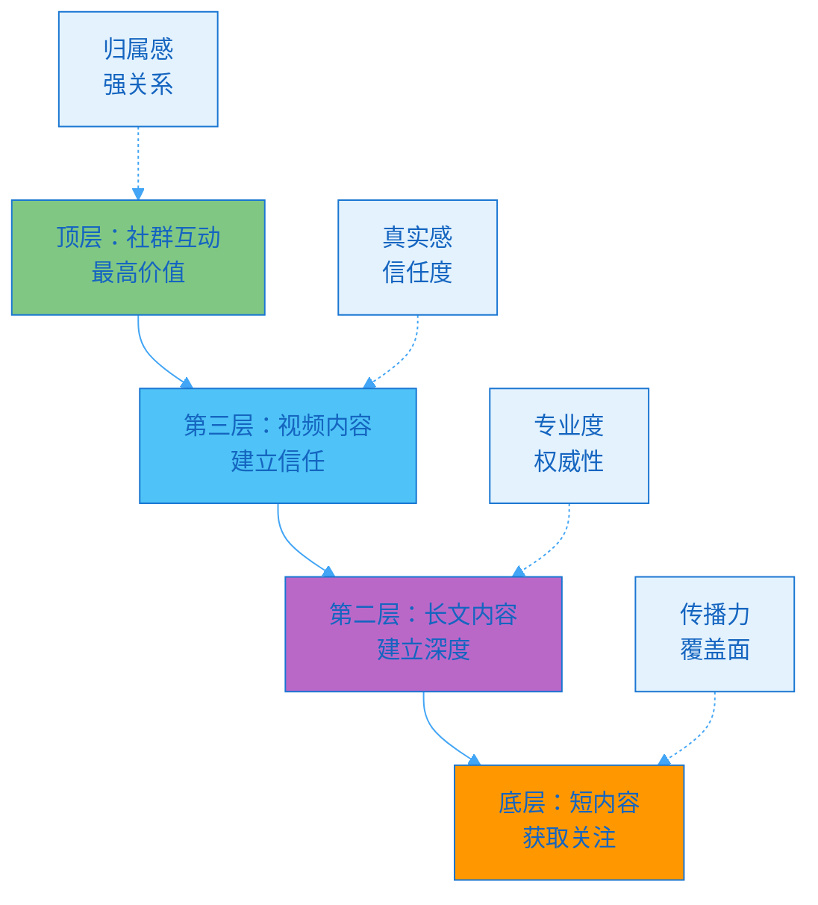
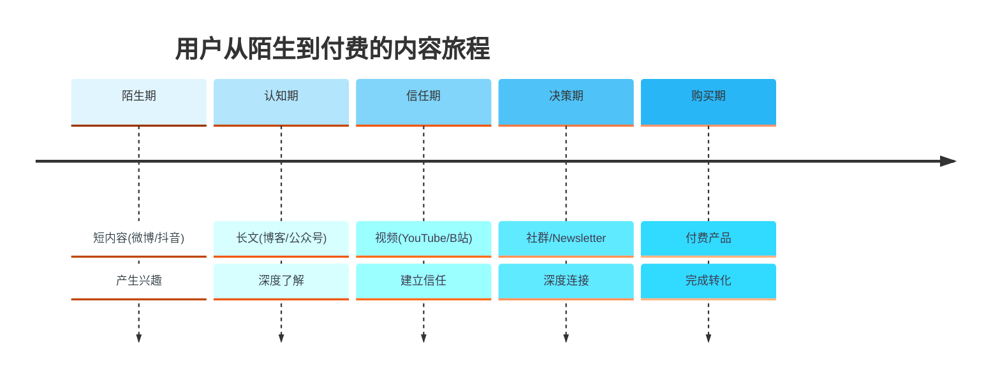
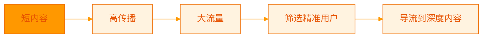
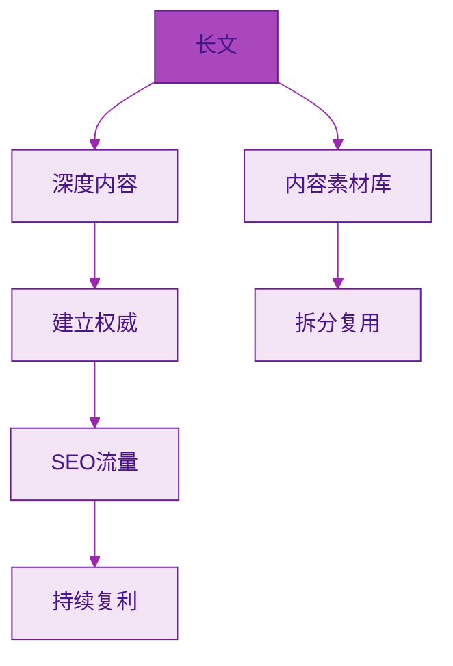
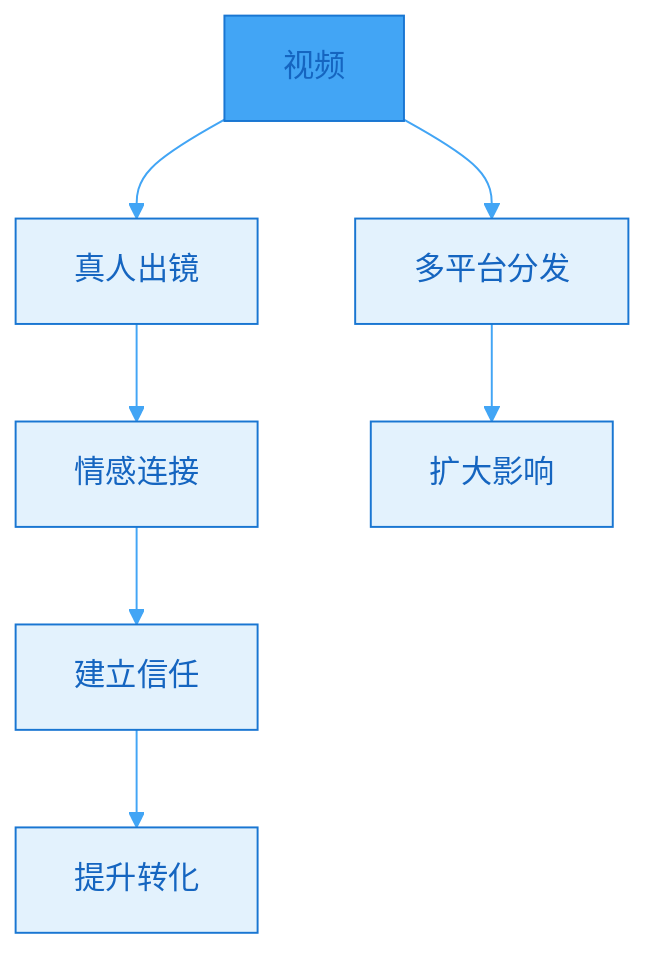
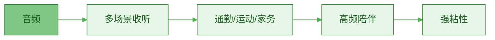
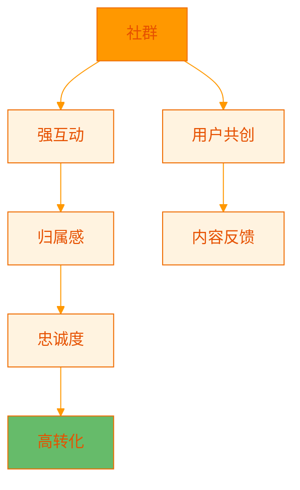
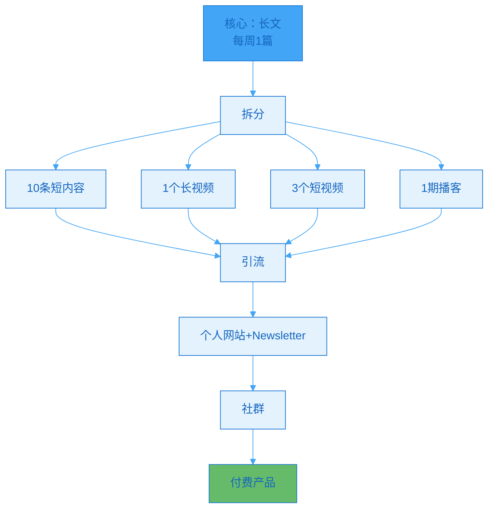
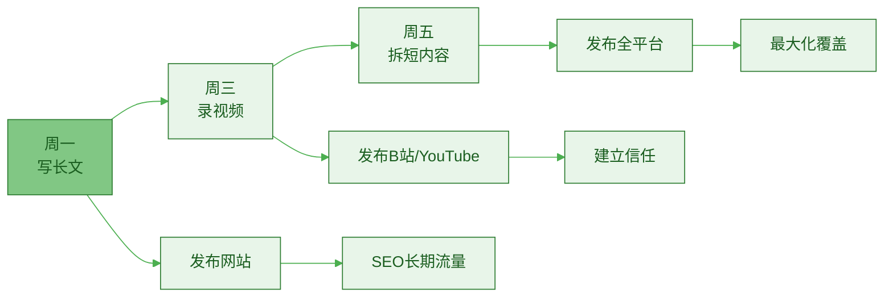
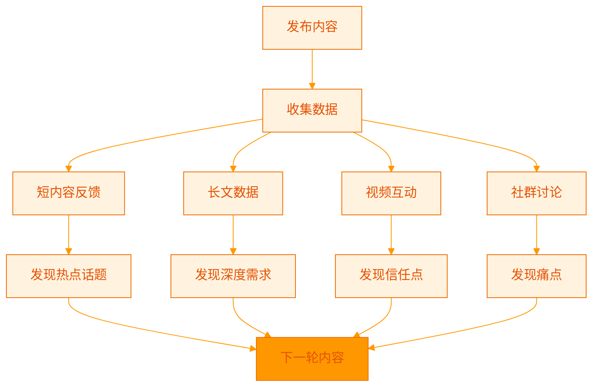

> [!quote] 内容形式的协同效应
> "不同的内容形式不是竞争关系，而是协同关系。
> 
> 文字建立深度，视频建立信任，音频建立陪伴，社群建立归属。
> 
> 组合使用，价值最大化。"
> ——来自 [[3. MDFriday 实战记录/03.网站/Dan Koe/视频笔记/8|内容生态系统]]

## 内容形式的价值层级

### 四层金字塔模型

**价值层级对比**：

| 层级 | 形式 | 主要作用 | 价值密度 | 转化率 | 适用阶段 |
|-----|------|---------|---------|--------|---------|
| **L1** | 短内容 | 吸引关注 | ⭐ | 0.5% | 冷启动 |
| **L2** | 长文 | 建立专业 | ⭐⭐⭐ | 2% | 沉淀期 |
| **L3** | 视频 | 建立信任 | ⭐⭐⭐⭐ | 5% | 增长期 |
| **L4** | 社群 | 归属感 | ⭐⭐⭐⭐⭐ | 15% | 变现期 |

> [!important] 关键认知
> 
> **不是选择，而是组合**：
> - 不是"只做视频"或"只写文章"
> - 而是建立完整的内容体系
> - 不同形式服务不同目的
> - 协同效应最大化价值

### 用户旅程与内容形式

> [!success] 完整转化路径
> 
> **用户小王的旅程**：
> 
> **Day 1**（陌生期）：
> - 在小红书看到你的一条笔记
> - 内容有用，点了关注
> 
> **Day 7**（认知期）：
> - 又看到几条你的短内容
> - 点击链接进入你的网站
> - 读了一篇长文，觉得很专业
> - 订阅了Newsletter
> 
> **Day 30**（信任期）：
> - Newsletter推送了你的新视频
> - 看完视频，觉得你很真实
> - 连续看了5个视频
> - 对你产生信任
> 
> **Day 60**（决策期）：
> - 加入了你的免费社群
> - 看到其他人的好评
> - 决定购买你的产品
> 
> **Day 61**（购买期）：
> - 花$199购买课程
> - 成为付费用户

## 内容形式的详细解析

### 形式1: 短内容（关注层）

> [!tip] 作用：最大化覆盖，获取关注
> **特点：传播快，但价值浅**

**主要平台**：

| 平台 | 形式 | 最佳长度 | 优势 |
|-----|------|---------|------|
| **微博** | 图文 | 200字 | 传播快 |
| **小红书** | 图文 | 500字+配图 | 年轻女性用户 |
| **抖音** | 短视频 | 60秒 | 算法推荐强 |
| **快手** | 短视频 | 60秒 | 下沉市场 |
| **Twitter** | 文字 | 280字 | 国际化 |

**最佳实践**：

> [!check] 短内容策略
> 
> **内容设计**：
> - [ ] 一个核心观点
> - [ ] 有冲突或反差
> - [ ] 3秒抓住注意力
> - [ ] 引导到长内容
> 
> **发布策略**：
> - [ ] 每天1-3条
> - [ ] 从长文中提取
> - [ ] 测试不同角度
> - [ ] 数据驱动优化

### 形式2: 长文（深度层）

> [!tip] 作用：建立专业度，展示深度
> **特点：SEO友好，持续价值**

**主要平台**：

| 平台 | 形式 | 最佳长度 | 优势 |
|-----|------|---------|------|
| **个人网站** | 博客 | 2000-5000字 | 完全掌控 |
| **知乎** | 回答/文章 | 1000-3000字 | SEO好 |
| **公众号** | 图文 | 1500-3000字 | 私域沉淀 |
| **Medium** | 文章 | 1500-2500字 | 国际化 |

**最佳实践**：

> [!check] 长文策略
> 
> **内容设计**：
> - [ ] 系统化框架
> - [ ] 深度案例分析
> - [ ] 数据支撑
> - [ ] 可操作性强
> 
> **发布策略**：
> - [ ] 每周1-2篇
> - [ ] 发布到自己网站
> - [ ] 同步到其他平台
> - [ ] 持续优化迭代

### 形式3: 视频（信任层）

> [!tip] 作用：建立真实连接，产生信任
> **特点：信任度高，制作成本高**

**主要平台**：

| 平台 | 形式 | 最佳时长 | 优势 |
|-----|------|---------|------|
| **YouTube** | 长视频 | 10-20分钟 | 全球最大 |
| **B站** | 长视频 | 10-15分钟 | 年轻用户 |
| **抖音** | 短视频 | 60秒 | 算法推荐 |
| **视频号** | 中视频 | 3-5分钟 | 微信生态 |

**最佳实践**：

> [!check] 视频策略
> 
> **内容设计**：
> - [ ] 真人出镜
> - [ ] 故事化表达
> - [ ] 实操演示
> - [ ] 真实案例
> 
> **发布策略**：
> - [ ] 每周1-2个长视频
> - [ ] 拆分成多个短视频
> - [ ] 跨平台分发
> - [ ] 引导到长文/社群

### 形式4: 音频（陪伴层）

> [!tip] 作用：建立陪伴感，深度连接
> **特点：场景灵活，粘性强**

**主要平台**：

| 平台 | 形式 | 最佳时长 | 优势 |
|-----|------|---------|------|
| **播客** | 音频节目 | 30-60分钟 | 深度内容 |
| **小宇宙** | 播客 | 30-60分钟 | 中文用户 |
| **喜马拉雅** | 音频课程 | 10-30分钟 | 付费便捷 |
| **Newsletter** | 音频版 | 10-20分钟 | 私域结合 |

**最佳实践**：

> [!check] 音频策略
> 
> **内容设计**：
> - [ ] 对话/访谈形式
> - [ ] 深度话题探讨
> - [ ] 真实分享
> - [ ] 留白和停顿
> 
> **发布策略**：
> - [ ] 每周1期
> - [ ] 从长文/视频改编
> - [ ] 提供transcript
> - [ ] 配合Newsletter

### 形式5: 社群（归属层）

> [!tip] 作用：最高级的连接，归属感
> **特点：转化率最高，但运营成本高**

**主要形式**：

| 形式 | 特点 | 适合场景 | 运营成本 |
|-----|------|---------|---------|
| **微信群** | 即时互动 | 中文用户，强关系 | 高 |
| **Discord** | 结构化 | 全球用户，游戏化 | 中 |
| **知识星球** | 付费社群 | 深度内容，付费筛选 | 中 |
| **Telegram** | 开放 | 国际化，隐私性 | 低 |

**最佳实践**：

> [!check] 社群策略
> 
> **入口设计**：
> - [ ] 设置筛选机制
> - [ ] 付费或审核
> - [ ] 明确规则
> 
> **运营策略**：
> - [ ] 定期活动
> - [ ] UGC鼓励
> - [ ] 核心用户培养
> - [ ] 价值持续交付
> 
> **变现策略**：
> - [ ] 会员费
> - [ ] 高级内容
> - [ ] 产品内测
> - [ ] 付费答疑

## 完整内容体系设计

### 一人公司的标准配置

> [!important] 推荐的内容组合
> **核心原则：一次创作，多次分发**

**最小可行配置**（MVP）：

| 内容形式 | 频率 | 时间投入 | 平台 |
|---------|------|---------|------|
| **长文** | 每周1篇 | 4小时 | 个人网站 |
| **短内容** | 每天2条 | 1小时 | 微博+小红书 |
| **Newsletter** | 每周1封 | 1小时 | 邮件 |
| **总计** | | 6小时/周 | |

**标准配置**：

| 内容形式 | 频率 | 时间投入 | 平台 |
|---------|------|---------|------|
| **长文** | 每周1篇 | 4小时 | 个人网站+知乎 |
| **短内容** | 每天3条 | 1.5小时 | 全平台 |
| **视频** | 每周1个 | 3小时 | B站+YouTube |
| **Newsletter** | 每周1封 | 1小时 | 邮件 |
| **社群运营** | 每天 | 0.5小时 | 微信群 |
| **总计** | | 10小时/周 | |

**完整配置**：

| 内容形式 | 频率 | 时间投入 | 平台 |
|---------|------|---------|------|
| **长文** | 每周2篇 | 8小时 | 多平台 |
| **短内容** | 每天5条 | 2小时 | 全平台 |
| **长视频** | 每周2个 | 6小时 | B站+YouTube |
| **短视频** | 每天3个 | 2小时 | 抖音+视频号 |
| **播客** | 每周1期 | 2小时 | 小宇宙 |
| **Newsletter** | 每周2封 | 2小时 | 邮件 |
| **社群** | 每天 | 1小时 | 微信+Discord |
| **总计** | | 23小时/周 | |

### 不同阶段的配置建议

> [!tip] 根据发展阶段调整

**阶段1：冷启动（0-1000粉）**：
- 重点：长文+短内容
- 目标：建立内容资产，测试方向
- 配置：最小可行配置
- 时间：6小时/周

**阶段2：增长期（1000-10000粉）**：
- 重点：长文+视频+短内容
- 目标：多平台覆盖，建立信任
- 配置：标准配置
- 时间：10小时/周

**阶段3：变现期（10000+粉）**：
- 重点：全形式覆盖+社群运营
- 目标：深度连接，产品变现
- 配置：完整配置
- 时间：20-25小时/周（可招助手）

## 内容形式的协同策略

### 协同1：长文→视频→短内容

> [!tip] 经典的内容分发流程
> **一次深度创作，三次价值释放**

**时间安排**：

| 日期 | 工作 | 时间 | 产出 |
|-----|------|------|------|
| **周一** | 创作长文 | 4小时 | 1篇3000字 |
| **周二** | 准备视频脚本 | 1小时 | 视频大纲 |
| **周三** | 拍摄剪辑视频 | 3小时 | 1个视频 |
| **周四** | 拆分短内容 | 1.5小时 | 10条短内容 |
| **周五-周日** | 定时发布+互动 | 0.5小时/天 | 持续曝光 |

### 协同2：用户反馈→内容优化

> [!tip] 闭环优化系统
> **让用户数据指导内容方向**

**反馈循环**：

1. **短内容测试**：
   - 发10个不同角度的短内容
   - 看哪个互动最高
   - 选最好的话题写长文

2. **长文深化**：
   - 长文评论区收集问题
   - 补充到长文或做续集
   - 形成系列内容

3. **视频建信**：
   - 视频展示真实性
   - 评论区深度互动
   - 识别核心用户

4. **社群转化**：
   - 邀请活跃用户进群
   - 深度了解需求
   - 共创产品

### 协同3：不同平台的内容适配

> [!tip] 一份内容，多种呈现
> **尊重平台特性，优化用户体验**

**内容适配矩阵**：

| 核心内容 | 知乎 | 小红书 | B站 | 抖音 | Newsletter |
|---------|------|--------|-----|------|-----------|
| **时间管理** | 深度长文 | 视觉化笔记 | 实操视频 | 金句短视频 | 完整链接 |
| **工具推荐** | 对比评测 | 使用心得 | 演示教程 | 快速展示 | 详细列表 |
| **个人故事** | 详细叙述 | 图文并茂 | Vlog形式 | 片段剪辑 | 深度分享 |

## 常见问题

### Q1: 精力有限，应该专注一个形式吗？

> [!success] 建议：长文+短内容起步
> 
> **最优策略**：
> - 阶段1（前3个月）：
>   - 长文（每周1篇）
>   - 短内容（拆分长文）
> 
> - 阶段2（3-6个月）：
>   - 加入视频（每周1个）
> 
> - 阶段3（6个月后）：
>   - 加入音频/社群

### Q2: 如何平衡不同形式的时间分配？

> [!tip] 80/20原则
> 
> **时间分配**：
> - 80%时间：创作核心内容（长文/视频）
> - 20%时间：分发和复用（短内容/社群）
> 
> **价值产出**：
> - 核心内容：20%时间 → 80%价值
> - 分发复用：80%杠杆效应

### Q3: 所有平台都要做吗？

> [!important] 聚焦2-3个主平台
> 
> **选择标准**：
> 1. 目标用户在哪里？
> 2. 你擅长什么形式？
> 3. 哪个平台投入产出比最高？
> 
> **推荐组合**：
> - 组合1：个人网站+知乎+B站
> - 组合2：个人网站+小红书+视频号
> - 组合3：个人网站+YouTube+Twitter

## 行动指南

### 建立你的内容体系

> [!check] 4周搭建计划
> 
> **Week 1：确定核心**
> - [ ] 选择核心内容形式（长文）
> - [ ] 选择2-3个主平台
> - [ ] 设定更新频率
> 
> **Week 2：MVP上线**
> - [ ] 发布第1篇长文
> - [ ] 拆分5条短内容
> - [ ] 测试发布流程
> 
> **Week 3：建立流程**
> - [ ] 固化创作流程
> - [ ] 制作内容模板
> - [ ] 设定发布节奏
> 
> **Week 4：扩展形式**
> - [ ] 尝试第2种形式（视频）
> - [ ] 追踪数据反馈
> - [ ] 优化内容策略

### 内容体系检查清单

> [!tip] 定期检查
> 
> **每月检查**：
> - [ ] 各形式产出达标？
> - [ ] 数据表现如何？
> - [ ] 用户反馈如何？
> - [ ] 需要调整吗？
> 
> **每季度检查**：
> - [ ] 内容体系完整吗？
> - [ ] 是否需要增加新形式？
> - [ ] 哪些可以优化？
> - [ ] 变现效果如何？

## 总结

> [!quote] 核心要点
> "内容形式层级模型：
> 
> L1 短内容 - 获取关注（传播力）
> L2 长文 - 建立深度（专业度）
> L3 视频 - 建立信任（真实感）
> L4 音频 - 建立陪伴（粘性）
> L5 社群 - 建立归属（转化力）
> 
> 不是选择，而是组合。
> 一次创作，多次分发。
> 协同效应，价值最大化。"

### 内容体系矩阵

| 阶段 | 核心形式 | 辅助形式 | 时间投入 | 目标 |
|-----|---------|---------|---------|------|
| **MVP** | 长文+短内容 | - | 6小时/周 | 建立基础 |
| **标准** | +视频 | Newsletter | 10小时/周 | 多渠道覆盖 |
| **完整** | +音频+社群 | 全形式 | 20+小时/周 | 深度变现 |

### 关键原则

> [!important] 记住这三点
> 
> 1. **由简到繁**
>    - 从MVP开始
>    - 逐步扩展形式
>    - 不要一开始就做全
> 
> 2. **一次创作，多次分发**
>    - 长文是核心
>    - 其他形式都是衍生
>    - 提高效率杠杆
> 
> 3. **数据驱动优化**
>    - 追踪各形式效果
>    - 聚焦高ROI形式
>    - 持续迭代

### 下一步阅读

- [[../10.建立个人网站/a.为什么必需拥有自己的阵地|为什么必需拥有自己的阵地]]
- [[../11.内容产品化路径/a.电子书|电子书]]
- [[../12.内容变现的三种结构/a.免费到低价到高价|免费到低价到高价]]

---

**建立完整内容体系，让价值螺旋上升！**
