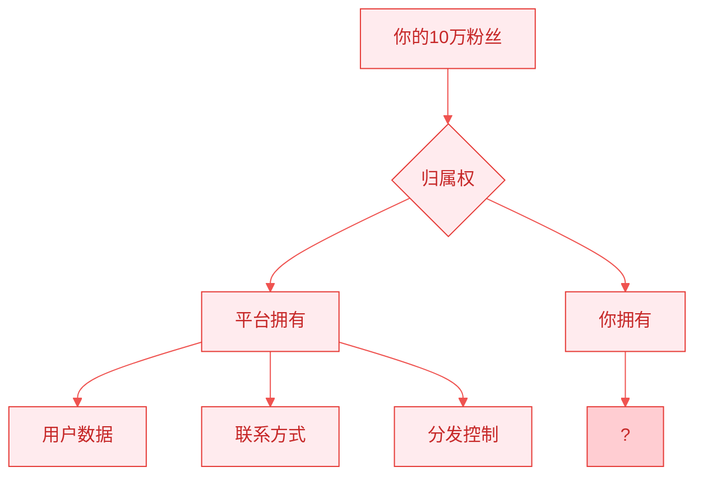
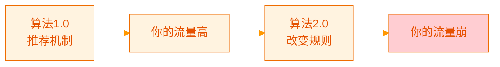
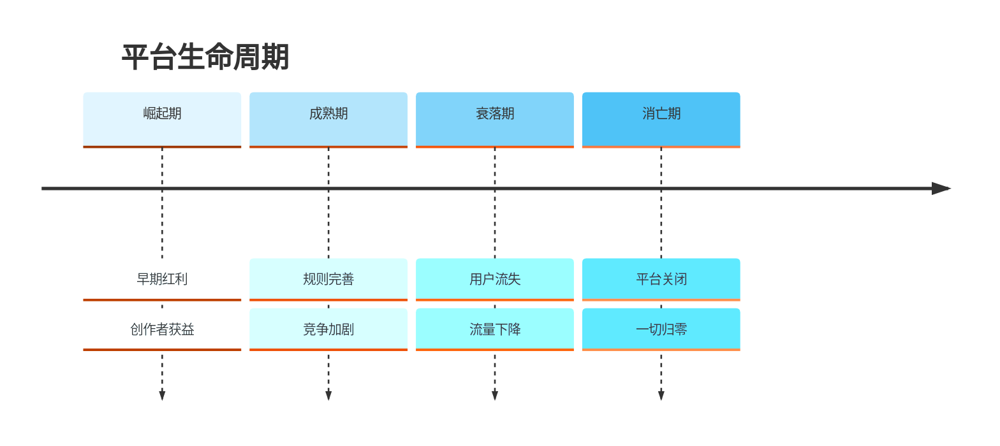
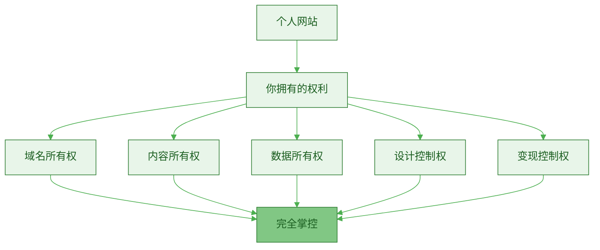
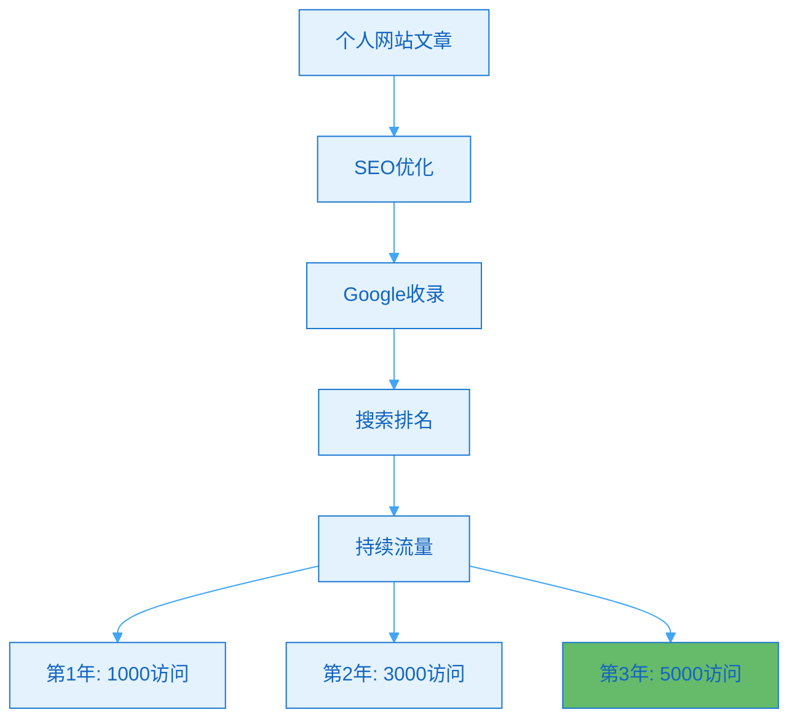
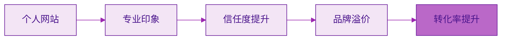
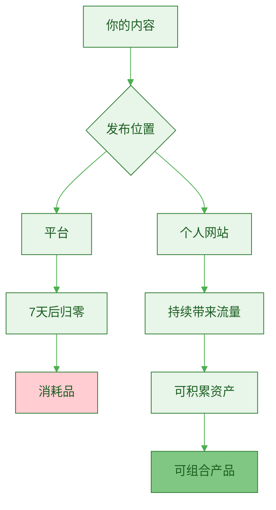
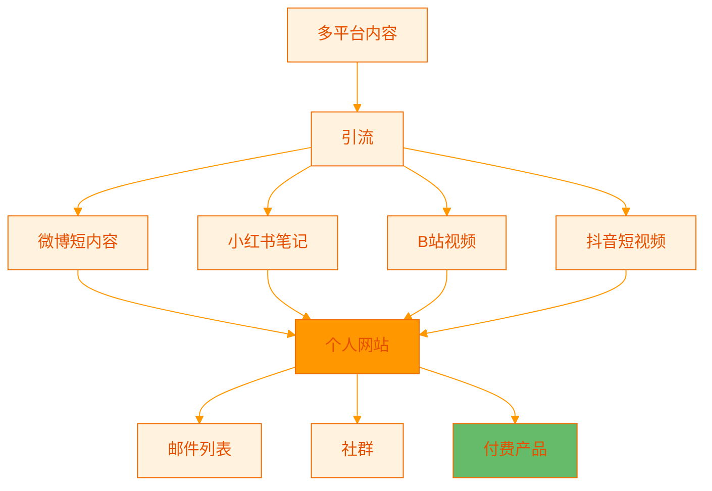
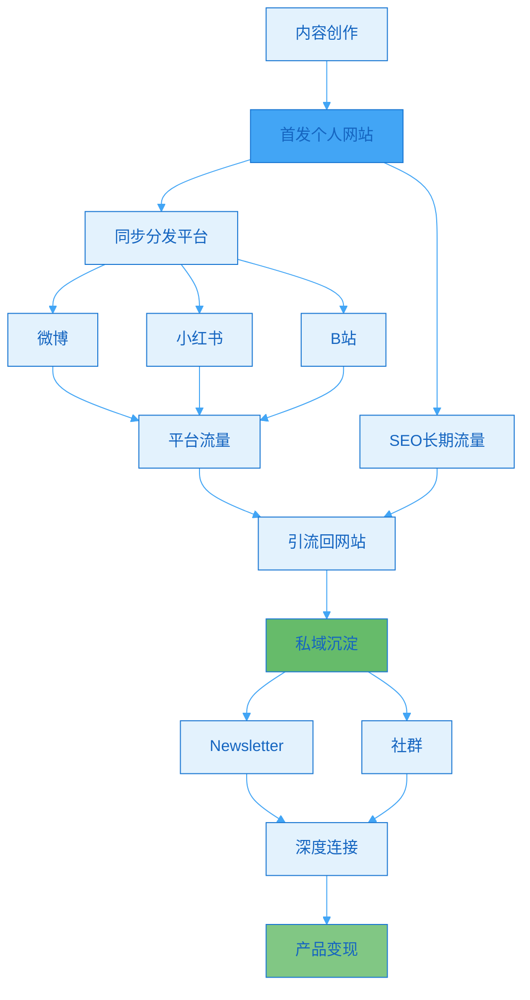

> [!quote] 数字房地产的价值
> "社交媒体是租来的土地，个人网站是你拥有的房产。
> 
> 平台可以倒闭，算法可以变化，但你的网站永远属于你。
> 
> 拥有自己的阵地，是一人公司的基础设施。"
> ——来自 [[3. MDFriday 实战记录/03.网站/Dan Koe/视频笔记/14|一人商业的未来]]

## 平台的不确定性

### 你真的拥有粉丝吗？

> [!danger] 残酷的真相
> **你在平台上的10万粉丝，其实不属于你。**



**现实对比**：

| 资产 | 平台粉丝 | 网站订阅者 |
|-----|---------|-----------|
| **数据所有权** | ❌ 平台 | ✅ 你 |
| **联系方式** | ❌ 看不到 | ✅ 邮箱在手 |
| **触达率** | ❌ 5-20% | ✅ 80%+ |
| **平台依赖** | ❌ 完全依赖 | ✅ 独立 |
| **可迁移性** | ❌ 无法导出 | ✅ 随时导出 |
| **长期价值** | ❌ 不确定 | ✅ 持续增值 |

> [!example] 真实案例
> 
> **案例1：算法改变**
> - 创作者A，公众号30万粉丝
> - 2023年算法调整
> - 阅读量从5万降到2000
> - 3年积累，一夜崩塌
> 
> **案例2：平台封号**
> - 创作者B，微博50万粉丝
> - 因"违规"被封号
> - 申诉无果
> - 所有粉丝清零
> 
> **案例3：平台衰落**
> - 创作者C，人人网100万好友
> - 平台关闭
> - 粉丝全部失去
> - 无法联系

### 平台的三大风险

> [!warning] 你必须面对的风险

**风险1：算法变化**



| 平台 | 算法变化案例 | 影响 |
|-----|-------------|------|
| **微信** | 2018年改版，减少图文推荐 | 阅读量普遍下降50-80% |
| **微博** | 多次算法调整 | 粉丝触达率从80%降到5% |
| **抖音** | 流量分配倾斜 | 老账号流量下降 |
| **小红书** | 算法频繁调整 | 流量极不稳定 |

**风险2：规则变化**

> [!example] 规则变化的影响
> 
> **内容规则**：
> - 突然禁止某类内容
> - 你的历史内容可能违规
> - 账号被限流或封号
> 
> **变现规则**：
> - 平台分成比例改变
> - 提现规则变化
> - 收入大幅下降
> 
> **导流规则**：
> - 禁止外链
> - 无法引流到私域
> - 切断变现路径

**风险3：平台衰落**



**历史教训**：

| 平台 | 巅峰期 | 现状 | 创作者损失 |
|-----|--------|------|-----------|
| **人人网** | 2011年 | 已关闭 | 所有粉丝清零 |
| **新浪博客** | 2008年 | 基本无人 | 流量归零 |
| **贴吧** | 2012年 | 衰落 | 大幅下降 |
| **QQ空间** | 2010年 | 边缘化 | 用户流失 |

## 个人网站的战略价值

### 价值1：完全掌控

> [!success] 你的地盘你做主
> **网站是你100%拥有的数字资产。**



**掌控对比**：

| 维度 | 平台 | 个人网站 |
|-----|------|---------|
| **内容审核** | 平台决定 | 你决定 |
| **设计风格** | 平台模板 | 完全自定义 |
| **功能添加** | 受限 | 无限可能 |
| **数据导出** | 困难/不可能 | 随时导出 |
| **变现方式** | 平台规则 | 任意方式 |
| **URL结构** | 平台域名 | 你的域名 |

> [!example] 掌控的价值
> 
> **案例：创作者的自由**
> 
> **在平台上**：
> - 不能放外链（引流受限）
> - 不能接广告（变现受限）
> - 不能改版式（体验受限）
> - 不能看数据（优化受限）
> 
> **在自己网站**：
> - ✅ 可以放任何链接
> - ✅ 可以接任何广告
> - ✅ 可以任意设计
> - ✅ 可以看完整数据
> - ✅ 可以安装任何功能
> - ✅ 可以用任何变现方式

### 价值2：SEO长期流量

> [!tip] 搜索引擎是最稳定的流量来源
> **一篇好文章，带来3年持续流量。**



**SEO价值对比**：

| 内容位置 | SEO效果 | 长期流量 | 价值 |
|---------|---------|---------|------|
| **平台文章** | ⚠️ 受限 | 低 | 短期 |
| **个人网站** | ✅ 完全优化 | 高 | 长期 |

**数据证明**：

> [!success] SEO的复利效应
> 
> **一篇优质网站文章的生命周期**：
> 
> ```
> 发布第1个月: 100访问（主要推广）
> 发布第3个月: 300访问（SEO起效）
> 发布第6个月: 800访问（排名提升）
> 发布第12个月: 1500访问（前10排名）
> 第2年: 每月2000访问
> 第3年: 每月2500访问
> 
> 累计3年: 超过60,000访问
> ```
> 
> **同样内容在公众号**：
> ```
> 发布第1天: 5000访问（推送）
> 发布第3天: 200访问
> 发布第7天: 50访问
> 发布第30天: 接近0
> 
> 累计3年: 约5,300访问
> ```
> 
> **网站文章价值是平台的11倍！**

### 价值3：品牌专业度

> [!tip] 网站=专业=可信
> **有自己网站的创作者，更专业。**



**品牌感知对比**：

| 场景 | 只有平台账号 | 有个人网站 |
|-----|-------------|-----------|
| **第一印象** | "可能是业余的" | "看起来很专业" |
| **信任度** | 60分 | 85分 |
| **付费意愿** | 低 | 高 |
| **客单价** | $9-49 | $99-999 |
| **合作机会** | 少 | 多 |

> [!example] 品牌价值案例
> 
> **创作者A**（只有公众号）：
> - 粉丝：5万
> - 推出$199课程
> - 转化率：1%
> - 销量：50人
> - 收入：$9,950
> - 品牌感：业余
> 
> **创作者B**（有专业网站）：
> - 粉丝：5万
> - 推出$199课程
> - 转化率：3%
> - 销量：150人
> - 收入：$29,850
> - 品牌感：专业
> 
> **同样粉丝，B的收入是A的3倍！**

### 价值4：内容资产化

> [!important] 网站让内容成为资产
> **平台内容是消耗品，网站内容是资产。**



**资产对比**：

| 特征 | 平台内容 | 网站内容 |
|-----|---------|---------|
| **生命周期** | 7-30天 | 3-5年+ |
| **价值曲线** | 递减 | 递增 |
| **可积累性** | ❌ | ✅ |
| **可组合性** | ❌ | ✅ |
| **可变现性** | ⚠️ 受限 | ✅ 灵活 |
| **可转让性** | ❌ | ✅ |

**资产化路径**：

> [!success] 网站内容的资产化
> 
> **50篇网站文章可以**：
> - 组合成电子书（$19-49）
> - 组合成课程（$99-299）
> - 作为咨询样本（吸引客户）
> - 建立行业权威（获得机会）
> - 网站本身可出售（$10,000+）

### 价值5：私域流量池

> [!tip] 网站是私域的中心
> **所有流量最终汇聚到网站。**



**私域转化路径**：

| 阶段 | 动作 | 工具 | 转化率 |
|-----|------|------|--------|
| **1. 吸引** | 平台内容 | 微博/抖音/B站 | - |
| **2. 导流** | 引导点击 | CTA链接 | 5% |
| **3. 沉淀** | 订阅网站 | Newsletter | 20% |
| **4. 培育** | 持续价值 | 邮件/社群 | - |
| **5. 转化** | 购买产品 | 网站产品页 | 10% |

**总转化率** = 5% × 20% × 10% = 0.1%

> [!example] 私域价值
> 
> **没有网站**：
> ```
> 100,000平台浏览
> → 无法沉淀
> → 依赖平台推送
> → 触达率5%
> → 实际触达5,000人
> ```
> 
> **有网站**：
> ```
> 100,000平台浏览
> → 5%导流(5,000人到网站)
> → 20%订阅(1,000人订阅)
> → 邮件触达率80%
> → 实际触达800人
> → 且拥有邮箱，可随时联系
> ```

## 个人网站 vs 平台的战略定位

### 不是二选一，而是协同

> [!important] 正确理解网站与平台的关系
> **平台是获客渠道，网站是资产基地。**



**战略定位**：

| 角色 | 平台 | 个人网站 |
|-----|------|---------|
| **定位** | 流量获取渠道 | 资产沉淀基地 |
| **作用** | 吸引陌生用户 | 转化忠实用户 |
| **内容** | 短内容、引流内容 | 深度内容、完整内容 |
| **目标** | 最大化曝光 | 最大化转化 |
| **投入** | 30%时间精力 | 70%时间精力 |

### 完整生态布局

> [!check] 一人公司的标准配置
> 
> **核心（必须有）**：
> - [ ] 个人网站（资产基地）
> - [ ] Newsletter（私域连接）
> 
> **渠道（选2-3个）**：
> - [ ] 微博/Twitter（快速传播）
> - [ ] 小红书（图文种草）
> - [ ] B站/YouTube（视频信任）
> - [ ] 知乎（SEO补充）
> 
> **社群（可选）**：
> - [ ] 微信群/Discord（深度互动）
> - [ ] 知识星球（付费社群）

## 建立网站的常见顾虑

### 顾虑1："我不懂技术"

> [!success] 现在建站非常简单
> 
> **传统方式**（需要技术）：
> - 购买服务器
> - 配置环境
> - 写代码
> - 部署上线
> 
> **现代方式**（零技术）：
> - 使用 [[2. 一人公司实操手册/02.MDFriday 使用指南/|MDFriday]]
> - 在Obsidian写作
> - 一键发布
> - 10分钟上线
> 
> **其他简单方案**：
> - Notion → Super/Potion（5分钟）
> - WordPress（30分钟）
> - Ghost（30分钟）

### 顾虑2："建站要花很多钱"

> [!success] 成本极低
> 
> **基础配置**：
> - 域名：$10-15/年
> - 托管：$0-5/月（MDFriday）
> - 总计：$15-75/年
> 
> **对比**：
> - 一杯咖啡：$5
> - 网站一年：相当于3-15杯咖啡
> - 但回报：10倍甚至100倍

### 顾虑3："没人会访问我的网站"

> [!tip] SEO会带来持续流量
> 
> **真实数据**：
> - 坚持更新3个月：月访问50-200
> - 坚持更新6个月：月访问500-2000
> - 坚持更新12个月：月访问2000-10000
> 
> **而且**：
> - 这些是精准用户
> - 转化率远高于平台
> - 是真正属于你的资产

### 顾虑4："维护网站很麻烦"

> [!success] 现代工具很简单
> 
> **使用MDFriday**：
> - 在Obsidian写作（你已经在用）
> - 点击发布（1秒）
> - 不需要其他维护
> 
> **时间对比**：
> - 平台发布：5分钟/篇 × 多平台 = 30分钟
> - 网站发布：1秒/篇（自动同步）
> 
> **网站更简单！**

## 立即行动

### 本周建站计划

> [!check] 7天上线计划
> 
> **Day 1**: 准备
> - [ ] 想好域名（你的名字/品牌）
> - [ ] 注册域名（$10-15）
> 
> **Day 2**: 选择方案
> - [ ] 评估几个建站方案
> - [ ] 选择最适合的（推荐MDFriday）
> 
> **Day 3**: 基础配置
> - [ ] 安装工具
> - [ ] 连接域名
> - [ ] 选择主题
> 
> **Day 4-5**: 内容迁移
> - [ ] 整理已有内容
> - [ ] 发布到网站
> - [ ] 调整格式
> 
> **Day 6**: 优化
> - [ ] 添加关于页面
> - [ ] 设置Newsletter
> - [ ] SEO基础优化
> 
> **Day 7**: 推广
> - [ ] 在各平台宣布
> - [ ] 引导用户访问
> - [ ] 开始收集订阅

### 建站检查清单

> [!tip] 网站必备要素
> 
> **内容页面**：
> - [ ] 首页（最新文章）
> - [ ] 文章列表页
> - [ ] 文章详情页
> - [ ] 关于页面
> 
> **功能要素**：
> - [ ] Newsletter订阅框
> - [ ] 搜索功能
> - [ ] 分类/标签
> - [ ] RSS订阅
> 
> **SEO基础**：
> - [ ] 每篇文章有标题和描述
> - [ ] URL结构清晰
> - [ ] 图片有alt标签
> - [ ] 网站速度快
> 
> **转化要素**：
> - [ ] 明确的CTA
> - [ ] 产品/服务页面
> - [ ] 联系方式
> - [ ] 社交媒体链接

## 总结

> [!quote] 核心要点
> "个人网站是一人公司的数字房地产。
> 
> 平台会变，算法会改，但你的网站永远属于你。
> 
> 五大战略价值：
> 1. 完全掌控 - 你的地盘你做主
> 2. SEO长期流量 - 3年持续复利
> 3. 品牌专业度 - 提升信任和溢价
> 4. 内容资产化 - 可积累可变现
> 5. 私域流量池 - 真正拥有用户
> 
> 不是要不要的问题，而是什么时候的问题。
> 答案是：现在。"

### 平台 vs 网站对比

| 维度 | 平台 | 个人网站 | 推荐策略 |
|-----|------|---------|---------|
| **所有权** | ❌ 平台 | ✅ 你 | 网站为主 |
| **长期价值** | ❌ 不确定 | ✅ 持续增值 | 网站为主 |
| **SEO效果** | ⚠️ 受限 | ✅ 完全优化 | 网站为主 |
| **流量获取** | ✅ 快速 | ⚠️ 较慢 | 平台辅助 |
| **传播力** | ✅ 强 | ⚠️ 弱 | 平台辅助 |

### 关键原则

> [!important] 记住这三点
> 
> 1. **网站是基础设施**
>    - 不是可选项，是必需品
>    - 越早建越好
> 
> 2. **平台是获客渠道**
>    - 用平台获取流量
>    - 引导到网站沉淀
> 
> 3. **从简单开始**
>    - 不追求完美
>    - 先上线再优化
>    - 内容>设计

### 下一步阅读

- [[b.内容归档逻辑|内容归档逻辑]]
- [[c.网站的战略意义|网站的战略意义]]
- [[../11.内容产品化路径/a.电子书|电子书]]

---

**今天就建立你的数字资产基地！**
