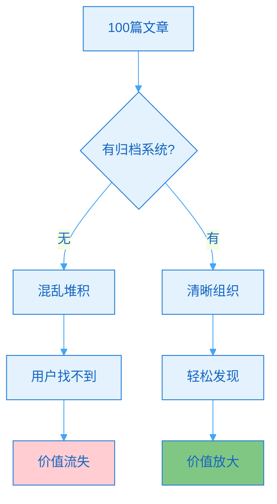
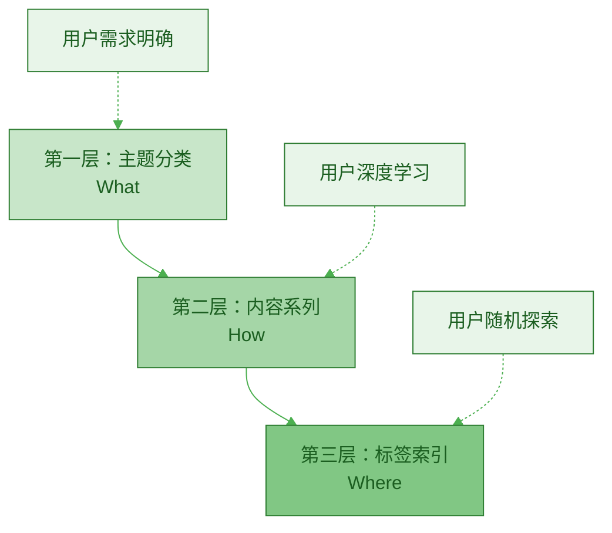
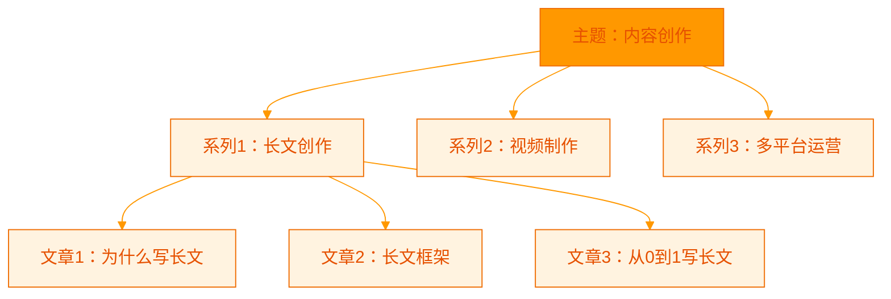
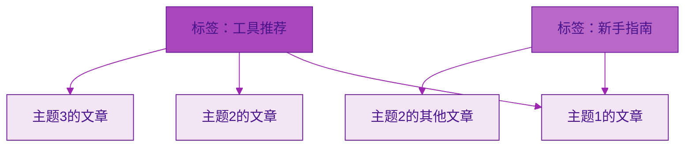
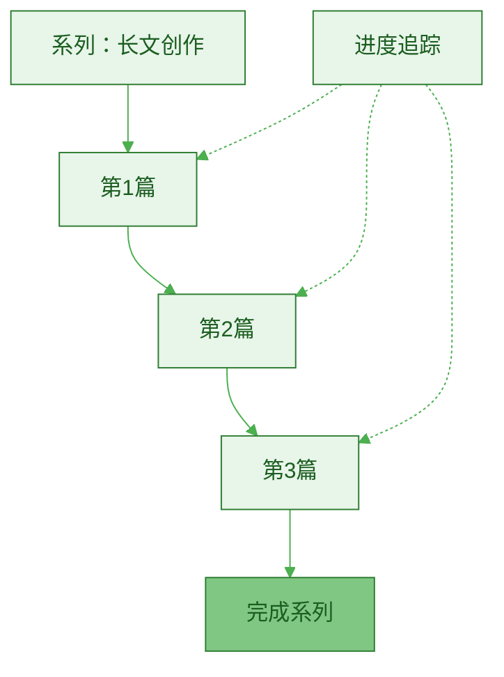
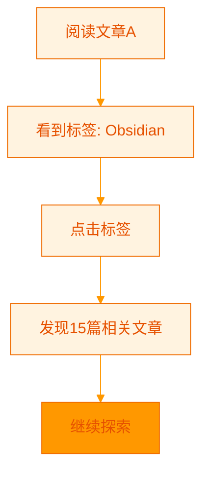

> [!quote] 组织是为了更好的发现
> "好的内容归档系统，让用户轻松找到他们需要的内容。
> 
> 不是为了分类而分类，而是为了价值传递。
> 
> 结构即服务，组织即体验。"
> ——来自 [[3. MDFriday 实战记录/03.网站/Dan Koe/视频笔记/8|内容生态系统]]

## 为什么需要内容归档系统？

### 内容越多，越需要结构

> [!important] 混乱 vs 有序的差异
> **没有结构的内容库，是垃圾场；有结构的内容库，是宝藏。**



**数据对比**：

| 指标 | 无结构 | 有结构 | 差异 |
|-----|--------|--------|------|
| **用户停留时间** | 1.5分钟 | 8分钟 | 5.3倍 |
| **页面浏览数** | 1.2页 | 4.5页 | 3.8倍 |
| **订阅转化率** | 0.8% | 3.2% | 4倍 |
| **用户满意度** | 60分 | 85分 | +42% |

> [!example] 真实案例
> 
> **网站A**（无归档系统）：
> - 150篇文章
> - 只有时间排序
> - 用户体验：
>   - "找不到想看的内容"
>   - "不知道还有什么"
>   - 平均看1篇就离开
> - 转化率：0.5%
> 
> **网站B**（有归档系统）：
> - 150篇文章
> - 清晰的分类和系列
> - 用户体验：
>   - "内容很系统"
>   - "一篇接一篇看下去"
>   - 平均看5篇
> - 转化率：3.8%
> 
> **B的转化率是A的7.6倍！**

## 内容归档的三层架构

### 架构全景



### 第一层：主题分类（类目）

> [!tip] 主题=核心方向
> **3-7个主题，覆盖你的核心定位。**

**主题分类原则**：

| 原则 | 说明 | 示例 |
|-----|------|------|
| **聚焦** | 3-7个主题 | 不要超过10个 |
| **互斥** | 主题之间不重叠 | "工具"和"效率"可能重叠 |
| **完备** | 覆盖所有内容 | 每篇文章有归属 |
| **持久** | 不频繁改动 | 稳定的分类体系 |

> [!example] 主题分类示例
> 
> **一人公司博客**：
> 1. 内容创作（30篇）
> 2. 个人品牌（25篇）
> 3. 效率工具（20篇）
> 4. 商业变现（18篇）
> 5. 个人成长（15篇）
> 
> **程序员博客**：
> 1. 技术教程（40篇）
> 2. 项目实战（25篇）
> 3. 职业发展（20篇）
> 4. 工具推荐（15篇）
> 5. 读书笔记（10篇）
> 
> **生活方式博客**：
> 1. 极简生活（30篇）
> 2. 理财规划（25篇）
> 3. 健康管理（20篇）
> 4. 时间管理（18篇）

**主题命名技巧**：

> [!check] 好的主题名称
> 
> **清晰具体**：
> - ✅ "内容创作"（清楚）
> - ❌ "思考"（模糊）
> 
> **用户视角**：
> - ✅ "如何赚钱"（用户关心的）
> - ❌ "个人随笔"（自我视角）
> 
> **长期稳定**：
> - ✅ "效率提升"（永恒主题）
> - ❌ "2024年总结"（时效性强）

### 第二层：内容系列（系列）

> [!tip] 系列=深度路径
> **将主题下的内容，组织成连贯的学习路径。**



**系列的价值**：

| 好处 | 说明 | 效果 |
|-----|------|------|
| **引导深度阅读** | 看完一篇接着看下一篇 | 页面访问量+300% |
| **建立系统认知** | 完整学习路径 | 理解度+150% |
| **提升专业度** | 展示系统性思考 | 信任度+80% |
| **方便更新** | 系列化持续补充 | 长期价值 |

> [!example] 系列设计示例
> 
> **主题：一人公司**
> 
> **系列1：启动篇**（5篇）
> ```
> 1. 为什么要做一人公司
> 2. 一人公司的底层模型
> 3. 如何找到你的定位
> 4. 第一个月做什么
> 5. 常见问题与解答
> ```
> 
> **系列2：内容篇**（8篇）
> ```
> 1. 长文为何是飞轮中心
> 2. 长文创作的底层框架
> 3. 从0到1写出第一篇长文
> 4. 一篇长文如何支撑半年内容
> 5. 3000字到10条短内容
> 6. 平台表达差异
> 7. 长文到视频脚本
> 8. 内容形式层级模型
> ```
> 
> **系列3：变现篇**（6篇）
> ```
> 1. 免费到低价到高价
> 2. 电子书变现路径
> 3. 课程设计方法
> 4. 会员专栏运营
> 5. 咨询服务定价
> 6. 产品组合策略
> ```

**系列设计原则**：

> [!check] 系列设计清单
> 
> **逻辑连贯**：
> - [ ] 有明确的学习顺序
> - [ ] 前后内容有关联
> - [ ] 难度递进
> 
> **独立完整**：
> - [ ] 每篇可独立阅读
> - [ ] 也可连续阅读
> - [ ] 相互链接
> 
> **数量适中**：
> - [ ] 每个系列3-10篇
> - [ ] 太少不成系列
> - [ ] 太多用户疲劳

### 第三层：标签索引（标签）

> [!tip] 标签=横向连接
> **跨主题、跨系列的内容关联。**



**标签类型**：

| 类型 | 作用 | 示例 |
|-----|------|------|
| **工具类** | 标注使用的工具 | Obsidian、Notion、ChatGPT |
| **难度类** | 标注适合人群 | 新手友好、进阶、高级 |
| **形式类** | 标注内容形式 | 实操、理论、案例分析 |
| **时效类** | 标注时间相关 | 2024年度总结、最新 |

**标签使用原则**：

> [!check] 标签规范
> 
> **数量控制**：
> - [ ] 每篇文章3-8个标签
> - [ ] 总标签数<50个
> - [ ] 定期清理无用标签
> 
> **命名规范**：
> - [ ] 简洁明了
> - [ ] 统一格式
> - [ ] 避免重复相似
> 
> **使用一致**：
> - [ ] 维护标签列表
> - [ ] 新标签前先搜索
> - [ ] 同义词统一

> [!example] 标签应用案例
> 
> **文章：《如何用Obsidian建立一人公司内容系统》**
> 
> **主题**：内容创作
> **系列**：工具实战
> **标签**：
> - Obsidian（工具）
> - 内容系统（概念）
> - 实操教程（形式）
> - 新手友好（难度）
> - 效率提升（价值）
> 
> **用户可以通过**：
> - 浏览"内容创作"主题找到
> - 顺着"工具实战"系列阅读
> - 点击"Obsidian"标签看所有相关文章
> - 搜索"新手友好"找适合的文章

## 四种导航模式

### 模式1：分类导航（新用户）

> [!tip] 适合：明确知道要看什么主题
> **路径：首页 → 分类页 → 文章列表 → 文章详情**

```mermaid
%%{init: {'theme':'base', 'themeVariables': {'primaryColor':'#e3f2fd','primaryTextColor':'#1565c0','primaryBorderColor':'#1976d2','lineColor':'#42a5f5'}}}%%
graph LR
    A[首页] --> B[看到6个主题]
    B --> C[点击"内容创作"]
    C --> D[看到30篇文章]
    D --> E[选择感兴趣的]
    
    style E fill:#42a5f5
```

**分类页设计**：

| 元素 | 作用 | 示例 |
|-----|------|------|
| **主题描述** | 说明这个主题是什么 | "内容创作：教你如何高效产出优质内容" |
| **文章数量** | 展示内容丰富度 | "30篇文章" |
| **推荐文章** | 引导新用户 | 置顶3-5篇精华 |
| **系列列表** | 展示子结构 | 显示该主题下的所有系列 |

### 模式2：系列导航（深度学习）

> [!tip] 适合：想系统学习某个话题
> **路径：系列首页 → 按顺序阅读 → 完成整个系列**



**系列页设计**：

> [!example] 系列页模板
> 
> ```markdown
> # 系列：长文创作完全指南
> 
> ## 系列介绍
> 本系列共8篇文章，带你从0到1掌握长文创作。
> 
> 适合：
> - 想开始写长文的创作者
> - 写作效率低的人
> - 想建立内容系统的一人公司
> 
> 学完你将获得：
> - 长文创作的底层框架
> - 高效的写作流程
> - 可复用的模板
> 
> ## 系列文章（共8篇）
> 
> ### 第一部分：认知篇
> - [√] 1. 长文为何是飞轮中心（已读）
> - [√] 2. 长文创作的底层框架（已读）
> - [ ] 3. 从0到1写出第一篇长文
> 
> ### 第二部分：实操篇
> - [ ] 4. 长文创作的5个步骤
> - [ ] 5. 如何写出吸引人的开头
> - [ ] 6. 结构化思维训练
> 
> ### 第三部分：高阶篇
> - [ ] 7. 数据驱动的内容优化
> - [ ] 8. 一篇长文支撑半年内容
> 
> [开始学习第3篇 →]
> ```

### 模式3：标签导航（探索发现）

> [!tip] 适合：随机探索相关内容
> **路径：文章底部标签 → 相关文章列表 → 发现新内容**



**标签页设计**：

| 元素 | 作用 | 示例 |
|-----|------|------|
| **标签说明** | 解释这个标签 | "Obsidian：强大的知识管理工具" |
| **文章数量** | 展示内容量 | "15篇文章使用了这个标签" |
| **相关标签** | 帮助发现 | "你可能还对这些标签感兴趣..." |
| **热门文章** | 推荐精华 | 按浏览量排序前5篇 |

### 模式4：搜索导航（精准需求）

> [!tip] 适合：有明确问题要解决
> **路径：搜索框 → 输入关键词 → 找到答案**

**搜索优化**：

> [!check] 搜索功能清单
> 
> **基础功能**：
> - [ ] 搜索文章标题
> - [ ] 搜索文章内容
> - [ ] 搜索标签
> 
> **高级功能**：
> - [ ] 模糊匹配
> - [ ] 相关推荐
> - [ ] 历史搜索
> - [ ] 热门搜索

## 内容归档的实施步骤

### Step 1：内容盘点（1-2小时）

> [!check] 盘点清单
> 
> **统计现有内容**：
> - [ ] 总共多少篇文章？
> - [ ] 哪些主题？
> - [ ] 哪些可以组成系列？
> 
> **分析内容分布**：
> - [ ] 哪个主题文章最多？
> - [ ] 哪个主题最受欢迎？
> - [ ] 有哪些内容空白？

### Step 2：设计结构（2-3小时）

> [!check] 结构设计
> 
> **确定主题分类**：
> - [ ] 列出候选主题
> - [ ] 删减到3-7个
> - [ ] 确保互斥完备
> 
> **规划系列**：
> - [ ] 每个主题下2-4个系列
> - [ ] 每个系列3-10篇文章
> - [ ] 设计阅读顺序
> 
> **制定标签规范**：
> - [ ] 标签命名规则
> - [ ] 标签使用数量
> - [ ] 标签维护机制

### Step 3：执行归档（3-5小时）

> [!check] 执行清单
> 
> **分配主题**：
> - [ ] 为每篇文章分配主题
> - [ ] 检查是否有遗漏
> 
> **组织系列**：
> - [ ] 将文章组织成系列
> - [ ] 设定系列阅读顺序
> - [ ] 创建系列首页
> 
> **添加标签**：
> - [ ] 为每篇文章添加标签
> - [ ] 保持标签一致性

### Step 4：创建导航（2-3小时）

> [!check] 导航设置
> 
> **主导航**：
> - [ ] 首页
> - [ ] 分类页
> - [ ] 标签云
> - [ ] 关于页
> 
> **辅助导航**：
> - [ ] 侧边栏（最新/热门/推荐）
> - [ ] 面包屑导航
> - [ ] 文章内相关文章推荐
> - [ ] 上一篇/下一篇（系列内）

### Step 5：持续维护（每周30分钟）

> [!check] 维护任务
> 
> **每周**：
> - [ ] 新文章归档
> - [ ] 检查标签一致性
> 
> **每月**：
> - [ ] 审查分类是否合理
> - [ ] 更新系列内容
> - [ ] 清理无用标签
> 
> **每季度**：
> - [ ] 全面审查结构
> - [ ] 根据数据优化
> - [ ] 补充内容空白

## 常见问题

### Q1: 主题太多怎么办？

> [!success] 精简策略
> 
> **问题**：定了15个主题，太分散
> 
> **解决**：
> 1. 合并相似主题
>    - "效率提升"+"时间管理" → "效率管理"
> 
> 2. 降级为系列
>    - 把小主题变成大主题下的系列
> 
> 3. 暂时隐藏
>    - 文章少的主题先不展示
>    - 积累到10篇再开放

### Q2: 一篇文章属于多个主题怎么办？

> [!tip] 选择主要主题
> 
> **原则**：
> - 一篇文章只能属于一个主题（主分类）
> - 但可以有多个标签（辅助关联）
> 
> **示例**：
> - 文章：《用Notion建立内容系统》
> - 主题：内容创作（主要）
> - 标签：Notion、工具推荐（辅助）

### Q3: 系列文章数量不均怎么办？

> [!success] 灵活调整
> 
> **正常现象**：
> - 有的系列3篇
> - 有的系列10篇
> - 这很正常
> 
> **优化方向**：
> - 短系列：考虑补充内容
> - 长系列：考虑拆分为子系列
> - 不强求完全一致

## 行动指南

### 本周归档计划

> [!check] Week 1 行动
> 
> **Day 1**: 内容盘点
> - [ ] 统计所有文章
> - [ ] 初步主题分类
> 
> **Day 2**: 结构设计
> - [ ] 确定3-7个主题
> - [ ] 规划系列结构
> 
> **Day 3-4**: 执行归档
> - [ ] 分配主题
> - [ ] 组织系列
> - [ ] 添加标签
> 
> **Day 5**: 创建导航
> - [ ] 设置主导航
> - [ ] 创建系列首页
> 
> **Day 6-7**: 测试优化
> - [ ] 模拟用户浏览
> - [ ] 优化体验
> - [ ] 收集反馈

## 总结

> [!quote] 核心要点
> "内容归档的三层架构：
> 
> L1 主题分类 - 方向明确（3-7个主题）
> L2 内容系列 - 深度学习（连贯路径）
> L3 标签索引 - 横向关联（灵活发现）
> 
> 四种导航模式：
> - 分类导航（新用户）
> - 系列导航（深度学习）
> - 标签导航（探索发现）
> - 搜索导航（精准需求）
> 
> 结构即服务，组织即体验。"

### 归档系统对比

| 维度 | 无结构 | 有结构 | 提升 |
|-----|--------|--------|------|
| **页面浏览数** | 1.2页 | 4.5页 | 3.8倍 |
| **停留时间** | 1.5分钟 | 8分钟 | 5.3倍 |
| **转化率** | 0.8% | 3.2% | 4倍 |
| **用户满意度** | 60分 | 85分 | +42% |

### 关键原则

> [!important] 记住这三点
> 
> 1. **用户视角设计**
>    - 不是为了分类而分类
>    - 是为了用户更好地发现
> 
> 2. **三层架构**
>    - 主题（方向）
>    - 系列（深度）
>    - 标签（关联）
> 
> 3. **持续优化**
>    - 根据数据调整
>    - 根据反馈改进
>    - 保持灵活

### 下一步阅读

- [[c.网站的战略意义|网站的战略意义]]
- [[../11.内容产品化路径/a.电子书|电子书]]
- [[../14.内容操作系统的构建/a.多设备同步写作|多设备同步写作]]

---

**建立清晰的内容架构，让价值更容易被发现！**
