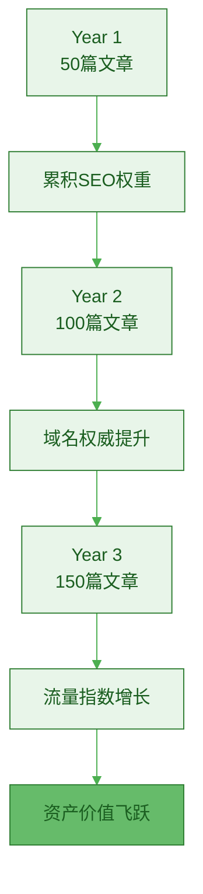
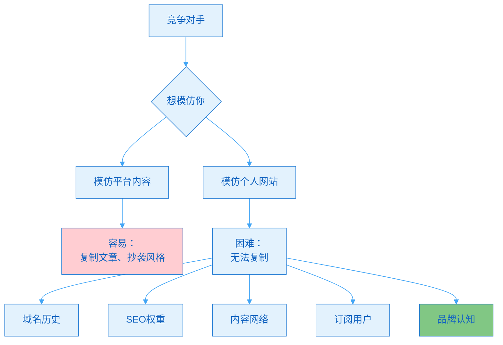
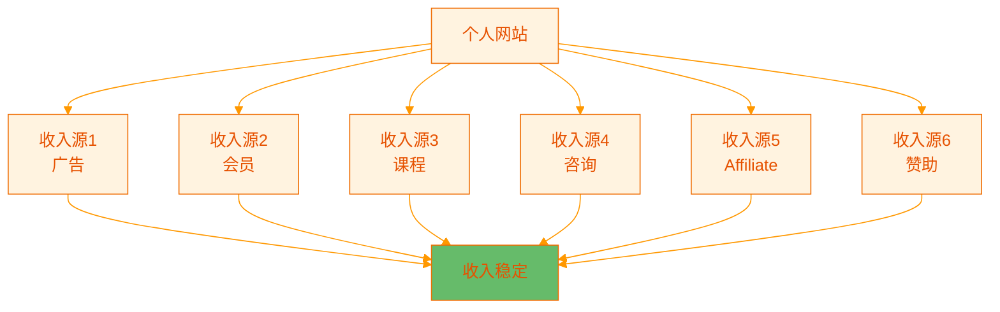
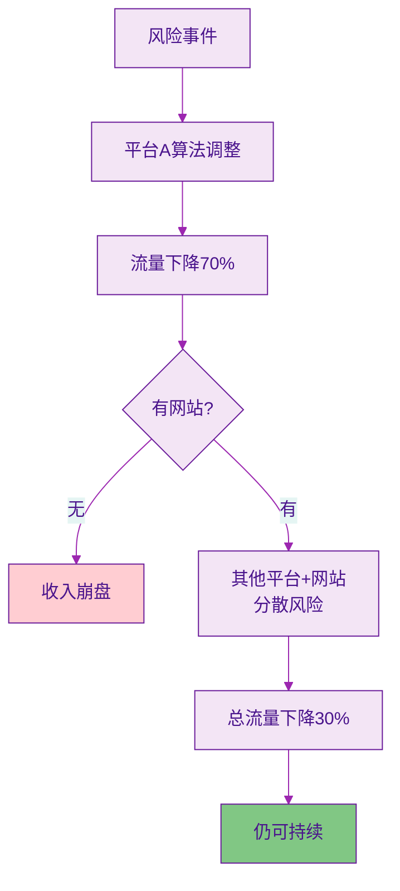
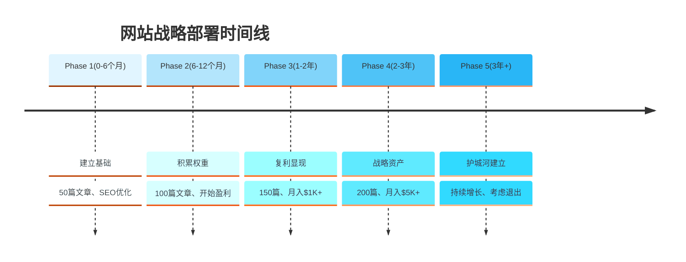

> [!quote] 网站是数字时代的房地产
> "土地有限,但数字空间无限。
> 
> 早期互联网开拓者拥有了最好的域名，获得了巨大价值。
> 
> 现在建立个人网站，就是在数字世界占领你的一亩三分地。"
> ——来自 [[3. MDFriday 实战记录/03.网站/Dan Koe/视频笔记/14|一人商业的未来]]

## 网站的五大战略价值

### 战略1：长期复利资产

> [!important] 时间是网站最好的朋友
> **网站内容会随时间增值，而不是贬值。**

**网站vs平台的价值曲线**：

| 时间 | 平台内容价值 | 网站内容价值 | 差距 |
|-----|-------------|-------------|------|
| **1个月** | 100 | 20 | -80% |
| **6个月** | 50 | 80 | +60% |
| **12个月** | 20 | 200 | 10倍 |
| **24个月** | 10 | 500 | 50倍 |
| **36个月** | 5 | 1000 | 200倍 |

> [!success] 复利效应
> 
> **网站的复利来源**：
> 
> 1. **SEO复利**
>    - 文章越多,域名权重越高
>    - 新文章更容易排名
>    - 老文章持续带来流量
> 
> 2. **内容网络效应**
>    - 文章相互链接
>    - 形成知识网络
>    - 整体价值>单篇总和
> 
> 3. **品牌复利**
>    - 持续露出建立认知
>    - 专业度持续提升
>    - 信任度累积增长
> 
> 4. **数据复利**
>    - 了解用户偏好
>    - 优化内容方向
>    - 转化率持续提升

> [!example] 复利案例
> 
> **Year 1**（建站第一年）：
> - 发布50篇文章
> - 月访问：500
> - 月收入：$0
> - 感觉：好像没啥用
> 
> **Year 2**（第二年）：
> - 累积100篇文章
> - 月访问：5,000
> - 月收入：$500
> - 感觉：开始有效果
> 
> **Year 3**（第三年）：
> - 累积150篇文章
> - 月访问：25,000
> - 月收入：$5,000
> - 感觉：复利显现！
> 
> **Year 5**（第五年）：
> - 累积200篇文章
> - 月访问：100,000
> - 月收入：$25,000+
> - 感觉：网站成为主要收入源

### 战略2：品牌护城河

> [!tip] 网站是你的护城河
> **平台可以复制，网站很难复制。**

**护城河对比**：

| 资产类型 | 可复制性 | 护城河强度 |
|---------|---------|-----------|
| **平台粉丝** | ⚠️ 中等 | ⭐⭐ |
| **内容风格** | ⚠️ 容易 | ⭐ |
| **域名+SEO** | ✅ 困难 | ⭐⭐⭐⭐ |
| **内容网络** | ✅ 很难 | ⭐⭐⭐⭐ |
| **订阅用户** | ✅ 极难 | ⭐⭐⭐⭐⭐ |

> [!success] 护城河的价值
> 
> **短期（0-2年）**：
> - 护城河不明显
> - 竞争对手可以快速追赶
> 
> **中期（2-5年）**：
> - 护城河初步建立
> - SEO和品牌优势显现
> - 竞争对手需要2-3年追赶
> 
> **长期（5年+）**：
> - 护城河难以逾越
> - 复合优势明显
> - 竞争对手几乎无法追上

### 战略3：商业灵活性

> [!tip] 网站让你有无限可能
> **平台限制多，网站自由度高。**

**商业模式对比**：

| 商业模式 | 平台 | 个人网站 |
|---------|------|---------|
| **广告** | 平台抽成50-70% | 100%归你 |
| **会员订阅** | 受限或被禁 | 完全自由 |
| **产品销售** | 审核严格 | 随意售卖 |
| **咨询服务** | 不支持 | 自由定价 |
| **affiliate** | 受限 | 不受限 |
| **赞助** | 分成 | 直接谈判 |

> [!example] 商业灵活性案例
> 
> **在平台上**：
> - 想接广告？平台说了算
> - 想卖课程？要交30%抽成
> - 想放外链？被限流
> - 想涨价？怕用户流失
> 
> **在自己网站**：
> - ✅ 任意广告商合作
> - ✅ 0抽成卖课程
> - ✅ 随意放外链
> - ✅ 灵活定价策略
> - ✅ 多种收入组合
> - ✅ A/B测试优化

**收入多元化**：

### 战略4：退出价值

> [!important] 网站是可出售的资产
> **平台账号难以转让，网站可以卖掉。**

**网站估值方式**：

| 估值方法 | 公式 | 示例 |
|---------|------|------|
| **收入倍数** | 年收入 × 2-4倍 | 年收$50K → 售价$100-200K |
| **流量倍数** | 月访问 × $1-3 | 月10万访问 → 售价$100-300K |
| **利润倍数** | 年利润 × 3-5倍 | 年利$30K → 售价$90-150K |

**网站交易平台**：

| 平台 | 适合规模 | 交易特点 |
|-----|---------|---------|
| **Flippa** | $1K-100K | 最大众化 |
| **Empire Flippers** | $50K-5M | 专业vetting |
| **FE International** | $1M+ | 高端交易 |
| **私下交易** | 任意 | 灵活自由 |

> [!example] 退出案例
> 
> **案例1：内容站售出**
> - 运营时间：3年
> - 文章数：200篇
> - 月访问：50,000
> - 月收入：$3,000
> - 售价：$100,000
> - ROI：建站成本$500 → 200倍回报
> 
> **案例2：工具站售出**
> - 运营时间：2年
> - 月访问：10,000
> - 月收入：$2,000（SaaS订阅）
> - 售价：$80,000
> - 买家：同行业公司
> 
> **平台账号**：
> - 10万粉丝微博账号
> - 估值：几乎为0（无法合法转让）

### 战略5：抗风险能力

> [!tip] 分散风险，不把鸡蛋放在一个篮子
> **平台单点风险，网站+多平台=风险分散。**

**风险分散策略**：

| 策略 | 纯平台模式 | 网站+多平台模式 |
|-----|-----------|----------------|
| **单平台依赖** | 100% | 20-30% |
| **算法风险** | 极高 | 低 |
| **封号风险** | 致命 | 可承受 |
| **平台衰落风险** | 致命 | 可承受 |
| **抗风险能力** | 弱 | 强 |

> [!example] 抗风险案例
> 
> **创作者A**（纯平台）：
> - 100%流量来自公众号
> - 2023年算法调整
> - 阅读量从5万降到2000
> - 收入从$5K/月降到$500/月
> - 结果：难以为继
> 
> **创作者B**（网站+多平台）：
> - 流量来源：
>   - 个人网站：40%
>   - 公众号：30%
>   - B站：20%
>   - 其他：10%
> - 2023年公众号算法调整
> - 公众号流量下降70%
> - 总流量下降21%（30% × 70%）
> - 收入从$5K/月降到$4K/月
> - 结果：影响可控，持续优化

## 网站的战略部署

### 部署阶段

### Phase 1：建立基础（0-6个月）

> [!check] 第一阶段目标
> 
> **核心任务**：
> - [ ] 网站上线
> - [ ] 发布50篇文章
> - [ ] 完成SEO基础优化
> - [ ] 建立Newsletter系统
> 
> **关键指标**：
> - 月访问：100-500
> - 订阅者：20-50人
> - 月收入：$0（正常）
> 
> **时间分配**：
> - 80%创作内容
> - 15%SEO优化
> - 5%推广

### Phase 2：积累权重（6-12个月）

> [!check] 第二阶段目标
> 
> **核心任务**：
> - [ ] 累积100篇文章
> - [ ] SEO开始起效
> - [ ] 尝试第一个产品
> - [ ] 优化转化路径
> 
> **关键指标**：
> - 月访问：1,000-5,000
> - 订阅者：100-300人
> - 月收入：$100-500
> 
> **时间分配**：
> - 70%创作内容
> - 20%产品开发
> - 10%优化转化

### Phase 3：复利显现（1-2年）

> [!check] 第三阶段目标
> 
> **核心任务**：
> - [ ] 累积150篇文章
> - [ ] SEO流量占50%+
> - [ ] 产品阶梯完善
> - [ ] 建立社群
> 
> **关键指标**：
> - 月访问：10,000-30,000
> - 订阅者：500-1,500人
> - 月收入：$1,000-3,000
> 
> **时间分配**：
> - 50%创作内容
> - 30%产品优化
> - 20%社群运营

### Phase 4：战略资产（2-3年）

> [!check] 第四阶段目标
> 
> **核心任务**：
> - [ ] 累积200篇文章
> - [ ] 品牌护城河建立
> - [ ] 收入多元化
> - [ ] 考虑规模化
> 
> **关键指标**：
> - 月访问：50,000-100,000
> - 订阅者：2,000-5,000人
> - 月收入：$5,000-15,000
> 
> **时间分配**：
> - 30%创作内容
> - 40%产品运营
> - 30%团队/系统

### Phase 5：护城河建立（3年+）

> [!check] 第五阶段目标
> 
> **战略选择**：
> - **选项1**：持续运营（稳定收入）
> - **选项2**：规模化（招团队扩大）
> - **选项3**：出售退出（变现）
> - **选项4**：自动化（被动收入）
> 
> **关键指标**：
> - 月访问：100,000+
> - 订阅者：5,000+人
> - 月收入：$15,000+
> 
> **决策因素**：
> - 个人目标
> - 市场机会
> - 生活方式偏好

## 立即行动

### 本周启动计划

> [!check] 7天网站上线
> 
> **Day 1**：战略规划
> - [ ] 明确网站定位
> - [ ] 确定核心主题
> - [ ] 设定3年目标
> 
> **Day 2-3**：技术实施
> - [ ] 注册域名
> - [ ] 选择建站方案
> - [ ] 完成基础配置
> 
> **Day 4-5**：内容准备
> - [ ] 整理已有内容
> - [ ] 发布到网站
> - [ ] 优化SEO
> 
> **Day 6**：系统完善
> - [ ] 设置Newsletter
> - [ ] 添加转化要素
> - [ ] 多平台引流设置
> 
> **Day 7**：推广启动
> - [ ] 在各平台宣布
> - [ ] 引导用户访问
> - [ ] 开始数据追踪

### 战略检查清单

> [!tip] 定期检查
> 
> **每月检查**：
> - [ ] 流量增长如何？
> - [ ] SEO表现如何？
> - [ ] 转化率如何？
> - [ ] 是否按计划推进？
> 
> **每季度检查**：
> - [ ] 是否达到阶段目标？
> - [ ] 需要调整策略吗？
> - [ ] 有新机会吗？
> 
> **每年检查**：
> - [ ] 网站整体价值？
> - [ ] 护城河是否建立？
> - [ ] 下一阶段目标？

## 总结

> [!quote] 核心要点
> "个人网站的五大战略价值：
> 
> 1. 长期复利资产 - 时间越长价值越大
> 2. 品牌护城河 - 难以被复制超越
> 3. 商业灵活性 - 无限变现可能
> 4. 退出价值 - 可出售的资产
> 5. 抗风险能力 - 分散平台风险
> 
> 战略部署五阶段：
> Phase 1(0-6月): 建立基础
> Phase 2(6-12月): 积累权重
> Phase 3(1-2年): 复利显现
> Phase 4(2-3年): 战略资产
> Phase 5(3年+): 护城河建立
> 
> 最佳建站时机：现在。"

### 价值增长曲线

| 时间 | 平台价值 | 网站价值 | 网站优势 |
|-----|---------|---------|---------|
| **6个月** | 100 | 50 | -50% |
| **1年** | 80 | 150 | +88% |
| **2年** | 50 | 500 | 10倍 |
| **3年** | 20 | 1,000 | 50倍 |
| **5年** | 10 | 3,000 | 300倍 |

### 关键原则

> [!important] 记住这三点
> 
> 1. **长期主义**
>    - 网站是3-5年的投资
>    - 短期看不到效果是正常的
>    - 坚持就是最大的优势
> 
> 2. **复利思维**
>    - 每篇文章都是资产
>    - 时间是最好的朋友
>    - 持续积累指数增长
> 
> 3. **现在就开始**
>    - 最好的建站时机是5年前
>    - 第二好的时机是现在
>    - 不要等到"准备好"

### 下一步阅读

- [[../11.内容产品化路径/a.电子书|电子书]]
- [[../12.内容变现的三种结构/a.免费到低价到高价|免费到低价到高价]]
- [[../14.内容操作系统的构建/a.多设备同步写作|多设备同步写作]]

---

**今天就开始建立你的数字资产，让时间为你工作！**
