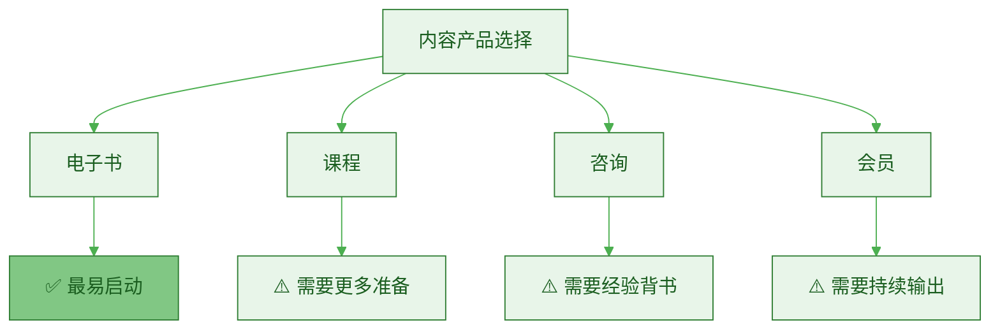
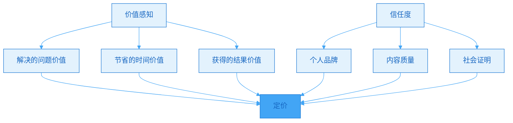
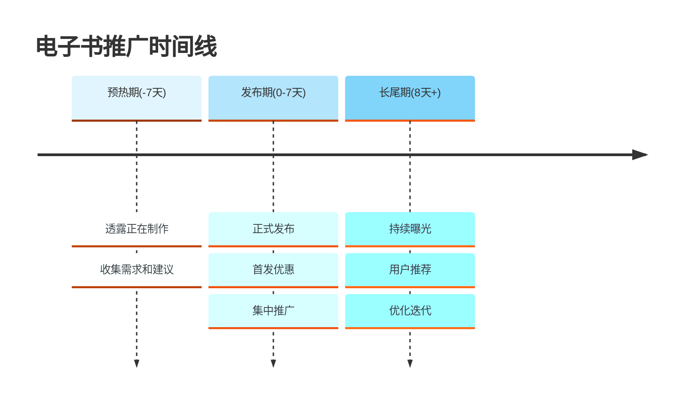

> [!quote] 电子书是内容变现的第一步
> "电子书不是书，是打包的价值。
> 
> 你已经有的内容，重新组织，就是一本书。
> 
> 不需要出版社，不需要印刷，今天完成明天就能卖。"
> ——来自 [[3. MDFriday 实战记录/03.网站/Dan Koe/视频笔记/11|数字产品创造]]

## 为什么电子书是最佳起点？

### 电子书 vs 其他产品

> [!important] 门槛最低，风险最小
> **电子书是一人公司的第一个产品。**



**产品对比**：

| 维度 | 电子书 | 课程 | 咨询 | 会员 |
|-----|--------|------|------|------|
| **制作时间** | 1-4周 | 2-3个月 | 立即 | 持续 |
| **技术门槛** | ⭐ | ⭐⭐⭐ | ⭐ | ⭐⭐ |
| **内容复用** | ✅ 高 | ✅ 中 | ❌ 低 | ⚠️ 中 |
| **时间投入** | ✅ 一次性 | ⚠️ 较大 | ❌ 持续 | ❌ 持续 |
| **价格区间** | $9-49 | $99-999 | $500+ | $9-99/月 |
| **适合新手** | ✅ 是 | ⚠️ 需经验 | ❌ 不推荐 | ⚠️ 需经验 |

> [!success] 电子书的六大优势
> 
> 1. **门槛低**
>    - 不需要视频设备
>    - 不需要剪辑技能
>    - 只需要写作能力
> 
> 2. **可复用**
>    - 网站文章直接组合
>    - 不需要重新创作
>    - 整理+优化即可
> 
> 3. **制作快**
>    - 1-4周完成
>    - 边做边卖（MVP）
>    - 持续优化迭代
> 
> 4. **零成本**
>    - 无制作成本
>    - 无库存成本
>    - 100%利润
> 
> 5. **自动化**
>    - 设置自动发货
>    - 24小时销售
>    - 被动收入
> 
> 6. **可扩展**
>    - 电子书→课程
>    - 电子书→咨询
>    - 电子书→会员

> [!example] 真实案例
> 
> **创作者A的第一个产品**：
> - 背景：运营公众号1年，30篇文章
> - 产品：电子书《内容创作完全指南》
> - 制作时间：2周
> - 内容来源：整合10篇已有文章
> - 定价：$19
> - 第一个月销量：23本
> - 收入：$437
> - 感受："原来变现这么简单！"
> 
> **关键收获**：
> - 验证了用户付费意愿
> - 建立了产品销售流程
> - 积累了客户反馈
> - 为后续产品打基础

## 电子书的三种类型

### 类型1：教程型（How-to）

> [!tip] 最受欢迎的类型
> **解决具体问题，提供操作步骤。**

**特点**：
- 解决明确问题
- 步骤清晰
- 可操作性强
- 立即见效

**适合主题**：
| 领域 | 示例 |
|-----|------|
| **技术** | 《零基础搭建个人网站》 |
| **效率** | 《Obsidian完全使用指南》 |
| **创作** | 《30天写作训练计划》 |
| **商业** | 《小红书涨粉实战手册》 |

**结构模板**：

```markdown
# 教程型电子书结构

## Part 1：为什么（Why）
- 为什么要学这个？
- 能获得什么结果？
- 适合谁？不适合谁？

## Part 2：是什么（What）
- 基础概念解释
- 核心原理说明
- 常见误区澄清

## Part 3：怎么做（How）
- Step 1：准备工作
- Step 2：开始实操
- Step 3：深入优化
- Step 4：常见问题

## Part 4：案例与资源
- 实战案例
- 工具推荐
- 延伸阅读
```

> [!example] 教程型案例
> 
> **《7天上线你的个人网站》**
> 
> **目录**：
> ```
> Day 1: 为什么要建网站？
> - 个人网站的五大价值
> - 常见顾虑消除
> - 本周学习路径
> 
> Day 2: 选择建站方案
> - 5种建站方案对比
> - MDFriday快速上手
> - 域名购买指南
> 
> Day 3: 内容规划
> - 网站结构设计
> - 内容归档逻辑
> - 导航设置
> 
> Day 4-5: 内容迁移
> - 文章格式转换
> - SEO优化清单
> - 图片处理技巧
> 
> Day 6: 转化优化
> - Newsletter设置
> - CTA设计
> - 分析工具安装
> 
> Day 7: 推广启动
> - 多平台引流
> - 第一批访客
> - 持续优化计划
> ```
> 
> **定价**：$19
> **页数**：60-80页
> **制作时间**：2周

### 类型2：框架型（Framework）

> [!tip] 高价值类型
> **提供思维模型和决策框架。**

**特点**：
- 传授思维方式
- 可迁移应用
- 长期价值高
- 适合进阶用户

**适合主题**：
| 领域 | 示例 |
|-----|------|
| **思维** | 《一人公司底层逻辑》 |
| **决策** | 《内容选题决策框架》 |
| **系统** | 《个人知识管理系统》 |
| **战略** | 《内容创作飞轮模型》 |

**结构模板**：

```markdown
# 框架型电子书结构

## Part 1：问题与现状
- 大多数人的困境
- 为什么传统方法失效
- 新框架的必要性

## Part 2：框架介绍
- 核心概念定义
- 框架全景图
- 底层逻辑解释

## Part 3：框架应用
- 应用场景1 + 案例
- 应用场景2 + 案例
- 应用场景3 + 案例

## Part 4：实践工具
- 思维清单
- 决策矩阵
- 自查表格
```

> [!example] 框架型案例
> 
> **《内容创作飞轮：从0到1的系统思维》**
> 
> **目录**：
> ```
> 第一部分：仓鼠轮 vs 飞轮
> - 为什么越忙越穷？
> - 仓鼠轮的三大特征
> - 飞轮的复利效应
> 
> 第二部分：飞轮模型
> - 长文作为飞轮中心
> - 短内容作为加速器
> - 多平台作为放大器
> - 私域作为沉淀池
> 
> 第三部分：飞轮启动
> - 第一步：找到核心定位
> - 第二步：建立内容系统
> - 第三步：启动飞轮
> - 第四步：持续加速
> 
> 第四部分：常见问题
> - 飞轮启动太慢怎么办？
> - 如何判断飞轮在转？
> - 何时能看到效果？
> 
> 附录：
> - 飞轮自查清单
> - 内容规划模板
> - 案例库
> ```
> 
> **定价**：$29-49
> **页数**：80-120页
> **制作时间**：3-4周

### 类型3：汇编型（Collection）

> [!tip] 最快上线
> **精选内容合集，快速变现。**

**特点**：
- 现有内容打包
- 制作速度快
- 适合测试市场
- 价格相对较低

**适合场景**：
- 已有大量文章
- 想快速测试变现
- 建立产品信心
- 作为引流产品

**结构模板**：

```markdown
# 汇编型电子书结构

## Part 1：主题引入
- 为什么选这个主题
- 内容来源说明
- 阅读建议

## Part 2：精选文章
- 文章1（轻微修改）
- 文章2（轻微修改）
- 文章3（轻微修改）
- ... （10-20篇）

## Part 3：额外价值
- 总结与行动清单
- 资源推荐
- 社群邀请
```

> [!example] 汇编型案例
> 
> **《一人公司启动手册：精选20篇实战笔记》**
> 
> **内容**：
> ```
> 前言：为什么要做一人公司
> 
> 第一章：定位与起步（5篇）
> - 打工的尽头
> - 找到你的定位
> - 第一个月做什么
> - 常见误区
> - 心态准备
> 
> 第二章：内容创作（8篇）
> - 长文创作框架
> - 3000字到10条短内容
> - 平台表达差异
> - 视频脚本转换
> - ...
> 
> 第三章：建立系统（7篇）
> - 个人网站搭建
> - Newsletter系统
> - 多设备同步
> - ...
> 
> 总结与行动清单
> ```
> 
> **定价**：$9-19
> **页数**：50-100页
> **制作时间**：1周

## 电子书制作的5个步骤

### Step 1：选题与定位（1天）

> [!check] 选题清单
> 
> **需求验证**：
> - [ ] 有人问过相关问题吗？
> - [ ] 搜索量如何？
> - [ ] 竞品情况？
> 
> **内容储备**：
> - [ ] 我有多少相关文章？
> - [ ] 需要补充多少内容？
> - [ ] 制作时间预估？
> 
> **价值定位**：
> - [ ] 解决什么问题？
> - [ ] 目标读者是谁？
> - [ ] 预期价格多少？

**选题框架**：

| 问题 | 答案 |
|-----|------|
| **核心问题** | 这本书解决什么问题？ |
| **目标读者** | 谁会买这本书？ |
| **独特价值** | 为什么买我的而不是别人的？ |
| **预期成果** | 读完后读者能做什么？ |
| **定价** | $9 / $19 / $29 / $49？ |

> [!tip] 选题技巧
> 
> **好选题的三个标准**：
> 
> 1. **痛点明确**
>    - ✅ "如何在30天写出第一篇长文"
>    - ❌ "写作的艺术"（太宽泛）
> 
> 2. **成果可测**
>    - ✅ "7天上线个人网站"
>    - ❌ "提升个人影响力"（不可测）
> 
> 3. **你有优势**
>    - ✅ 你实践过并有成果
>    - ❌ 纯理论没有经验

### Step 2：内容规划（1-2天）

> [!check] 规划清单
> 
> **目录设计**：
> - [ ] 列出主要章节（3-7章）
> - [ ] 每章细分小节（2-5节）
> - [ ] 确保逻辑连贯
> 
> **内容盘点**：
> - [ ] 哪些内容可以直接使用？
> - [ ] 哪些需要改写？
> - [ ] 哪些需要新写？
> 
> **页数估算**：
> - [ ] 预计总页数：60-120页
> - [ ] 每章页数分配
> - [ ] 图表数量规划

**目录设计模板**：

```markdown
# 电子书目录框架

## 前言（5页）
- 这本书是写给谁的
- 你将获得什么
- 如何使用这本书

## 第一章：[标题]（15-20页）
### 1.1 [小节标题]
- 核心概念
- 为什么重要
- 常见误区

### 1.2 [小节标题]
- 具体方法
- 步骤说明
- 案例演示

## 第二章：[标题]（15-20页）
...（重复结构）

## 第三章：[标题]（15-20页）
...

## 附录（10页）
- 工具清单
- 模板下载
- 延伸阅读

总页数：60-80页
```

### Step 3：内容制作（1-2周）

> [!check] 制作清单
> 
> **内容整合**：
> - [ ] 复制已有文章
> - [ ] 调整语气和风格
> - [ ] 统一术语和格式
> 
> **内容补充**：
> - [ ] 新写缺失部分
> - [ ] 添加过渡内容
> - [ ] 补充案例和图表
> 
> **价值增强**：
> - [ ] 添加独家内容（未公开）
> - [ ] 制作实用工具（清单、模板）
> - [ ] 设计配图和图表

**制作工具推荐**：

| 工具 | 用途 | 优势 |
|-----|------|------|
| **Obsidian** | 写作 | Markdown原生支持 |
| **Notion** | 组织 | 可视化结构 |
| **Canva** | 封面设计 | 模板丰富 |
| **Excalidraw** | 手绘图表 | 简洁美观 |
| **Pandoc** | 格式转换 | PDF/ePub生成 |

> [!tip] 内容复用技巧
> 
> **从网站文章到电子书**：
> 
> 1. **去平台化**
>    - 删除"点赞""关注"等平台用语
>    - 改为"继续阅读下一章"
> 
> 2. **增加深度**
>    - 补充背景知识
>    - 添加更多案例
>    - 深化论述
> 
> 3. **优化结构**
>    - 调整章节顺序
>    - 添加过渡段落
>    - 确保逻辑流畅
> 
> 4. **添加独家**
>    - 10-20%全新内容
>    - 独家工具和模板
>    - 购买者专属资源

### Step 4：格式制作（2-3天）

> [!check] 格式清单
> 
> **基础元素**：
> - [ ] 封面设计
> - [ ] 目录页
> - [ ] 版权页
> - [ ] 页眉页脚
> 
> **内容格式**：
> - [ ] 标题层级统一
> - [ ] 正文字体和大小
> - [ ] 代码块样式（如需要）
> - [ ] 列表和引用样式
> 
> **视觉元素**：
> - [ ] 配图和图表
> - [ ] 信息框（提示、警告）
> - [ ] 分隔符和装饰
> 
> **技术检查**：
> - [ ] 生成PDF
> - [ ] 测试链接（如有）
> - [ ] 文件大小（<10MB）

**封面设计要点**：

| 元素 | 建议 |
|-----|------|
| **标题** | 大而清晰，抓眼球 |
| **副标题** | 说明具体价值 |
| **作者** | 你的名字和品牌 |
| **配图** | 简洁专业，不要杂乱 |
| **颜色** | 2-3种颜色，保持一致 |

### Step 5：上线销售（1天）

> [!check] 上线清单
> 
> **销售页面**：
> - [ ] 产品介绍
> - [ ] 目标读者
> - [ ] 内容目录
> - [ ] 购买理由（3-5条）
> - [ ] 价格和购买按钮
> - [ ] 常见问题
> 
> **支付设置**：
> - [ ] 选择支付平台
> - [ ] 设置自动发货
> - [ ] 测试购买流程
> 
> **推广准备**：
> - [ ] 推广文案
> - [ ] 宣传图片
> - [ ] 邮件通知已有订阅者

**销售平台选择**：

| 平台 | 费率 | 优势 | 适合 |
|-----|------|------|------|
| **Gumroad** | 10% | 简单易用，国际化 | 海外市场 |
| **Lemon Squeezy** | 5%+50¢ | 税务处理，专业 | 海外市场 |
| **小鹅通** | 5-6% | 本地化，微信支付 | 国内市场 |
| **自建支付** | 2-3% | 完全控制 | 技术用户 |

## 定价策略

### 定价框架

> [!tip] 价格 = 价值感知 × 信任度
> **不是成本定价，而是价值定价。**



**定价区间**：

| 价格区间 | 特点 | 适合情况 |
|---------|------|---------|
| **$9-19** | 低门槛，高转化 | 第一个产品、引流产品 |
| **$29-49** | 中等价值 | 有经验积累、教程型 |
| **$99-199** | 高价值 | 框架型、稀缺知识 |
| **$299+** | 专业级 | 行业权威、深度内容 |

> [!example] 定价案例分析
> 
> **同一本书，不同创作者，不同价格**：
> 
> **创作者A**（新手）：
> - 粉丝：1000人
> - 信任度：低
> - 定价：$9
> - 转化率：3%
> - 销量：30本
> - 收入：$270
> 
> **创作者B**（有经验）：
> - 粉丝：5000人
> - 信任度：中
> - 定价：$29
> - 转化率：2%
> - 销量：100本
> - 收入：$2,900
> 
> **创作者C**（行业专家）：
> - 粉丝：10,000人
> - 信任度：高
> - 定价：$99
> - 转化率：1.5%
> - 销量：150本
> - 收入：$14,850
> 
> **关键**：不是价格决定销量，而是信任度决定价格！

### 定价技巧

> [!success] 5个定价技巧
> 
> **技巧1：锚定定价**
> - 设置原价$49
> - 首发优惠$29
> - 用户感觉占便宜
> 
> **技巧2：阶梯定价**
> - 基础版：$19（电子书）
> - 进阶版：$49（电子书+模板）
> - 豪华版：$99（电子书+模板+咨询）
> 
> **技巧3：限时涨价**
> - 首发7天：$19
> - 之后涨价至：$29
> - 制造紧迫感
> 
> **技巧4：捆绑销售**
> - 单本：$29
> - 三本合集：$69（节省$18）
> - 全套：$99（节省更多）
> 
> **技巧5：终身更新**
> - 一次购买，终身更新
> - 承诺持续优化
> - 提升价值感

## 推广策略

### 3阶段推广



### 推广渠道

| 渠道 | 方式 | 预期转化 |
|-----|------|---------|
| **已有订阅者** | 邮件通知 | 5-10% |
| **个人网站** | 置顶推广 | 2-5% |
| **社交媒体** | 发布推文 | 1-3% |
| **社群** | 直接推荐 | 10-20% |
| **合作推广** | 互推 | 1-2% |

> [!tip] 推广文案模板
> 
> **主题**：我花了3周，把1年的实战经验写成了这本书
> 
> **正文**：
> ```
> 嗨，朋友们！
> 
> 过去3周，我做了一件事：
> 把我一年来实践一人公司的经验，
> 整理成了一本电子书。
> 
> 《一人公司启动手册》
> 
> 这本书包含：
> ✅ 20个实战案例
> ✅ 5套可复用模板
> ✅ 100+条实操建议
> 
> 适合：
> - 想要开始一人公司的人
> - 感觉内容创作没方向的人
> - 想建立系统化工作流的人
> 
> 原价$49，首发优惠$29
> 仅限前100名（已售23本）
> 
> [立即购买]
> 
> P.S. 购买后如果觉得不值，7天内无理由退款。
> ```

## 行动指南

### 4周上线计划

> [!check] Week 1-4 行动
> 
> **Week 1：选题与规划**
> - [ ] Day 1-2：确定选题
> - [ ] Day 3-4：设计目录
> - [ ] Day 5-7：内容盘点
> 
> **Week 2：内容制作**
> - [ ] 整合已有内容
> - [ ] 补充新内容
> - [ ] 添加案例和图表
> 
> **Week 3：格式制作**
> - [ ] 统一格式
> - [ ] 设计封面
> - [ ] 生成PDF
> - [ ] 内部测试
> 
> **Week 4：上线推广**
> - [ ] 设置销售页面
> - [ ] 配置支付系统
> - [ ] 启动推广
> - [ ] 收集反馈

## 总结

> [!quote] 核心要点
> "电子书是最容易启动的内容产品：
> 
> 三种类型：
> - 教程型（How-to）- 解决具体问题
> - 框架型（Framework）- 提供思维模型
> - 汇编型（Collection）- 快速打包变现
> 
> 五个步骤：
> 1. 选题与定位（1天）
> 2. 内容规划（1-2天）
> 3. 内容制作（1-2周）
> 4. 格式制作（2-3天）
> 5. 上线销售（1天）
> 
> 关键原则：
> - 门槛低、制作快、可复用
> - 不追求完美，先上线再迭代
> - 价值定价，不是成本定价
> 
> 现在就开始你的第一本书！"

### 快速对比

| 维度 | 第一本书建议 | 理由 |
|-----|-------------|------|
| **类型** | 汇编型或教程型 | 最快上线 |
| **页数** | 50-80页 | 不要太长 |
| **制作时间** | 2-4周 | 保持动力 |
| **定价** | $9-29 | 降低门槛 |
| **首发优惠** | 是 | 促进销售 |

### 关键指标

> [!important] 追踪这些数据
> 
> **制作阶段**：
> - 实际制作时间
> - 内容复用比例
> - 新增内容量
> 
> **销售阶段**：
> - 首周销量
> - 转化率
> - 退款率
> - 用户反馈
> 
> **优化方向**：
> - 根据反馈迭代
> - 优化销售页
> - 调整定价

### 下一步阅读

- [[b.会员专栏|会员专栏设计]]
- [[d.课程|课程文本化]]
- [[../12.内容变现的三种结构/a.免费到低价到高价|免费到低价到高价]]

---

**开始制作你的第一本电子书，迈出内容变现第一步！**
