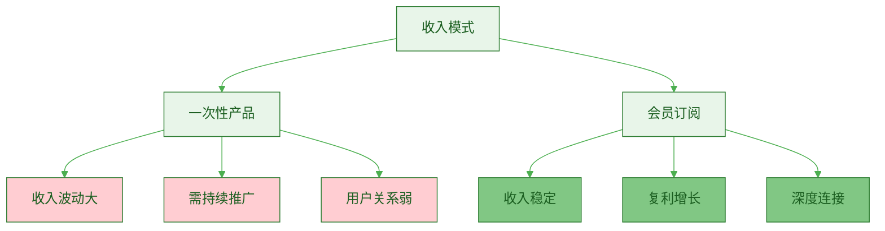
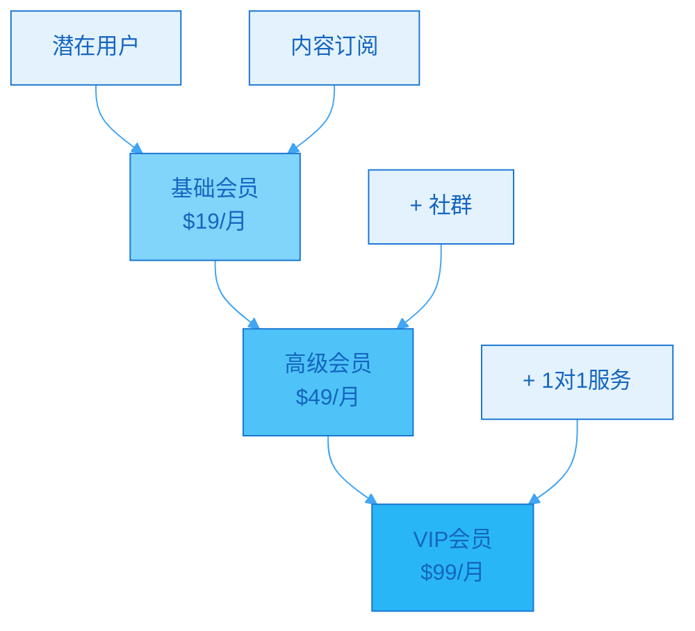

> [!quote] 订阅是最稳定的商业模式
> "一次性产品靠冲刺，订阅产品靠长跑。
> 
> 100个每月付$10的会员，就是$1000稳定月收入。
> 
> 这是一人公司最理想的现金流结构。"
> ——来自 [[3. MDFriday 实战记录/03.网站/Dan Koe/视频笔记/12|可持续收入模型]]

## 为什么要做会员专栏？

### 会员制的独特价值

> [!important] 订阅制 = 稳定现金流 + 忠实用户
> **会员专栏是一人公司的现金流基础。**



**收入对比**：

| 维度 | 一次性产品 | 会员订阅 |
|-----|-----------|---------|
| **收入稳定性** | ❌ 波动大 | ✅ 稳定 |
| **收入预测** | ❌ 难以预测 | ✅ 可预测 |
| **现金流** | ⚠️ 不连续 | ✅ 持续 |
| **用户LTV** | $29（一次） | $120（年） |
| **增长模式** | 线性 | 复利 |
| **压力** | ⚠️ 持续销售压力 | ✅ 留存即增长 |

> [!success] 会员制的六大优势
> 
> **1. 收入可预测**
> - 100会员 × $10/月 = $1,000/月
> - 明确知道下月收入
> - 便于规划和投资
> 
> **2. 复利增长**
> ```
> Month 1: 10会员 × $10 = $100
> Month 3: 30会员 × $10 = $300
> Month 6: 80会员 × $10 = $800
> Month 12: 200会员 × $10 = $2,000
> ```
> - 新会员持续加入
> - 老会员持续续费
> - 指数级增长
> 
> **3. 深度连接**
> - 会员更愿意互动
> - 获得高质量反馈
> - 建立社群氛围
> 
> **4. 创作动力**
> - 会员期待持续更新
> - 倒逼自己输出
> - 形成良性循环
> 
> **5. 价值放大**
> - 免费内容吸引
> - 付费内容筛选
> - 高质量用户群
> 
> **6. 商业灵活性**
> - 可升级更高价产品
> - 可开发定制服务
> - 转化率更高

> [!example] 真实案例
> 
> **创作者A的会员之路**：
> 
> **Month 1-3**（启动期）：
> - 推出会员专栏
> - 定价$9/月
> - 首批20人加入
> - 月收入$180
> - 感觉："收入不多，但很稳定"
> 
> **Month 4-6**（增长期）：
> - 持续更新内容
> - 会员增至60人
> - 月收入$540
> - 感觉："复利开始显现"
> 
> **Month 7-12**（稳定期）：
> - 口碑传播
> - 会员增至150人
> - 月收入$1,350
> - 感觉："现金流稳定了！"
> 
> **Year 2**（扩展期）：
> - 会员稳定在200人
> - 推出高级会员$29/月
> - 50人升级
> - 月收入：$1,500 + $1,450 = $2,950
> - 感觉："可以全职了"

## 会员专栏的三种模式

### 模式1：内容订阅型

> [!tip] 最常见的模式
> **持续提供优质内容，会员按月/年付费。**

**特点**：
- 内容为核心价值
- 定期更新
- 形式多样
- 门槛相对较低

**适合人群**：
- 内容创作者
- 知识分享者
- 技能教学者

**内容类型**：

| 内容形式 | 频率 | 示例 |
|---------|------|------|
| **深度文章** | 周更/双周 | 深度分析、实战复盘 |
| **实战案例** | 周更 | 真实案例拆解 |
| **工具模板** | 月更 | 可复用模板 |
| **独家资源** | 不定期 | 行业报告、工具合集 |
| **问答互动** | 周更 | 会员提问答疑 |

> [!example] 内容订阅型案例
> 
> **《一人公司实战会员》**
> 
> **定价**：$19/月 或 $199/年
> 
> **内容规划**：
> ```
> 每周更新（周三）：
> - 1篇深度文章（2000-3000字）
> - 主题：一人公司实战经验
> 
> 每月额外：
> - 1个实用模板
> - 1次直播答疑（60分钟）
> - 当月精选资源包
> 
> 不定期：
> - 行业洞察报告
> - 工具推荐和教程
> - 成员案例分享
> 
> 专属福利：
> - 私密Discord社群
> - 所有电子书8折
> - 咨询服务优先排期
> ```
> 
> **价值计算**：
> - 每周文章：价值$10/篇 × 4 = $40
> - 每月模板：价值$9
> - 每月答疑：价值$29
> - 总价值：$78/月
> - 实际收费：$19/月
> - **性价比：4倍**

### 模式2：社群互动型

> [!tip] 注重社群价值
> **内容+社群，重视成员间的连接和互动。**

**特点**：
- 社群为核心
- 强互动性
- 归属感强
- 留存率高

**适合人群**：
- 有社群运营能力
- 追求深度连接
- 愿意投入时间互动

**社群活动**：

| 活动类型 | 频率 | 价值 |
|---------|------|------|
| **主题讨论** | 每周 | 激发思考 |
| **案例分享** | 每周 | 实战经验 |
| **资源共享** | 持续 | 信息流通 |
| **线上活动** | 每月 | 增强黏性 |
| **线下聚会** | 每季度 | 深度链接 |

> [!example] 社群互动型案例
> 
> **《一人公司同行者社群》**
> 
> **定价**：$29/月 或 $299/年
> 
> **社群结构**：
> ```
> Discord服务器：
> 
> 📢 公告区
> - 每周主题
> - 活动通知
> 
> 💬 日常交流
> - 日常打卡
> - 随便聊聊
> - 资源分享
> 
> 🎯 主题频道
> - #内容创作
> - #工具分享
> - #案例拆解
> - #提问答疑
> 
> 🔥 活动区
> - 每周共读
> - 每月挑战
> - 作品展示
> 
> 🎁 专属资源
> - 模板库
> - 工具箱
> - 课程录播
> ```
> 
> **运营计划**：
> ```
> 每周一（8:00）：
> - 发布本周主题
> - 抛出讨论问题
> 
> 每周三（20:00）：
> - 语音讨论会（60分钟）
> - 本周主题深度讨论
> 
> 每周五（9:00）：
> - 一周精华汇总
> - 优质内容整理
> 
> 每月最后一周：
> - 月度挑战发起
> - 上月优秀成员表彰
> ```

### 模式3：服务增值型

> [!tip] 高价值模式
> **内容+社群+定制服务，提供全方位支持。**

**特点**：
- 服务为核心
- 高度定制化
- 价格较高
- 用户数量少

**适合人群**：
- 有专业技能
- 时间精力充足
- 追求高客单价

**服务内容**：

| 服务类型 | 频率 | 价值 |
|---------|------|------|
| **1对1咨询** | 每月1次 | 高度定制 |
| **作品点评** | 每周 | 实时反馈 |
| **定制方案** | 需求驱动 | 解决问题 |
| **优先支持** | 随时 | 快速响应 |

> [!example] 服务增值型案例
> 
> **《一人公司加速营》**
> 
> **定价**：$99/月 或 $999/年（限额50人）
> 
> **服务内容**：
> ```
> 基础服务：
> - 所有内容订阅型内容
> - 所有社群互动型权益
> 
> 增值服务：
> - 每月1次1对1咨询（30分钟）
> - 每周内容点评（文章/视频）
> - 专属微信群（快速响应）
> - 定制化成长方案
> 
> 专属福利：
> - 所有数字产品免费
> - 线下活动优先参与
> - 年度私董会邀请
> ```
> 
> **价值计算**：
> - 每月咨询：$100
> - 每周点评：$25 × 4 = $100
> - 内容权益：$30
> - 总价值：$230/月
> - 实际收费：$99/月
> - **性价比：2.3倍**

## 会员专栏设计的5个关键

### 关键1：明确价值主张

> [!important] 用户为什么要付费订阅？
> **必须有清晰、独特的价值主张。**

**价值主张框架**：

```markdown
## 会员专栏价值主张模板

### 目标用户
你是[身份描述]，正在[面临什么挑战]

### 核心价值
加入会员，你将获得：
1. [核心价值1]：[具体说明]
2. [核心价值2]：[具体说明]
3. [核心价值3]：[具体说明]

### 独特优势
与其他XX相比，我们的独特之处：
- [差异点1]
- [差异点2]
- [差异点3]

### 预期成果
订阅X个月后，你可以：
- [具体成果1]
- [具体成果2]
- [具体成果3]
```

> [!example] 价值主张示例
> 
> **《一人公司实战会员》价值主张**：
> 
> ```
> 你是想要启动一人公司的创作者，
> 但不知道从哪里开始，也担心走弯路。
> 
> 加入会员，你将获得：
> 
> 1. 系统化路径
>    - 不是碎片化知识
>    - 完整的实战地图
>    - 从0到1的清晰步骤
> 
> 2. 真实案例库
>    - 我的实战复盘
>    - 成功与失败案例
>    - 可直接复用的经验
> 
> 3. 持续陪伴
>    - 每周新内容
>    - 社群互助
>    - 问题即时解答
> 
> 与其他课程不同：
> - 不是一次性课程，而是持续更新
> - 不是理论讲解，而是实战经验
> - 不是单向输出，而是双向互动
> 
> 订阅3个月后，你可以：
> - 找到明确的一人公司方向
> - 建立自己的内容系统
> - 产出第一个数字产品
> ```

### 关键2：内容更新节奏

> [!tip] 稳定比频繁更重要
> **设定可持续的更新节奏，并严格执行。**

**更新频率建议**：

| 会员价格 | 建议频率 | 内容量 |
|---------|---------|--------|
| **$9/月** | 双周更新 | 1篇深度文章 |
| **$19/月** | 每周更新 | 1篇文章 + 月度资源 |
| **$29/月** | 每周更新 | 2-3篇内容 + 互动 |
| **$49/月** | 每周更新 | 多形式内容 + 服务 |

> [!danger] 常见错误
> 
> **❌ 开始太频繁**：
> - 承诺每天更新
> - 坚持2周就崩溃
> - 会员失望，大量退订
> 
> **✅ 稳定可持续**：
> - 承诺每周更新
> - 持续执行1年
> - 会员信任度提升
> - 口碑传播增长

**内容日历模板**：

```markdown
## 会员内容日历（示例）

### Week 1
- 周一：主题预告
- 周三：深度文章（2500字）
- 周五：资源分享

### Week 2
- 周一：案例拆解
- 周三：深度文章（2500字）
- 周五：工具推荐

### Week 3
- 周一：用户问答
- 周三：深度文章（2500字）
- 周五：模板发布

### Week 4
- 周一：月度总结
- 周三：深度文章（2500字）
- 周五：下月预告 + 直播答疑
```

### 关键3：分层定价策略

> [!tip] 满足不同需求的用户
> **提供2-3个会员等级。**



**分层设计示例**：

| 等级 | 价格 | 内容 | 人数 |
|-----|------|------|------|
| **基础会员** | $19/月 | 每周1篇文章 + 月度资源 | 不限 |
| **高级会员** | $49/月 | 基础内容 + 社群 + 月度答疑 | 不限 |
| **VIP会员** | $99/月 | 高级权益 + 1对1咨询 + 优先支持 | 限50人 |

> [!success] 分层定价的好处
> 
> **对用户**：
> - 可以选择适合的等级
> - 可以逐步升级
> - 灵活性高
> 
> **对创作者**：
> - 覆盖更多用户
> - 增加升级收入
> - 平衡时间精力

### 关键4：留存机制设计

> [!important] 获客难，留存更难
> **会员的价值在于长期订阅。**

**留存率对比**：

| 留存率 | 3个月后 | 6个月后 | 12个月后 |
|--------|---------|---------|----------|
| **30%** | 30人 | 9人 | 3人 |
| **60%** | 60人 | 36人 | 22人 |
| **80%** | 80人 | 64人 | 52人 |

**假设每月新增10人**：
- 留存30%，Year 1总会员：~40人
- 留存60%，Year 1总会员：~100人
- 留存80%，Year 1总会员：~140人

**留存提升策略**：

> [!check] 留存清单
> 
> **内容层面**：
> - [ ] 稳定更新（最重要）
> - [ ] 质量保证
> - [ ] 持续创新
> 
> **互动层面**：
> - [ ] 欢迎新会员
> - [ ] 响应问题
> - [ ] 重视反馈
> 
> **价值层面**：
> - [ ] 定期赠送福利
> - [ ] 会员专属活动
> - [ ] 老会员特权
> 
> **情感层面**：
> - [ ] 记住活跃会员
> - [ ] 庆祝里程碑
> - [ ] 营造归属感

> [!example] 留存案例
> 
> **创作者的留存策略**：
> 
> **新会员欢迎**：
> - 加入后24小时内发欢迎邮件
> - 介绍如何充分利用会员权益
> - 邀请加入专属社群
> 
> **30天检查**：
> - 自动发送调查问卷
> - "会员体验如何？"
> - "有什么建议？"
> 
> **3个月里程碑**：
> - 个人感谢信
> - 赠送专属资源包
> - 邀请参与内容共创
> 
> **6个月特权**：
> - 升级为"资深会员"
> - 获得徽章
> - 优先提问权
> 
> **12个月庆祝**：
> - 公开感谢
> - 免费1对1咨询
> - 年度纪念品
> 
> **结果**：留存率从45%提升到75%

### 关键5：退订挽回机制

> [!tip] 优雅地处理退订
> **退订是正常的，关键是如何应对。**

**退订原因分析**：

| 原因 | 占比 | 可挽回性 |
|-----|------|---------|
| **价格因素** | 20% | ⚠️ 中 |
| **内容不符** | 30% | ❌ 低 |
| **更新不稳** | 25% | ✅ 高 |
| **时间精力** | 15% | ⚠️ 中 |
| **其他** | 10% | - |

**挽回策略**：

> [!success] 退订流程设计
> 
> **Step 1：询问原因**
> ```
> 很遗憾看到你要离开。
> 
> 能告诉我原因吗？（单选）
> - [ ] 内容不符合预期
> - [ ] 更新频率有问题
> - [ ] 价格考虑
> - [ ] 时间精力不足
> - [ ] 其他（请说明）
> ```
> 
> **Step 2：针对性挽回**
> 
> 如果选"价格考虑"：
> ```
> 我理解。
> 
> 给你一个特别选项：
> - 暂停订阅3个月（而不是取消）
> - 或者降级到基础会员（$9/月）
> 
> 你觉得怎么样？
> ```
> 
> 如果选"更新频率"：
> ```
> 感谢反馈！
> 
> 我正在调整更新节奏。
> 愿意再给我一个月机会吗？
> 
> 如果下月还不满意，我会退还这个月的费用。
> ```
> 
> **Step 3：优雅告别**
> 
> 如果坚持退订：
> ```
> 完全理解。
> 
> 离开后你仍然可以：
> - 订阅免费Newsletter
> - 访问部分免费内容
> - 随时回来（老会员价）
> 
> 期待未来再见！
> ```

## 会员专栏的启动流程

### Phase 1：筹备期（2-4周）

> [!check] 筹备清单
> 
> **Week 1-2：定位与规划**
> - [ ] 确定会员类型
> - [ ] 明确价值主张
> - [ ] 设计分层定价
> - [ ] 规划内容节奏
> 
> **Week 3-4：内容准备**
> - [ ] 准备首月内容（4-8篇）
> - [ ] 设计欢迎流程
> - [ ] 创建社群框架
> - [ ] 测试技术平台

### Phase 2：预热期（1周）

> [!check] 预热活动
> 
> **Day 1-3：制造期待**
> - [ ] 宣布即将推出会员
> - [ ] 透露部分内容
> - [ ] 收集用户需求
> 
> **Day 4-7：限时优惠**
> - [ ] 公布会员详情
> - [ ] 首发优惠价
> - [ ] 倒计时营销
> - [ ] 前100名特权

### Phase 3：启动期（第1个月）

> [!check] 启动任务
> 
> **第1周**：
> - [ ] 正式开放订阅
> - [ ] 欢迎新会员
> - [ ] 发布首篇内容
> 
> **第2-4周**：
> - [ ] 按承诺更新内容
> - [ ] 激活社群互动
> - [ ] 收集早期反馈
> - [ ] 快速迭代优化

### Phase 4：稳定期（2-6个月）

> [!check] 稳定运营
> 
> **持续优化**：
> - [ ] 稳定内容输出
> - [ ] 提升内容质量
> - [ ] 增强社群活跃度
> - [ ] 积累成功案例
> 
> **增长策略**：
> - [ ] 老会员推荐
> - [ ] 定期开放优惠
> - [ ] 合作推广
> - [ ] SEO自然流量

## 平台选择

### 国内平台

| 平台 | 费率 | 特点 | 适合 |
|-----|------|------|------|
| **知识星球** | ¥0（免费） | 社群功能强、用户习惯好 | 社群型 |
| **小鹅通** | 5-6% | 功能全面、专业 | 内容型 |
| **轻芒** | 8-10% | 简洁优雅 | 轻量级 |

### 国际平台

| 平台 | 费率 | 特点 | 适合 |
|-----|------|------|------|
| **Patreon** | 5-12% | 最流行、功能丰富 | 海外市场 |
| **Substack** | 10% | 邮件为主、简单 | 内容型 |
| **Ghost** | 自托管 | 完全控制、专业 | 技术用户 |

### 自建方案

**优势**：
- 0抽成
- 完全控制
- 数据归自己

**劣势**：
- 技术门槛
- 需要运维
- 支付对接复杂

> [!tip] 选择建议
> 
> **新手**：
> - 国内用户 → 知识星球
> - 海外用户 → Patreon
> 
> **进阶**：
> - 追求专业 → 小鹅通/Ghost
> - 追求自由 → 自建方案

## 行动指南

### 4周启动计划

> [!check] 快速启动
> 
> **Week 1**：定位与规划
> - [ ] 确定会员模式
> - [ ] 明确价值主张
> - [ ] 设计定价策略
> 
> **Week 2**：内容准备
> - [ ] 准备首月内容
> - [ ] 设计欢迎流程
> - [ ] 选择平台
> 
> **Week 3**：技术搭建
> - [ ] 注册平台
> - [ ] 设置会员等级
> - [ ] 配置支付
> - [ ] 测试流程
> 
> **Week 4**：预热启动
> - [ ] 预热宣传（3天）
> - [ ] 正式启动
> - [ ] 欢迎首批会员
> - [ ] 发布内容

## 总结

> [!quote] 核心要点
> "会员专栏是一人公司的稳定现金流：
> 
> 三种模式：
> 1. 内容订阅型 - 以内容为核心
> 2. 社群互动型 - 以社群为核心
> 3. 服务增值型 - 以服务为核心
> 
> 五个关键：
> 1. 明确价值主张
> 2. 稳定更新节奏
> 3. 分层定价策略
> 4. 留存机制设计
> 5. 退订挽回机制
> 
> 核心指标：
> - 获客成本 < 生命周期价值
> - 留存率 > 60%
> - 月流失率 < 5%
> 
> 关键公式：
> 月收入 = 会员数 × 平均客单价 × 留存率
> 
> 稳定的现金流 = 自由的人生。"

### 会员增长预测

**假设**：
- 每月新增10人
- 留存率70%
- 平均$19/月

| 月份 | 新增 | 流失 | 总会员 | 月收入 |
|-----|------|------|--------|--------|
| **M1** | 10 | 0 | 10 | $190 |
| **M3** | 10 | 3 | 24 | $456 |
| **M6** | 10 | 4 | 48 | $912 |
| **M12** | 10 | 7 | 91 | $1,729 |
| **M24** | 10 | 8 | 156 | $2,964 |

### 关键原则

> [!important] 记住这三点
> 
> 1. **稳定第一**
>    - 稳定更新比频繁更新重要
>    - 可持续性是关键
> 
> 2. **留存优先**
>    - 留住1个老会员 > 获取3个新会员
>    - 重视用户体验
> 
> 3. **长期主义**
>    - 会员是长期游戏
>    - 第1年建基础
>    - 第2年见成效
>    - 第3年可观收入

### 下一步阅读

- [[c.加密内容|加密内容]]
- [[d.课程|课程文本化]]
- [[../12.内容变现的三种结构/a.免费到低价到高价|免费到低价到高价]]

---

**建立你的会员专栏，开启稳定现金流！**
