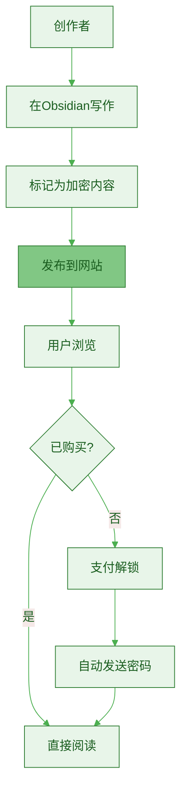
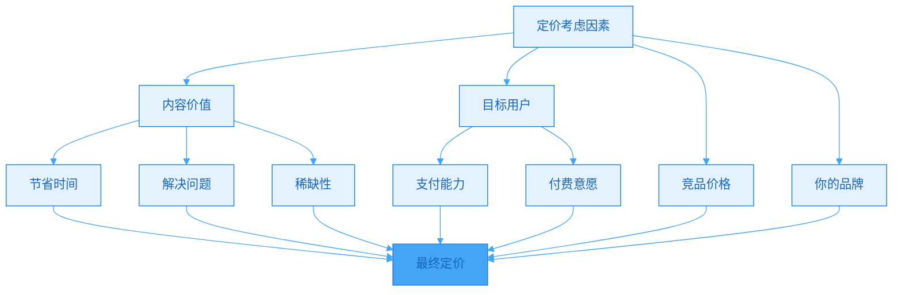
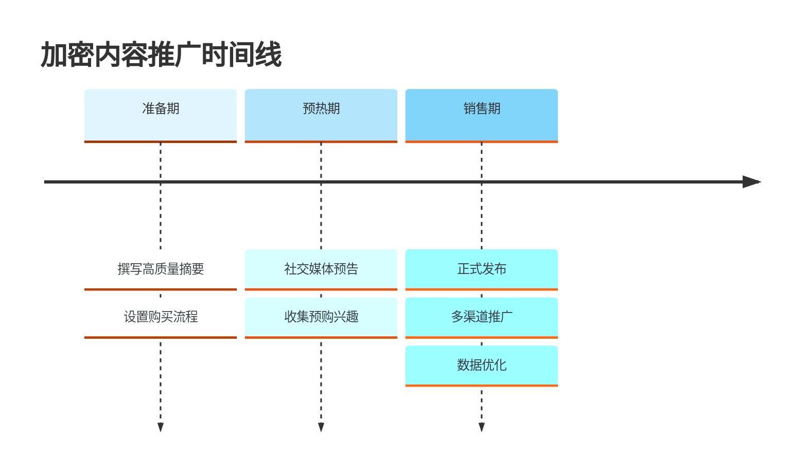

> [!quote] 创作者拥有，用户购买
> "内容加密不是为了防盗，而是为了价值交换。
> 
> 创作者保留所有权，用户购买访问权。
> 
> 这是数字内容最理想的状态。"
> ——来自 [[资源/help/content/friday.md|MDFriday 帮助文档]]

## 什么是加密内容？

### MDFriday的创新模式

> [!important] 内容加密 = 轻量级产品化
> **在网站上直接售卖内容，无需第三方平台。**



**传统模式 vs 加密内容**：

| 维度 | 传统平台模式 | MDFriday加密内容 |
|-----|-------------|------------------|
| **平台依赖** | 必须依赖第三方 | 完全自主 |
| **数据所有权** | 平台拥有 | 创作者拥有 |
| **抽成** | 5-30% | 0%（仅支付手续费2-3%） |
| **用户体验** | 跳转到其他平台 | 网站内完成 |
| **内容控制** | 受平台规则限制 | 完全控制 |
| **可移植性** | 锁定在平台 | 随时迁移 |

> [!success] 加密内容的六大优势
> 
> **1. 零平台抽成**
> - 不需要知识付费平台
> - 支付费用仅2-3%
> - 97%收入归自己
> 
> **2. 完全自主**
> - 内容在自己网站
> - 价格自己定
> - 随时可调整
> 
> **3. 用户体验好**
> - 不跳转其他平台
> - 支付后即刻查看
> - 一站式体验
> 
> **4. 内容灵活**
> - 可以是单篇文章
> - 可以是系列内容
> - 可以是资源包
> 
> **5. SEO友好**
> - 加密内容仍然被收录
> - 显示摘要吸引用户
> - 付费后全文可见
> 
> **6. 可组合性强**
> - 与免费内容混合
> - 形成内容梯度
> - 自然引导转化

> [!example] 真实场景
> 
> **用户访问你的网站**：
> 
> 1. **看到文章列表**：
>    ```
>    📄 如何建立个人网站（免费）
>    📄 内容归档逻辑（免费）
>    🔒 我的网站赚钱全复盘（$9）
>    📄 电子书制作指南（免费）
>    🔒 我的电子书销售策略（$19）
>    ```
> 
> 2. **点击加密文章**：
>    - 看到摘要和目录
>    - 了解文章价值
>    - 看到"支付$9解锁"按钮
> 
> 3. **支付后**：
>    - 自动收到解锁密码
>    - 输入密码查看全文
>    - 密码永久有效
> 
> 4. **再次访问**：
>    - 输入之前的密码
>    - 直接查看内容
>    - 无需重复购买

## 加密内容的三种类型

### 类型1：深度实战复盘

> [!tip] 最有价值的内容类型
> **真实经历+数据+反思，别人无法复制。**

**特点**：
- 真实数据
- 完整过程
- 失败教训
- 可操作性强

**适合主题**：

| 领域 | 示例 |
|-----|------|
| **内容创作** | 《我的文章如何从0到10万阅读》 |
| **产品变现** | 《电子书首月赚$2000的完整复盘》 |
| **工具使用** | 《我用Obsidian管理100篇文章的系统》 |
| **增长策略** | 《3个月公众号涨粉5000的全过程》 |

**结构模板**：

```markdown
# 实战复盘结构

## 背景与目标
- 起点状态
- 想要达成的目标
- 为什么想做这件事

## 完整过程
### 第一阶段：准备（时间）
- 做了什么
- 遇到什么问题
- 如何解决
- 数据表现

### 第二阶段：执行（时间）
- 具体动作
- 关键决策
- 数据变化
- 调整策略

### 第三阶段：优化（时间）
- 发现的问题
- 优化措施
- 最终结果
- 数据对比

## 经验总结
### 做对的事（3-5条）
- 具体说明
- 为什么有效
- 如何复用

### 做错的事（3-5条）
- 具体说明
- 为什么失败
- 如何避免

## 可复用资源
- 工具列表
- 流程清单
- 模板下载
```

> [!example] 实战复盘案例
> 
> **《我的个人网站首月数据全复盘》**
> 
> **定价**：$19
> **字数**：5000+
> 
> **目录**：
> ```
> 1. 背景：为什么建网站
>    - 之前的困境
>    - 决定建站的契机
>    - 目标设定
> 
> 2. 第一周：技术实施
>    - 选择MDFriday的原因
>    - 域名注册过程
>    - 遇到的技术问题
>    - 花费：$25
> 
> 3. 第二周：内容迁移
>    - 整理50篇文章
>    - 内容分类归档
>    - SEO优化
>    - 时间投入：15小时
> 
> 4. 第三周：推广启动
>    - 多平台引流策略
>    - 首批100访客来源
>    - Newsletter设置
>    - 数据：50人订阅
> 
> 5. 第四周：优化迭代
>    - 用户行为分析
>    - 转化路径优化
>    - 快速调整
>    - 数据：200访客，100订阅
> 
> 6. 首月总结
>    - 总访问：1,200
>    - 总订阅：156人
>    - 转化率：13%
>    - 收入：$0（预期）
> 
> 7. 做对的5件事
>    （具体经验）
> 
> 8. 做错的3件事
>    （失败教训）
> 
> 9. 下个月计划
>    - 目标设定
>    - 具体动作
> 
> 10. 附录
>     - 完整支出清单
>     - 工具推荐
>     - 模板下载
> ```
> 
> **销量**：23本（前30天）
> **收入**：$437
> **投入**：8小时写作
> **时薪**：$54.6

### 类型2：独家工具/模板

> [!tip] 节省用户时间=价值
> **可直接使用的工具和模板。**

**特点**：
- 立即可用
- 节省时间
- 可定制化
- 持续价值

**适合形式**：

| 工具类型 | 示例 | 定价 |
|---------|------|------|
| **Obsidian模板** | 内容管理系统模板 | $9-19 |
| **Notion模板** | 一人公司仪表盘 | $9-29 |
| **Spreadsheet** | 内容规划日历 | $5-15 |
| **清单合集** | 10个实用清单 | $9-19 |

> [!example] 工具/模板案例
> 
> **《一人公司内容系统 - Obsidian模板》**
> 
> **定价**：$19
> 
> **包含**：
> ```
> 1. 完整的文件夹结构
>    - Inbox（收集箱）
>    - Projects（项目）
>    - Resources（资源）
>    - Archive（归档）
> 
> 2. 10个实用模板
>    - 长文创作模板
>    - 短内容模板
>    - 实战复盘模板
>    - 内容规划模板
>    - ...
> 
> 3. 自动化工作流
>    - Dataview查询
>    - Templater脚本
>    - QuickAdd设置
> 
> 4. 视频教程
>    - 30分钟上手视频
>    - 每个功能演示
> 
> 5. 使用文档
>    - 详细说明
>    - 常见问题
>    - 定制指南
> ```
> 
> **销售页面重点**：
> - ✅ 节省20小时搭建时间
> - ✅ 经过1年实战验证
> - ✅ 100+创作者使用
> - ✅ 终身免费更新
> - ✅ 7天不满意退款

### 类型3：系列深度教程

> [!tip] 打包成体系
> **将某个主题的深度内容打包出售。**

**特点**：
- 系统完整
- 深度讲解
- 循序渐进
- 高价值感

**适合主题**：

| 主题 | 示例 | 定价 |
|-----|------|------|
| **工具精通** | MDFriday完全指南 | $29-49 |
| **技能提升** | 长文写作30天训练 | $49-99 |
| **系统搭建** | 一人公司内容系统 | $49-99 |
| **实战课程** | Newsletter从0到1000订阅 | $99+ |

> [!example] 系列教程案例
> 
> **《MDFriday完全实战指南》**
> 
> **定价**：$49
> **字数**：20,000+
> **章节**：10章
> 
> **目录**：
> ```
> 第1章：为什么选择MDFriday
> - MDFriday vs 其他方案
> - 适合人群
> - 预期效果
> 
> 第2章：10分钟快速上手
> - 安装配置
> - 发布第一篇文章
> - 域名绑定
> 
> 第3章：主题选择与定制
> - 5个推荐主题
> - 主题配置详解
> - CSS定制技巧
> 
> 第4章：内容组织策略
> - 文件夹结构
> - 分类与标签
> - 导航设计
> 
> 第5章：高级功能
> - 内容加密
> - 多语言支持
> - 自定义短代码
> 
> 第6章：SEO优化
> - 标题优化
> - 描述撰写
> - 内部链接
> 
> 第7章：性能优化
> - 图片处理
> - 加载速度
> - CDN配置
> 
> 第8章：Newsletter集成
> - 邮件服务选择
> - 订阅表单
> - 自动化设置
> 
> 第9章：数据分析
> - Google Analytics
> - 用户行为追踪
> - 转化分析
> 
> 第10章：实战案例
> - 5个真实案例分析
> - 完整配置文件
> - 可复制模板
> 
> 附录：
> - 常见问题100问
> - 工具资源清单
> - 社群邀请
> ```

## 如何使用MDFriday加密内容

### Step 1：标记加密内容

> [!tip] 在Obsidian中标记
> **使用frontmatter标记内容为加密。**

```markdown
---
title: 我的网站赚钱全复盘
date: 2026-03-06
encrypted: true
price: 9
currency: USD
description: 完整数据、真实过程、可复用经验
---

这是文章的摘要部分，用户可以免费看到。
用来吸引用户购买。

可以包括：
- 文章价值
- 目标读者
- 主要内容
- 预期收获

<!--more-->

## 这里开始是付费内容

（只有购买后才能看到）
```

### Step 2：设置支付

> [!check] 配置支付方式
> 
> **国内市场**：
> - [ ] 微信支付
> - [ ] 支付宝
> 
> **国际市场**：
> - [ ] Stripe
> - [ ] PayPal

### Step 3：发布内容

> [!tip] 一键发布
> **发布后自动生成加密版本。**

用户看到：
- 文章标题和摘要
- 🔒 加密标识
- 价格和购买按钮
- 购买后自动解锁

### Step 4：管理订单

> [!check] 订单管理
> 
> **自动化**：
> - 用户支付后自动发送密码
> - 密码永久有效
> - 可在网站任意设备使用
> 
> **手动管理**：
> - 查看销售数据
> - 导出订单列表
> - 处理退款请求

## 定价策略

### 定价框架

> [!tip] 价值定价，不是成本定价
> **考虑用户获得的价值，而不是你的投入。**



**定价区间建议**：

| 内容类型 | 字数 | 建议价格 | 说明 |
|---------|------|---------|------|
| **单篇深度文章** | 3000-5000 | $5-19 | 实战复盘、独家经验 |
| **工具/模板** | - | $9-29 | 可直接使用 |
| **小型系列** | 10,000-15,000 | $29-49 | 3-5篇系列 |
| **完整教程** | 20,000+ | $49-99 | 10+篇体系化内容 |

> [!example] 定价案例
> 
> **同样的实战复盘，不同定价**：
> 
> **创作者A**（新手，1K粉丝）：
> - 内容：《我的公众号首月复盘》
> - 定价：$5
> - 销量：10本
> - 收入：$50
> 
> **创作者B**（进阶，5K粉丝）：
> - 内容：《公众号3个月涨粉2000全复盘》
> - 定价：$19
> - 销量：30本
> - 收入：$570
> 
> **创作者C**（专家，20K粉丝）：
> - 内容：《公众号年入$50K完整策略》
> - 定价：$49
> - 销量：50本
> - 收入：$2,450
> 
> **关键**：价格反映的是价值感知和信任度！

### 定价技巧

> [!success] 5个定价技巧
> 
> **1. 对比锚定**：
> ```
> 📄 免费文章：基础方法
> 🔒 $9文章：深度实战
> 🔒 $19文章：完整系统
> 
> 用户会觉得$9很划算
> ```
> 
> **2. 捆绑销售**：
> ```
> 单篇：$19
> 三篇合集：$49（节省$8）
> 全套10篇：$99（节省$91）
> ```
> 
> **3. 早鸟优惠**：
> ```
> 前50名：$9
> 之后：$19
> 制造稀缺性
> ```
> 
> **4. 分级定价**：
> ```
> 基础版：$19（文章）
> 进阶版：$39（文章+模板）
> 豪华版：$69（文章+模板+咨询）
> ```
> 
> **5. 会员折扣**：
> ```
> 普通用户：$19
> 会员价：$9
> 引导订阅会员
> ```

## 推广策略

### 推广三部曲



### 推广渠道

| 渠道 | 方式 | 转化率 |
|-----|------|--------|
| **Newsletter** | 邮件推荐 | 3-8% |
| **网站首页** | 置顶推荐 | 1-3% |
| **社交媒体** | 发帖推广 | 0.5-2% |
| **相关文章** | 文内推荐 | 2-5% |
| **社群** | 直接推荐 | 5-15% |

### 推广文案模板

> [!tip] 销售页文案结构
> 
> **标题**：用户能获得什么
> ```
> 《我的个人网站首月数据全复盘》
> 真实数据、完整过程、可复用经验
> ```
> 
> **副标题**：解决什么问题
> ```
> 想建个人网站但不知道效果？
> 这篇5000字复盘给你答案。
> ```
> 
> **摘要**：核心价值
> ```
> 这篇文章包含：
> ✅ 4周完整时间线
> ✅ 所有真实数据
> ✅ 5个成功经验
> ✅ 3个失败教训
> ✅ 可复用的工具和模板
> ```
> 
> **适合人群**：
> ```
> 这篇文章适合：
> - 想建个人网站的创作者
> - 对效果有顾虑的人
> - 想看真实案例的人
> 
> 不适合：
> - 已经有成熟网站的人
> - 不想投入时间的人
> ```
> 
> **价格和保证**：
> ```
> 价格：$19
> 
> 购买保证：
> - 7天不满意全额退款
> - 终身访问权限
> - 免费后续更新
> ```
> 
> **CTA**：
> ```
> [支付$19解锁全文]
> 
> 已有23人购买，平均评分4.8/5
> ```

## 常见问题

### Q1: 加密内容会影响SEO吗？

> [!success] 不会，反而有帮助
> 
> **SEO表现**：
> - 搜索引擎仍然收录
> - 显示标题、摘要和目录
> - 用户搜索到后付费查看
> - 等于免费获得SEO流量
> 
> **最佳实践**：
> - 摘要包含核心关键词
> - 摘要长度300-500字
> - 提供清晰的价值说明

### Q2: 用户会分享密码吗？

> [!tip] 有可能，但影响有限
> 
> **现实情况**：
> - 少部分人会分享
> - 但大部分人不会
> - 真正想看的人会付费
> 
> **减少分享的方法**：
> - 密码绑定邮箱
> - 定期更换密码（对老用户仍有效）
> - 价格合理（分享动力小）

### Q3: 加密内容 vs 电子书，选哪个？

> [!success] 可以结合使用
> 
> **加密内容适合**：
> - 单篇高价值内容
> - 快速上线测试
> - 与免费内容混合
> 
> **电子书适合**：
> - 系统化长内容
> - 想要更高定价
> - 作为独立产品
> 
> **组合策略**：
> - 网站有少量加密内容
> - 深度系统内容做成电子书
> - 相互引流

## 行动指南

### 首个加密内容计划

> [!check] 本周启动
> 
> **Day 1-2：选题**
> - [ ] 选择高价值主题
> - [ ] 确保有独特经验
> - [ ] 预估字数3000+
> 
> **Day 3-5：创作**
> - [ ] 撰写完整内容
> - [ ] 添加数据和案例
> - [ ] 准备工具/模板
> 
> **Day 6：配置**
> - [ ] 设置加密
> - [ ] 配置支付
> - [ ] 撰写销售页
> 
> **Day 7：发布**
> - [ ] 发布内容
> - [ ] 多渠道推广
> - [ ] 追踪数据

## 总结

> [!quote] 核心要点
> "加密内容是MDFriday的独特优势：
> 
> 三种类型：
> 1. 深度实战复盘 - 真实经历+数据
> 2. 独家工具/模板 - 节省时间
> 3. 系列深度教程 - 系统完整
> 
> 六大优势：
> 1. 零平台抽成（仅支付费2-3%）
> 2. 完全自主控制
> 3. 用户体验好
> 4. 内容灵活
> 5. SEO友好
> 6. 可组合性强
> 
> 定价策略：
> - 单篇深度：$5-19
> - 工具模板：$9-29
> - 小型系列：$29-49
> - 完整教程：$49-99
> 
> 关键：在自己的网站上直接售卖，
> 无需依赖第三方平台！"

### 加密内容 vs 其他产品

| 维度 | 加密内容 | 电子书 | 会员 | 课程 |
|-----|---------|--------|------|------|
| **制作时间** | 1-3天 | 1-4周 | 持续 | 2-3月 |
| **技术门槛** | ⭐ | ⭐⭐ | ⭐⭐ | ⭐⭐⭐ |
| **启动速度** | ✅ 最快 | ⚠️ 中等 | ⚠️ 中等 | ❌ 慢 |
| **收入类型** | 一次性 | 一次性 | 订阅 | 一次性 |
| **平台抽成** | 0% | 0-10% | 0-10% | 10-30% |

### 关键原则

> [!important] 记住这三点
> 
> 1. **质量第一**
>    - 只有真正有价值的内容才收费
>    - 不要为了收费而收费
> 
> 2. **合理定价**
>    - 价格反映价值
>    - 不要定得太低
>    - 也不要定得离谱
> 
> 3. **持续优化**
>    - 根据销售数据调整
>    - 根据用户反馈改进
>    - 不断提升价值

### 下一步阅读

- [[d.课程|课程文本化]]
- [[../12.内容变现的三种结构/a.免费到低价到高价|免费到低价到高价]]
- [[../10.建立个人网站/a.为什么必需拥有自己的阵地|为什么必需拥有自己的阵地]]

---

**利用MDFriday的加密内容功能，开启轻量级变现！**
