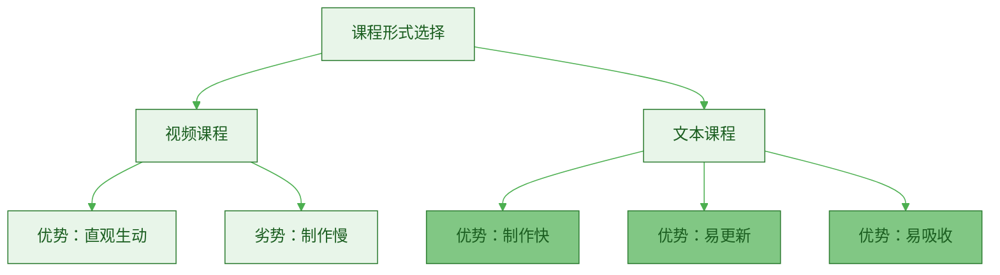
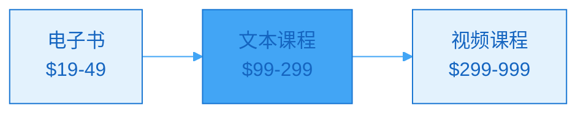

> [!quote] 课程不一定要视频
> "最好的课程是能让学生行动的课程。
> 
> 文本、视频、音频只是载体，关键是清晰的路径。
> 
> 文本课程制作快、迭代快、传播快。"
> ——来自 [[3. MDFriday 实战记录/03.网站/Dan Koe/视频笔记/9|创建数字产品]]

## 为什么文本课程？

### 文本 vs 视频课程

> [!important] 不是所有课程都需要视频
> **文本课程有独特优势。**



**深度对比**：

| 维度 | 文本课程 | 视频课程 |
|-----|---------|---------|
| **制作时间** | 1-2周 | 1-3月 |
| **技术门槛** | ⭐ | ⭐⭐⭐⭐ |
| **更新成本** | ✅ 低 | ❌ 高 |
| **学习速度** | ✅ 快（可跳读） | ⚠️ 慢（需看完） |
| **知识密度** | ✅ 高 | ⚠️ 低 |
| **可搜索性** | ✅ 强 | ❌ 弱 |
| **价格感知** | ⚠️ 中 | ✅ 高 |
| **适合场景** | 系统方法论 | 操作演示 |

> [!success] 文本课程的六大优势
> 
> **1. 制作速度快**
> - 无需拍摄设备
> - 无需剪辑技能
> - 1-2周可完成
> - 快速验证市场
> 
> **2. 迭代成本低**
> - 发现错误立即修改
> - 根据反馈快速优化
> - 持续添加新内容
> - 版本管理简单
> 
> **3. 学习效率高**
> - 学生可以快速扫读
> - 重点内容反复查看
> - 按需跳转章节
> - 便于做笔记
> 
> **4. 知识密度高**
> - 同样时间传递更多信息
> - 60分钟视频 ≈ 10分钟阅读
> - 更适合系统性知识
> - 便于深度思考
> 
> **5. SEO价值**
> - 搜索引擎可索引
> - 带来自然流量
> - 提升品牌曝光
> - 长期复利效应
> 
> **6. 可组合性强**
> - 易于打包成电子书
> - 易于制作讲义
> - 易于加入会员内容
> - 易于后期加视频

> [!example] 真实案例
> 
> **创作者A：先文本，后视频**
> 
> **Phase 1**（Month 1）：
> - 推出文本课程
> - 制作时间：2周
> - 定价：$99
> - 销量：30人
> - 收入：$2,970
> - 收集大量反馈
> 
> **Phase 2**（Month 2-3）：
> - 根据反馈优化文本
> - 补充20%新内容
> - 继续销售
> - 累计销量：80人
> - 累计收入：$7,920
> 
> **Phase 3**（Month 4-6）：
> - 在文本基础上录制视频
> - 推出"豪华版"
> - 文本版：$99
> - 文本+视频：$199
> - 新销量：50人（30人文本，20人豪华）
> - 新收入：$6,970
> 
> **总结**：
> - 总收入：$14,890
> - 如果一开始就做视频课程：
>   - 制作时间：3个月
>   - 延迟3个月才有收入
>   - 错过早期反馈
>   - 迭代成本高

## 文本课程的三种结构

### 结构1：线性进阶型

> [!tip] 最常见的课程结构
> **从基础到高级，循序渐进。**

**特点**：
- 明确的学习路径
- 前后依赖关系
- 难度递进
- 适合系统学习

**适合主题**：
- 技能学习（写作、工具使用）
- 系统方法（内容创作系统）
- 从0到1（个人网站搭建）

**结构模板**：

```markdown
# 线性进阶型课程结构

## 第一部分：基础认知（20%）
目标：理解核心概念，建立正确认知

### 模块1：为什么要学
- 现状与问题
- 学习的价值
- 预期成果

### 模块2：核心概念
- 关键概念解释
- 底层逻辑
- 常见误区

## 第二部分：入门实操（30%）
目标：完成第一个作品/项目

### 模块3：准备工作
- 工具准备
- 环境搭建
- 基础设置

### 模块4：第一个项目
- 步骤1
- 步骤2
- 步骤3
- 检查清单

## 第三部分：深度提升（30%）
目标：掌握高级技巧，提升质量

### 模块5：高级技巧
- 技巧1 + 案例
- 技巧2 + 案例
- 技巧3 + 案例

### 模块6：优化迭代
- 数据分析
- 持续改进
- 避免陷阱

## 第四部分：长期系统（20%）
目标：建立可持续的系统

### 模块7：系统搭建
- 工作流设计
- 自动化设置
- 效率提升

### 模块8：长期发展
- 进阶路线图
- 持续学习
- 社群资源

## 附录
- 工具清单
- 模板下载
- 常见问题
- 案例库
```

> [!example] 线性进阶型案例
> 
> **《从0到1建立一人公司内容系统》**
> 
> **定价**：$199
> **模块**：8个
> **字数**：40,000+
> 
> **目录**：
> ```
> 第一部分：认知篇
> 
> 模块1：为什么需要内容系统
> - 没有系统的困境（2000字）
> - 系统的复利效应（2000字）
> - 课程学习路线图（1000字）
> 
> 模块2：内容系统底层逻辑
> - 飞轮 vs 仓鼠轮（2500字）
> - 长文作为中心的原理（2000字）
> - 多平台协同策略（2500字）
> 
> 第二部分：搭建篇
> 
> 模块3：选择工具与平台
> - Obsidian完整设置（3000字）
> - MDFriday网站搭建（3000字）
> - Newsletter系统（2000字）
> 
> 模块4：第一篇长文
> - 长文创作框架（2500字）
> - 实战：写出你的第一篇（3000字）
> - 发布优化清单（1500字）
> 
> 第三部分：运营篇
> 
> 模块5：内容复用与分发
> - 一篇长文变10条短内容（3000字）
> - 平台适配策略（2500字）
> - 自动化工具（2000字）
> 
> 模块6：数据驱动优化
> - 关键指标追踪（2000字）
> - 内容迭代方法（2500字）
> - 转化路径优化（2000字）
> 
> 第四部分：进阶篇
> 
> 模块7：内容产品化
> - 电子书制作（2500字）
> - 加密内容设置（2000字）
> - 会员专栏运营（2500字）
> 
> 模块8：持续成长
> - 月度/季度回顾（1500字）
> - 系统持续优化（2000字）
> - 社群与资源（1000字）
> 
> 附录（10,000字）：
> - 30个实用模板
> - 工具完整清单
> - 100个常见问题
> - 10个成功案例
> 
> 总计：45,000字
> ```

### 结构2：模块化工具箱型

> [!tip] 灵活度最高
> **每个模块独立，学生按需学习。**

**特点**：
- 模块独立完整
- 无先后顺序
- 按需选择
- 适合有基础学生

**适合主题**：
- 工具集合（10个效率工具）
- 技巧合集（20个写作技巧）
- 案例库（15个实战案例）

**结构模板**：

```markdown
# 模块化工具箱型课程结构

## 课程地图
- 所有模块总览
- 学习路径建议
- 如何使用本课程

## 模块组1：[主题名称]
### 模块1.1：[独立主题]
- 问题场景
- 解决方案
- 实操步骤
- 案例演示

### 模块1.2：[独立主题]
（同上结构）

## 模块组2：[主题名称]
### 模块2.1：[独立主题]
（同上结构）

## 模块组3：[主题名称]
...

## 附录
- 模块索引
- 工具清单
- 快速查找指南
```

> [!example] 模块化工具箱型案例
> 
> **《一人公司实战工具箱：20个立即可用的方法》**
> 
> **定价**：$149
> **模块**：20个独立模块
> **字数**：30,000+
> 
> **目录**：
> ```
> 课程导航
> - 20个模块全景图
> - 3条学习路径推荐
> - 如何快速找到需要的内容
> 
> 组1：内容创作（6个模块）
> 
> M1：长文选题的5个来源
> - 场景：不知道写什么
> - 方法：5个选题来源
> - 案例：我的10个爆款选题
> （1500字）
> 
> M2：文章开头的7个公式
> - 场景：开头写不好
> - 方法：7个开头公式
> - 模板：直接套用
> （1500字）
> 
> M3：故事化表达技巧
> M4：数据可视化方法
> M5：金句提炼系统
> M6：结尾CTA设计
> 
> 组2：效率系统（5个模块）
> 
> M7：Obsidian模板系统
> M8：内容规划日历
> M9：灵感捕捉工作流
> M10：批量创作法
> M11：自动化发布
> 
> 组3：增长策略（5个模块）
> 
> M12：冷启动流量策略
> M13：爆款内容拆解
> M14：平台算法破解
> M15：私域沉淀路径
> M16：社群运营技巧
> 
> 组4：变现路径（4个模块）
> 
> M17：电子书快速制作
> M18：定价策略框架
> M19：销售页文案公式
> M20：数据分析仪表盘
> 
> 附录
> - 快速索引
> - 所有模板下载
> - 工具链接汇总
> ```

### 结构3：实战项目型

> [!tip] 最实用的结构
> **以完成一个真实项目为目标。**

**特点**：
- 目标明确
- 边学边做
- 成果导向
- 成就感强

**适合主题**：
- 30天写作挑战
- 7天网站上线
- 90天涨粉1000

**结构模板**：

```markdown
# 实战项目型课程结构

## 项目概览
- 最终成果
- 时间规划
- 准备工作

## Week 1：启动
### Day 1-2：准备
- 任务清单
- 工具准备
- 目标设定

### Day 3-7：基础搭建
- 每日任务
- 检查清单
- 提交作业

## Week 2：深入
### Day 8-14：核心工作
- 每日任务
- 重点难点
- 优化技巧

## Week 3：优化
### Day 15-21：细节打磨
- 每日任务
- 质量提升
- 问题解决

## Week 4：完成
### Day 22-30：收尾与发布
- 最后冲刺
- 项目检查
- 发布庆祝

## 项目后
- 后续优化
- 长期维护
- 下一步计划
```

> [!example] 实战项目型案例
> 
> **《30天长文写作训练营》**
> 
> **定价**：$99
> **周期**：30天
> **成果**：完成1篇3000字长文
> 
> **目录**：
> ```
> 项目概览
> - 30天完成一篇优质长文
> - 每天30分钟投入
> - 需要的工具和准备
> 
> Week 1：选题与框架（Day 1-7）
> 
> Day 1：找到你的选题
> - 任务：用3个方法产生10个选题
> - 学习：选题的3个标准
> - 作业：提交10个选题
> 
> Day 2：验证选题价值
> - 任务：用5个维度评估选题
> - 学习：验证方法
> - 作业：选定1个主题
> 
> Day 3：搭建文章框架
> - 任务：列出文章大纲
> - 学习：3-3-3结构
> - 作业：提交大纲
> 
> Day 4-5：收集素材
> - 任务：收集30个素材
> - 学习：素材来源和整理
> - 作业：素材库
> 
> Day 6-7：周回顾与调整
> - 回顾本周进展
> - 调整计划
> - 准备下周
> 
> Week 2：内容创作（Day 8-14）
> 
> Day 8：写出开头
> - 任务：完成开头300字
> - 学习：7个开头公式
> - 作业：提交开头
> 
> Day 9-10：第一部分
> - 任务：完成800字
> - 学习：论点展开方法
> - 作业：提交文本
> 
> Day 11-12：第二部分
> Day 13：第三部分
> Day 14：周回顾
> 
> Week 3：打磨优化（Day 15-21）
> 
> Day 15：结构优化
> Day 16：语言润色
> Day 17：案例补充
> Day 18：数据完善
> Day 19：视觉优化
> Day 20：SEO优化
> Day 21：周回顾
> 
> Week 4：发布推广（Day 22-30）
> 
> Day 22：最后检查
> Day 23：发布到网站
> Day 24：社交媒体推广
> Day 25-26：复用成短内容
> Day 27-28：数据追踪
> Day 29：效果复盘
> Day 30：庆祝与下一步
> 
> 项目后：持续优化
> - 根据数据迭代文章
> - 开始第二篇长文
> - 建立长期系统
> 
> 附录：
> - 每日清单PDF
> - 30个模板
> - 案例库
> - 社群邀请
> ```

## 文本课程制作流程

### Step 1：课程设计（3-5天）

> [!check] 设计清单
> 
> **明确目标**：
> - [ ] 学生能获得什么成果？
> - [ ] 解决什么具体问题？
> - [ ] 适合什么人？不适合什么人？
> 
> **内容规划**：
> - [ ] 选择课程结构类型
> - [ ] 列出所有模块
> - [ ] 确定每个模块的核心内容
> - [ ] 预估总字数
> 
> **学习体验**：
> - [ ] 如何引导学生行动？
> - [ ] 如何检查学习进度？
> - [ ] 如何提供反馈？

### Step 2：内容创作（1-2周）

> [!check] 创作清单
> 
> **每个模块**：
> - [ ] 清晰的学习目标
> - [ ] 核心知识讲解
> - [ ] 实操步骤说明
> - [ ] 案例演示
> - [ ] 行动清单
> - [ ] 常见问题
> 
> **整体把控**：
> - [ ] 语言通俗易懂
> - [ ] 逻辑清晰连贯
> - [ ] 重点突出
> - [ ] 视觉友好（标题、列表、图表）

### Step 3：互动设计（2-3天）

> [!check] 互动元素
> 
> **学习检查**：
> - [ ] 每个模块后的自查清单
> - [ ] 关键知识点测试
> - [ ] 实操作业
> 
> **反馈机制**：
> - [ ] 作业提交方式
> - [ ] 答疑渠道
> - [ ] 社群支持
> 
> **激励系统**：
> - [ ] 进度追踪
> - [ ] 完成徽章
> - [ ] 毕业证书

### Step 4：技术实施（1-2天）

> [!check] 技术清单
> 
> **课程平台选择**：
> - [ ] 自建网站（MDFriday + 加密）
> - [ ] 第三方平台（小鹅通/Teachable）
> - [ ] 混合方案
> 
> **功能设置**：
> - [ ] 课程导航
> - [ ] 进度追踪
> - [ ] 资源下载
> - [ ] 评论/问答
> 
> **支付配置**：
> - [ ] 支付方式
> - [ ] 自动发货
> - [ ] 退款流程

### Step 5：测试优化（2-3天）

> [!check] 测试清单
> 
> **内测**：
> - [ ] 邀请3-5人内测
> - [ ] 收集详细反馈
> - [ ] 快速迭代优化
> 
> **检查项**：
> - [ ] 所有链接可用
> - [ ] 排版无错误
> - [ ] 逻辑无断层
> - [ ] 体验流畅

## 定价策略

### 定价模型

> [!tip] 文本课程定价
> **比电子书高，比视频课程低。**



**定价区间**：

| 课程类型 | 模块数 | 字数 | 建议价格 |
|---------|--------|------|---------|
| **入门课程** | 3-5模块 | 15,000-25,000 | $99-149 |
| **系统课程** | 6-10模块 | 30,000-50,000 | $199-299 |
| **完整体系** | 10+模块 | 50,000+ | $399-599 |

**定价考虑因素**：

| 因素 | 影响 | 示例 |
|-----|------|------|
| **问题紧迫性** | 越紧迫价格越高 | "快速涨粉" vs "长期成长" |
| **结果价值** | 结果越大价格越高 | "赚$10K" vs "提升效率" |
| **目标用户** | 企业>个人 | B2B $999 vs B2C $199 |
| **竞品价格** | 参考市场 | 同类课程$299 |
| **你的品牌** | 知名度影响 | 新人$99 vs 专家$399 |

> [!example] 定价策略案例
> 
> **同一门课程，不同定价策略**：
> 
> **策略A：低价高量**
> - 定价：$99
> - 目标：100人
> - 收入：$9,900
> - 转化率：5%
> - 需要曝光：2,000人
> 
> **策略B：中价中量**
> - 定价：$199
> - 目标：50人
> - 收入：$9,950
> - 转化率：3%
> - 需要曝光：1,667人
> 
> **策略C：高价低量**
> - 定价：$399
> - 目标：25人
> - 收入：$9,975
> - 转化率：2%
> - 需要曝光：1,250人
> 
> **结论**：
> - 收入差不多
> - 但服务成本差很大
> - 25人 vs 100人
> - 推荐策略B或C

## 推广与销售

### 销售页设计

> [!tip] 销售页核心要素
> **让用户理解价值，建立信任，促成行动。**

**销售页结构**：

```markdown
# 课程销售页结构

## 标题
[解决什么问题] + [预期成果]

## 副标题
补充说明，强化吸引力

## 痛点共鸣（300-500字）
- 你是否遇到这些问题...
- 列举3-5个具体痛点
- 引发共鸣

## 解决方案（200-300字）
- 这门课程能帮你...
- 核心价值主张
- 独特优势

## 课程内容（详细）
- 模块列表
- 每个模块的价值
- 总时长/字数
- 配套资源

## 你将获得（5-7条）
✅ 具体成果1
✅ 具体成果2
✅ ...

## 适合人群
这门课程适合：
- [人群1]
- [人群2]
- [人群3]

不适合：
- [人群1]
- [人群2]

## 讲师介绍
- 相关背景
- 成果证明
- 为什么有资格教

## 学员评价（如有）
- 3-5个真实评价
- 包含姓名和成果

## 常见问题
- 10个常见问题解答

## 价格与保证
- 价格：$XXX
- 保证：30天不满意退款
- 赠送：额外福利

## CTA
[立即报名] 
已有XX人加入
```

### 推广渠道

| 渠道 | 方式 | 转化率 | 适合阶段 |
|-----|------|--------|---------|
| **邮件列表** | 邮件推广 | 5-12% | 首发 |
| **网站首页** | 置顶推广 | 2-5% | 持续 |
| **社交媒体** | 系列预热 | 1-3% | 预热+首发 |
| **社群** | 直接推荐 | 10-20% | 首发 |
| **合作推广** | 联合推广 | 3-8% | 扩大规模 |
| **广告投放** | 付费广告 | 1-5% | 规模化 |

## 行动指南

### 4周课程制作计划

> [!check] 快速启动
> 
> **Week 1：设计与规划**
> - [ ] Day 1-2：确定课程主题和目标
> - [ ] Day 3-4：设计课程结构
> - [ ] Day 5-7：详细内容规划
> 
> **Week 2-3：内容创作**
> - [ ] 按模块完成内容写作
> - [ ] 添加案例和图表
> - [ ] 制作配套资源
> 
> **Week 4：上线准备**
> - [ ] Day 1-3：技术实施和测试
> - [ ] Day 4-5：撰写销售页
> - [ ] Day 6：内测反馈
> - [ ] Day 7：正式上线

## 总结

> [!quote] 核心要点
> "文本课程是被低估的产品形式：
> 
> 三种结构：
> 1. 线性进阶型 - 系统学习
> 2. 模块化工具箱型 - 按需学习
> 3. 实战项目型 - 边做边学
> 
> 六大优势：
> 1. 制作速度快（1-2周）
> 2. 迭代成本低
> 3. 学习效率高
> 4. 知识密度高
> 5. SEO价值
> 6. 可组合性强
> 
> 定价策略：
> - 入门课程：$99-149
> - 系统课程：$199-299
> - 完整体系：$399-599
> 
> 关键：不是所有课程都需要视频，
> 文本课程有独特价值！"

### 产品对比总结

| 产品 | 制作时间 | 定价 | 适合 |
|-----|---------|------|------|
| **电子书** | 1-4周 | $9-49 | 快速变现 |
| **加密内容** | 1-3天 | $5-29 | 轻量级产品 |
| **会员专栏** | 持续 | $9-99/月 | 稳定现金流 |
| **文本课程** | 2-4周 | $99-599 | 系统知识 |
| **视频课程** | 1-3月 | $299-999 | 高价值感 |

### 关键原则

> [!important] 记住这三点
> 
> 1. **先文本后视频**
>    - 快速验证市场
>    - 收集反馈迭代
>    - 再投入视频制作
> 
> 2. **成果导向**
>    - 不是知识堆砌
>    - 而是能让学生行动
>    - 并获得具体成果
> 
> 3. **持续优化**
>    - 根据学员反馈改进
>    - 定期更新内容
>    - 提升课程价值

### 下一步阅读

- [[../12.内容变现的三种结构/a.免费到低价到高价|免费到低价到高价]]
- [[../12.内容变现的三种结构/b.产品阶梯设计|产品阶梯设计]]
- [[../13.效率就是结构化/a.批量创作方法|批量创作方法]]

---

**文本课程，低门槛高价值的知识产品！**
