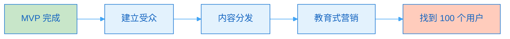
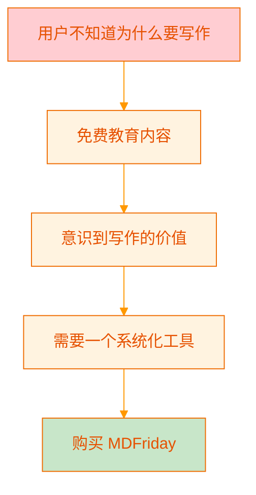
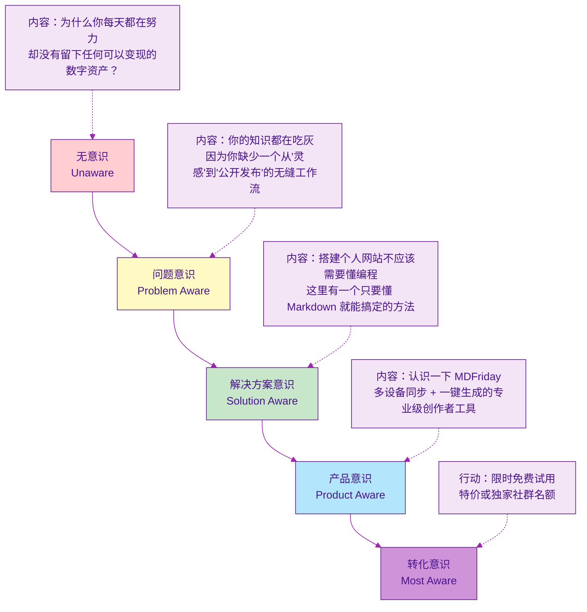
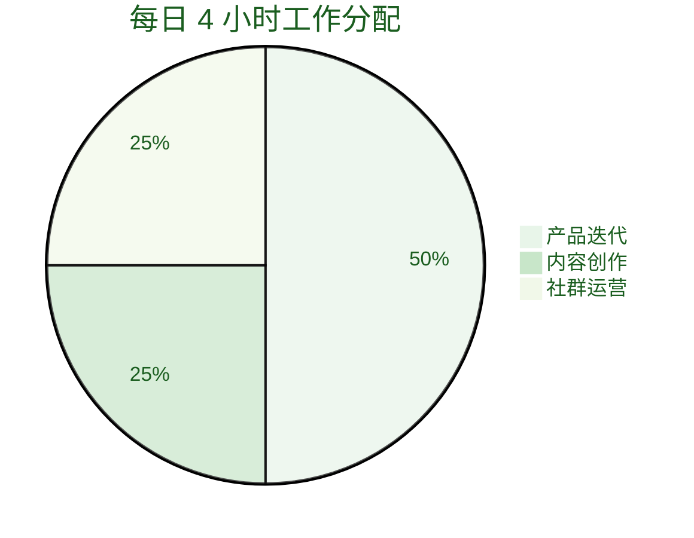
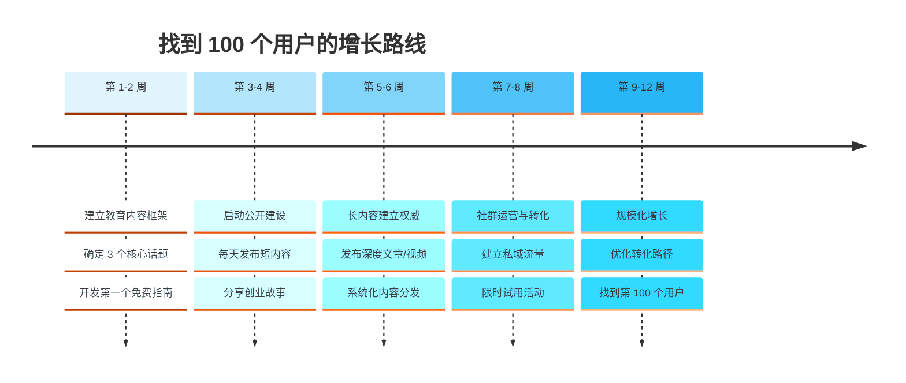
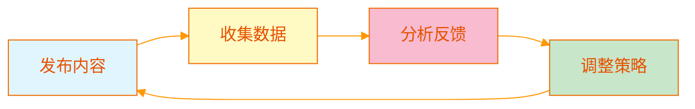

> [!quote] Dan Koe 核心洞察
> 大多数程序员和软件创始人失败的原因在于：**他们开发了产品，却不懂得营销,也没有建立受众分发渠道**。

## 当前阶段

我已经完成了 MDFriday 的 MVP——一款多设备同步写作并发布到网站的软件。这个产品本身非常优秀，甚至与 Dan Koe 正在开发的知识管理软件 Cortex 理念相似。

但是，正如 [[3. mdfriday 实战记录/03.网站/dan koe/视频笔记/23|高收入技能栈]] 中强调的：**产品只是价值的一部分，分销（流量+内容）才是企业成功的关键**。

现在的任务是：**找到第 100 个付费用户**。

---

## 一、核心问题诊断

> [!danger] 为什么好产品卖不出去？
> 人们不会仅仅因为一个"多设备同步"的**功能（Feature）**而购买，他们购买的是能够带来**改变（Transformation）**的**系统（System）**。

### 当前描述的问题

**现在的描述**："多设备同步写文章，并发布到网站"

这是一个**功能描述**，但它无法回答用户的核心问题：
- 这能解决我什么痛点？
- 这会给我的生活带来什么改变？
- 为什么我现在就要购买？

### 应该如何描述

参考 [[3. mdfriday 实战记录/03.网站/dan koe/视频笔记/16|价值创造框架]]：

**价值 = （意识 × 欲望）+ 问题 + 独特机制 + 证明 + 保证**

我们需要将产品重新定位为：

> [!success] 重新定位
> **从碎片化思维到持续产出：无摩擦创作者系统**
> 
> 随时随地捕捉灵感（多设备），无缝转化为高质量文章，一键建立权威的个人数字资产（网站），从而吸引受众并实现变现。

---

## 二、增长战略：教育为先

> [!tip] Dan Koe 的核心商业理念
> **每个企业都应该以教育为基础**。除非购买你产品的人具备使用它的意识，否则你的软件毫无意义。

这个理念在 [[3. mdfriday 实战记录/03.网站/dan koe/视频笔记/18|微教育商业模式]] 和 [[3. mdfriday 实战记录/03.网站/dan koe/视频笔记/24|微教育企业的未来]] 中被反复强调。

### 教育创造客户

### 具体行动

> [!check] 第一步：不要直接卖软件，先教人"为什么要写作"
> 
> 目标用户：创作者、自学者、希望打造个人品牌的人
> 
> 教育主题：
> - 写作是 21 世纪最伟大的高收入技能（参考 [[3. mdfriday 实战记录/03.网站/dan koe/视频笔记/19|写作：每天两小时赚取 80 万美元的技能]]）
> - 拥有个人博客是积累数字资产的关键
> - 为什么思维碎片化让你无法建立影响力

> [!check] 第二步：开发免费/低价的微型教育产品（MVP）
> 
> 例如：
> - 《7 天打造盈利性个人博客》
> - 《如何每天写作 1 小时建立个人品牌》
> - 《从笔记到文章：无摩擦创作工作流》
> 
> **当用户为了获取这些知识而留下邮箱时，你就可以顺理成章地告诉他们："为了最快实现指南中的目标，请使用 MDFriday。"**

---

## 三、公开建设（Build in Public）

参考 [[3. mdfriday 实战记录/03.网站/dan koe/视频笔记/12|真实内容创作]]：在 AI 时代，"复制"廉价，但"人味"稀缺。因此唯一的出路是**提升技能 + 提升真实性**。

### 把自己变成"一人媒体公司"

> [!example] 用你的软件创作你的内容
> 
> **这就是最好的广告！**
> 
> 每天在 B站、微信公众号、即刻上发布内容，告诉大家：
> - "这篇文章是我在地铁上用手机构思的"
> - "回家后在电脑上用 MDFriday 一键发布到博客"
> - **展示这个流畅的过程**

### 分享创业的"血泪史"与洞察

参考 [[3. mdfriday 实战记录/03.网站/dan koe/视频笔记/26|从零到一百万的科氏定律]]：

> [!quote] 克服冒名顶替综合症的关键是诚实
> 学生最容易从比他们**领先一两步的人**那里学习。

**记录你的创业历程**：
- 为什么觉得现有的 CMS（如 Hugo 命令行）不好用？
- 你是如何用业余时间把它做成现在的界面的？
- 分享你的失败、迭代和心得

**人们追随真实的人，并且更愿意购买他们看着成长起来的产品。**

### 长短内容结合

参考 [[3. mdfriday 实战记录/03.网站/dan koe/视频笔记/29|智能创作者如何从零增长受众]]：

| 内容类型 | 平台示例 | 目标 | 主题示例 |
|---------|---------|------|---------|
| **短内容** | B站动态/短视频/微头条 | 测试想法，吸引注意力 | - 为什么笔记软件越用越乱？ - 每天写作 1 小时的复利效应 - 搭建个人网站为什么不需要懂编程 |
| **长内容** | 长文博客/深度视频 | 建立信任和权威 | - 知识管理框架深度解析 - 如何构建内容生态系统 - 我的创作者工作流全揭秘 |

> [!tip] 内容策略
> 在长内容的末尾，系统且持续地放入 MDFriday 的下载或注册链接。

---

## 四、针对"意识的五个层次"进行营销布局

参考 [[3. mdfriday 实战记录/03.网站/dan koe/视频笔记/16|价值创造框架]] 和 [[3. mdfriday 实战记录/03.网站/dan koe/视频笔记/27|掌握说服力的四大框架]]：

**80% 的内容应聚焦于前三个层次**（无意识到解决方案意识）。

### 不同层次的内容策略

| 意识层次 | 市场占比 | 内容焦点 | 示例标题 |
|---------|---------|---------|---------|
| **无意识** | 40% | 痛点唤醒 | 为什么你每天产出那么多想法，却无法建立影响力？ |
| **问题意识** | 30% | 问题深化 | 笔记软件的三大陷阱：为什么你的知识库越来越混乱？ |
| **解决方案意识** | 20% | 解决方案框架 | 从灵感到发布：打造无摩擦创作系统的 5 个关键 |
| **产品意识** | 8% | 产品介绍 | MDFriday：专为创作者设计的全流程写作工具 |
| **转化意识** | 2% | 促成行动 | 限时体验：14 天免费试用 + 专属社群 |

> [!warning] 关键洞察
> 如果没人用你的产品，通常是因为你**只针对"已经知道自己需要同步写作软件"的人**（这只占市场的很小一部分）。
> 
> 你需要用内容打通意识的五个层次，**创造自己的客户**。

---

## 五、每日行动指南

参考 [[3. mdfriday 实战记录/03.网站/dan koe/视频笔记/25|一人商业模式完整指南]]：

> [!important] 核心原则
> 你的软件是**杠杆（代码）**，但撬动这个杠杆需要**分销（媒体/内容）**。

### 时间分配

> [!check] 每天的安排
> 
> **2 小时**：继续打磨和迭代软件
> - 修复 bug
> - 优化用户体验
> - 开发新功能
> 
> **1 小时**：写作和视频创作
> - 讲故事
> - 教方法
> - 输出价值观
> 
> **1 小时**：社群互动
> - 在 B站/知乎/社群里与人交流
> - 回复评论
> - 主动建立人脉（手动引流）

### 焦点转移

> [!quote] 关键思维转变
> 将焦点从"**如何让软件功能更酷**"转移到"**如何让我的用户通过这款软件成为更好的创作者**"。
> 
> 一旦你掌握了这种**价值创造与分发的技能**，你的软件用户将会呈指数级增长。

---

## 六、行动路线图

参考 [[3. mdfriday 实战记录/03.网站/dan koe/视频笔记/28|60 天赚到第一个 1000 美元的速成指南]] 和 [[3. mdfriday 实战记录/03.网站/dan koe/视频笔记/31|普通人如何建立一人企业]]：

### 具体行动清单

> [!todo] 第一阶段（第 1-2 周）：教育内容框架
> 
> - [ ] 确定 3 个核心话题（例如：写作的价值、个人品牌、知识管理）
> - [ ] 开发第一个免费指南（例如：《7 天打造个人博客》）
> - [ ] 建立邮件收集页面
> - [ ] 设计从教育到产品的转化路径

> [!todo] 第二阶段（第 3-4 周）：公开建设
> 
> - [ ] 每天发布 1-2 条短内容（B站/微博/即刻）
> - [ ] 分享产品开发故事和洞察
> - [ ] 展示 MDFriday 的实际使用场景
> - [ ] 主动与同领域创作者互动

> [!todo] 第三阶段（第 5-6 周）：长内容建立权威
> 
> - [ ] 每周发布 1 篇深度文章
> - [ ] 每周发布 1 个深度视频
> - [ ] 将表现最好的短内容扩展为长内容
> - [ ] 在长内容末尾引导注册/试用

> [!todo] 第四阶段（第 7-8 周）：社群运营与转化
> 
> - [ ] 建立用户社群（微信群/Discord）
> - [ ] 启动限时免费试用活动
> - [ ] 收集用户反馈，快速迭代
> - [ ] 分享用户成功案例

> [!todo] 第五阶段（第 9-12 周）：规模化增长
> 
> - [ ] 分析数据，优化转化路径
> - [ ] 开发更多教育产品
> - [ ] 与其他创作者合作推广
> - [ ] 达成 100 个付费用户目标

---

## 七、核心思维转变

> [!quote] Dan Koe 的智慧
> "商业是自我实现的载体，金钱是你活出使命的副产品。"
> ——引自 [[3. mdfriday 实战记录/03.网站/dan koe/视频笔记/_index|一人公司视频笔记汇总]]

### 从功能到系统

| 旧思维 | 新思维 |
|-------|-------|
| 我做了一个多设备同步工具 | 我创造了一个无摩擦创作系统 |
| 用户需要这个功能 | 用户需要改变他们的生活 |
| 如何让产品功能更多？ | 如何让用户通过产品成为更好的创作者？ |
| 产品开发是核心 | 教育和分销是核心 |

### 从卖产品到建立运动

参考 [[3. mdfriday 实战记录/03.网站/dan koe/视频笔记/14|一人企业与价值创造者的未来]]：

> [!success] 价值创造者的定位
> 
> **不要只卖一个写作工具，而是建立一场"内容创作者赋能运动"。**
> 
> - 你的品牌 = 你的目标（帮助创作者持续产出）
> - 你的内容 = 解决问题的障碍（如何克服写作障碍）
> - 你的产品 = 解决问题的系统（MDFriday）
> - 你的影响 = 用户的改变（从业余到专业创作者）

---

## 八、关键指标与验证

> [!tip] 如何知道策略是否有效？

### 衡量标准

| 指标 | 目标 | 验证方式 |
|-----|------|---------|
| **教育内容触达** | 每周 1000+ 阅读/观看 | 社交媒体数据分析 |
| **邮件列表增长** | 每周新增 50+ 订阅者 | 邮件服务商数据 |
| **试用注册** | 每周 10+ 新用户试用 | 产品后台数据 |
| **付费转化率** | 试用到付费 20%+ | 转化漏斗分析 |
| **社群活跃度** | 日均 10+ 有效互动 | 社群管理数据 |

### 迭代周期

> [!warning] 重要提醒
> 每周回顾数据，每两周调整策略。不要等待"完美"，要在行动中迭代。

---

## 九、总结：从 MVP 到增长的本质

参考 [[3. mdfriday 实战记录/03.网站/dan koe/视频笔记/33|打造第一个盈利产品的完整指南]]：

> [!quote] 核心洞察
> 成功不是快速致富的玄学，而是**学习产品营销和推广技能**。

### 三个关键认知

1. **产品是起点，不是终点**
   - 你已经有了一个好产品（MDFriday）
   - 但用户不会自动出现
   - 你需要**主动创造客户**

2. **教育是护城河**
   - 不要直接卖软件，先教人为什么需要它
   - 教育创造需求，需求创造客户
   - 你的竞争对手可以复制功能，但无法复制你的教育内容和个人品牌

3. **分销是杠杆**
   - 代码是 1x 杠杆（你写一次，永久运行）
   - 内容是 10x 杠杆（你写一次，无限传播）
   - 社群是 100x 杠杆（用户帮你传播）

### 最后的行动呼吁

> [!success] 现在就开始
> 
> 不要等待完美的时机，不要等待完全准备好。
> 
> **今天就选择一个行动**：
> - 写一篇"为什么要建立个人博客"的文章
> - 录一个展示 MDFriday 工作流的短视频
> - 在一个社群里分享你的创业故事
> 
> **记住 Dan Koe 的话：真正的"最快路径"是选择最长的道路并坚持走完。**

---

## 相关资源

- [[3. mdfriday 实战记录/03.网站/dan koe/视频笔记/|Dan Koe 一人公司视频笔记汇总]]
- [[3. mdfriday 实战记录/03.网站/dan koe/视频笔记/23|高收入技能栈]]
- [[3. mdfriday 实战记录/03.网站/dan koe/视频笔记/16|价值创造框架]]
- [[3. mdfriday 实战记录/03.网站/dan koe/视频笔记/18|微教育商业模式]]
- [[3. mdfriday 实战记录/03.网站/dan koe/视频笔记/27|掌握说服力的四大框架]]
- [[3. mdfriday 实战记录/03.网站/dan koe/视频笔记/33|打造第一个盈利产品的完整指南]]
