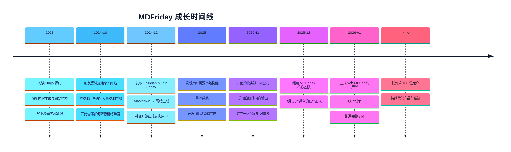
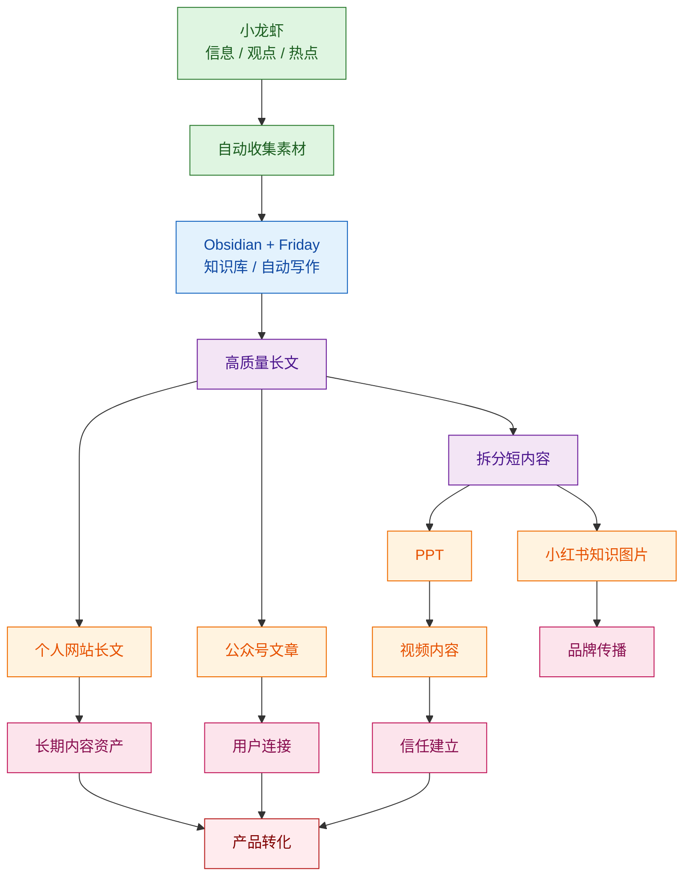

---
tags:
  - MDFriday
---
# MDFriday 品牌故事

在很多人眼里，MDFriday 是一个工具。

但实际上，它更像是一个 **慢慢长出来的系统**。

它从一段源码阅读开始，  
经过一次朋友求助，  
变成一个插件，  
再逐渐向**一人公司内容系统**方向成长。

# MDFriday 成长时间线

# 故事从哪里开始？

我一直都有阅读源码的习惯。
2022年时的我，正在阅读**全球最快静态站点生成器 Hugo** 的源码。

我特别想弄清楚几个问题：

> - 模板引擎到底是怎么工作的？ 
> - 为什么能这么快？

Hugo 的设计理念非常吸引人：

- 用户只用专注在写 Markdown ，其它都不用管
- 内容和样式分离，主题来负责样式
- 高效管理所有的内容，用最快的速度将 Markdown 变成网站

从技术角度看，这是一个设计的非常漂亮的系统。
当时的我，也完全没有想到，这里就是 **MDFriday 的起点**。
# 一次朋友的聊天

有一天，一位做职场教练的朋友（非技术人员）很高兴地告诉我：他搭建好了**自己的个人官网**！
用来向学员们介绍自己的课程，向自己的潜在学员介绍他们能得到什么。

他骄傲的说，他自学了 HTML 语言、网站部署、服务器配置、域名解析，花了一周时间，终于成功把自己的官网搭建出来了。

那一刻我意识到一件事：

> [!note]  
> 让知识创作者，专注在**内容创作**  ，
> 技术不应该成为表达的门槛。

# Friday 的诞生

于是我开始做一个小项目。名字很简单：**Friday**，它是一个 **Obsidian 插件**。

目标也很存粹：

> [!tip]  
> 让知识创作者专注在内容创作，  
> **一键变成网站**。

从那时开始，**写 Markdown = 写网站。**

# 用户开始出现

Obsidian 用户都非常重视**隐私**和**数据安全**。

他们的共同需求是：

- 想把笔记变成公开内容，分享给更多的人看
- 想拥有自己的个人网站，展示自己的第二大脑
- 不想把所有数据放在云端，喜欢本地优先
- 希望本地构建、本地预览，保证数据安全

于是 Friday 来说，演进方向就这样，自然而然的出现了。

# 一个新的方向

随着 AI 的出现，一人公司理念也慢慢火了起来。
越来越多的创作者开始意识到：

> [!quote]  
> AI 时代，一个人就是一个团队！
> 一人公司的成功案例也越来越多！

我也成为了一人公司实践者之一。
在这个过程中，MDFriday 的方向开始发生变化。

它不再只是一个建站工具。它开始变成一个 **内容系统**。
核心逻辑变成了一件事情：**一篇长文 → 多平台内容。**

# 内容系统的结构

让做产品，和做一人公司变成同一件事情

> [!success]  
> 让 MDFriday 辅助我做一人公司。

# 为什么叫 MDFriday？

MDFriday 这个名字，其实来自两个部分：

**MD**：Markdown。
**Friday**：像助手一样帮你完成工作。

这个名字其实是我们家小朋友取的，他最喜欢的人工智能是钢铁侠的 AI 助手 **FRIDAY**。

MDFriday 也是这样定位自己：

> [!tip]  
> 你是机长，负责起降，而它则是你的自动航行助手。
> 
