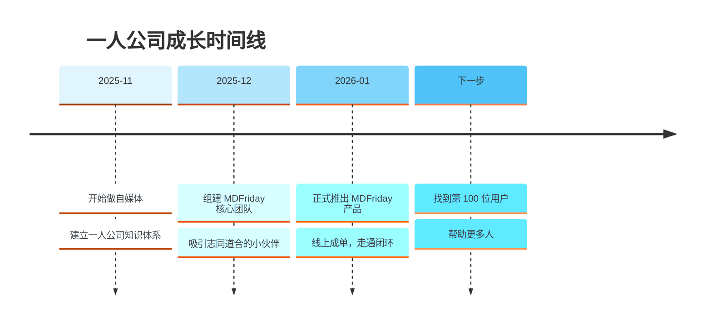

> [!quote] 核心理念
> **少工作，多赚钱，享受生活**  
> 不是一夜暴富，更不是不工作，而是自由掌握自己的创造力和时间。

## MDFriday 实战记录

###  我的一人公司旅程

### 这份实战记录包含什么？

> [!tip]  
> 如果你想做一人公司，不知道从哪里开始，这里是一个完整样本。

| 模块         | 核心问题          | 具体内容                                                                                                |
| ---------- | ------------- | --------------------------------------------------------------------------------------------------- |
| 我是怎么开始的    | 从 0 到 1 如何启动？ | - 如何定位自己？ - 如何选择细分方向？ - 如何定义第一款产品？ - 如何搭建最小可运行结构（MVP）？                                     |
| 我是怎么变现的    | 如何实现真实收入？     | - 用户为什么下单？ - 用户为什么犹豫？ - 免费与付费版本如何设计？ - 定价如何调整？ - 如何设计“帮助用户做决定”的结构？ - 如何建立信任，让成交自然发生？ |
| 用数据说话      | 如何理性优化而非拍脑袋？  | - 月度内容复盘 - 流量来源分析 - 转化率变化 - 用户行为观察 - 服务结构调整记录                                           |
| 用业余时间做一人公司 | 如何提高效率、压缩时间？  | - 一篇长文如何多平台复用 - 如何生成小红书图片 - 如何制作 PPT 与视频 - 如何同步官网与公众号 - 如何持续构建品牌信任                      |
| 犯错不可避免     | 如何通过复盘持续进化？   | - 犯过的错误 - 决策逻辑 - 定价调整 - 用户流失原因 - 心态波动 - 失败复盘                                         |

**全部公开**

真实，比包装更有力量！
不是教你理论，而是让你看到“可以复制的过程”。

> [!success] 现在就开始
> 不要等待完美的时机，不要等待完全准备好。
> 
> **品牌、内容、产品、系统，选择一个模块，迈出第一步。**

---
## 一人公司操作指南 
  
> [!tip]  
> 建议根据章节快速索引，按需阅读。  
> 讲解如何构建可持续赚钱的一人公司系统，而不是做一个忙碌的创作者。

| 部分   | 核心主题 | 章节                                                                                                                                                                                                   |
| ---- | ---- | ---------------------------------------------------------------------------------------------------------------------------------------------------------------------------------------------------- |
| 第一部分 | 认知重构 | [[1. 一人公司操作指南/02.平台不是你的资产/ \| 平台不是你的资产]] [[1. 一人公司操作指南/03.一人公司的底层模型/ \| 一人公司的底层模型]] [[1. 一人公司操作指南/04.内容就是资产/\|内容就是资产]]                                                                         |
| 第二部分 | 内容飞轮 | [[1. 一人公司操作指南/05.信息获取系统/\| 信息获取系统]] [[1. 一人公司操作指南/06.长文创作/\| 长文创作]] [[1. 一人公司操作指南/07.长文高效复用/\|长文高效复用]] [[1. 一人公司操作指南/08.数据反馈与长文升级/\|数据反馈与长文升级]] [[1. 一人公司操作指南/09.视频表达的二次杠杆/\|视频表达的二次杠杆]] |
| 第三部分 | 资产沉淀 | [[1. 一人公司操作指南/10.建立个人网站/\|建立个人网站]] [[1. 一人公司操作指南/11.内容产品化路径/\|内容产品化路径]] [[1. 一人公司操作指南/12.内容变现的三种结构/\|内容变现的三种结构]]                                                                               |
| 第四部分 | 系统化  | [[1. 一人公司操作指南/13.效率就是结构化/\|效率就是结构化]] [[1. 一人公司操作指南/14.内容操作系统的构建/\|内容操作系统的构建]] [[1. 一人公司操作指南/15.从创作者到经营者/\|从创作者到经营者]]                                                                           |
| 第五部分 | 长期战略 | [[1. 一人公司操作指南/16.一人公司的复利曲线/\|一人公司的复利曲线]] [[1. 一人公司操作指南/17.你的终局是什么？/\|你的终局是什么？]]                                                                                                                   |

## 一人公司实操手册  
> [!success]  
> 当你理解模型后，可以从这里开始动手实践。  
> 把理论变成步骤，把步骤变成结构，把结构变成收入。
  
| 模块   | 内容                                                 |
| ---- | -------------------------------------------------- |
| 内容系统 | [[2. 一人公司实操手册/01.内容系统搭建/\|内容系统搭建]]                 |
| 写作工具 | [[2. 一人公司实操手册/02.MDFriday 使用指南/ \| MDFriday 使用指南]] |
| 网站结构 | [[2. 一人公司实操手册/03.网站结构搭建/ \| 网站结构搭建]]               |
| 分发系统 | [[2. 一人公司实操手册/04.发布与分发系统/ \| 发布与分发系统]]             |
| 产品化  | [[2. 一人公司实操手册/05.产品化与交付系统/ \| 产品化与交付系统]]           |

