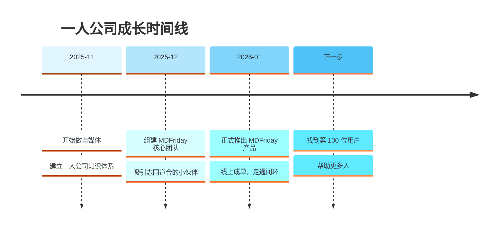
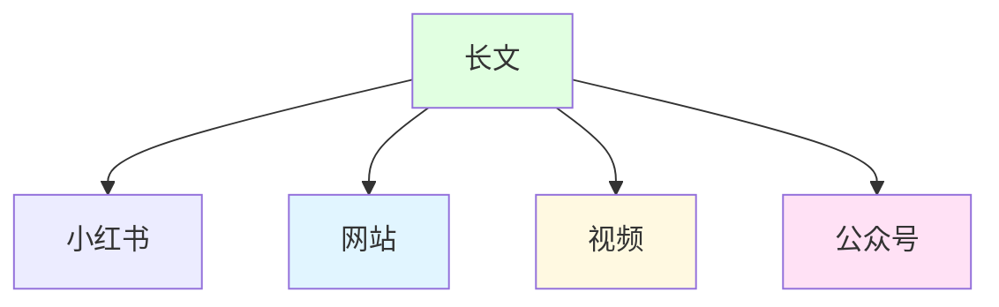

> [!quote] 核心理念
> **少工作，多赚钱，享受生活**  
> 不是一夜暴富，更不是不工作，而是自由掌握自己的创造力和时间。

## 欢迎来到一人公司实战笔记

如果你希望建立自己品牌，摆脱平台依赖；把内容变成真正的数字资产；打造睡后收入；减少无意义的忙碌，请从这里开始
## 一人公司操作指南  
  
> [!tip]  
> 建议根据章节快速索引，按需阅读。  
> 讲解如何构建可持续赚钱的一人公司系统，而不是做一个忙碌的创作者。

| 部分   | 核心主题 | 章节                                                                                                                                                                                                   |
| ---- | ---- | ---------------------------------------------------------------------------------------------------------------------------------------------------------------------------------------------------- |
| 第一部分 | 认知重构 | [[1. 一人公司操作指南/02.平台不是你的资产/ \| 平台不是你的资产]] [[1. 一人公司操作指南/03.一人公司的底层模型/ \| 一人公司的底层模型]] [[1. 一人公司操作指南/04.内容就是资产/\|内容就是资产]]                                                                         |
| 第二部分 | 内容飞轮 | [[1. 一人公司操作指南/05.信息获取系统/\| 信息获取系统]] [[1. 一人公司操作指南/06.长文创作/\| 长文创作]] [[1. 一人公司操作指南/07.长文高效复用/\|长文高效复用]] [[1. 一人公司操作指南/08.数据反馈与长文升级/\|数据反馈与长文升级]] [[1. 一人公司操作指南/09.视频表达的二次杠杆/\|视频表达的二次杠杆]] |
| 第三部分 | 资产沉淀 | [[1. 一人公司操作指南/10.建立个人网站/\|建立个人网站]] [[1. 一人公司操作指南/11.内容产品化路径/\|内容产品化路径]] [[1. 一人公司操作指南/12.内容变现的三种结构/\|内容变现的三种结构]]                                                                               |
| 第四部分 | 系统化  | [[1. 一人公司操作指南/13.效率就是结构化/\|效率就是结构化]] [[1. 一人公司操作指南/14.内容操作系统的构建/\|内容操作系统的构建]] [[1. 一人公司操作指南/15.从创作者到经营者/\|从创作者到经营者]]                                                                           |
| 第五部分 | 长期战略 | [[1. 一人公司操作指南/16.一人公司的复利曲线/\|一人公司的复利曲线]] [[1. 一人公司操作指南/17.你的终局是什么？/\|你的终局是什么？]]                                                                                                                   |

## 一人公司实操手册  
> [!success]  
> 当你理解模型后，可以从这里开始动手实践。  
> 把理论变成步骤，把步骤变成结构，把结构变成收入。
  
| 模块   | 内容                                                 |
| ---- | -------------------------------------------------- |
| 内容系统 | [[2. 一人公司实操手册/01.内容系统搭建/\|内容系统搭建]]                 |
| 写作工具 | [[2. 一人公司实操手册/02.MDFriday 使用指南/ \| MDFriday 使用指南]] |
| 网站结构 | [[2. 一人公司实操手册/03.网站结构搭建/ \| 网站结构搭建]]               |
| 分发系统 | [[2. 一人公司实操手册/04.发布与分发系统/ \| 发布与分发系统]]             |
| 产品化  | [[2. 一人公司实操手册/05.产品化与交付系统/ \| 产品化与交付系统]]           |

---
## MDFriday 实战记录

###  我的一人公司旅程

这是一本**正在生长**的实战笔记，记录我从零开始打造一人公司的完整旅程。

在这里，你可以看到：
- 一篇高质量长文如何成为核心资产
- 如何通过结构化复用，把它拆解为小红书图片集、官网文章、视频内容与公众号推送
- 如何只用 Markdown 写作，就完成内容生产、分发、展示与讲解的完整闭环

你将看到的不只是方法，而是完整过程：

- 内容飞轮如何运转
- 系统如何逐步自动化
- 本周结构如何优化
- 用户反馈如何影响产品迭代
- 流量与转化如何被持续复盘

这里记录的不是“成功故事”，  
而是一家一人公司真实运行的细节——  
包括思考、实验、失败、修正与进化。

[MDFriday](https://mdfriday.com)是我的产品，也是我的一人公司创作助手。帮我专注长文创作，通过知识复用，帮我把长文生成图片、PPT，发布到公众号、网站，沉淀数字资产，让四小时工作成为可能。 

### 如果你想快速行动

> [!tip] 快速启动清单
> - [ ] 完成 [[1.品牌/01-个人定位|个人定位]] 练习
> - [ ] 设置 [[2.内容/02-写作系统|每日写作习惯]]
> - [ ] 设计 [[3.产品/01-产品设计|MVP产品]]
> - [ ] 搭建 [[4.系统/03-工具栈选择|基础工具栈]]

## 💡 核心理念

基于 Dan Koe 的理论和我的实践，一人公司的核心理念是：

> [!important] 一人公司的本质
> - **商业是自我实现的载体**，而非仅仅赚钱的工具
> - **你就是你的细分市场**，最独特的价值来自你的经验和视角
> - **少工作，赚更多**，通过系统化而非时间堆砌
> - **内容即营销**，教育即销售
> - **产品即系统**，将你的方法打包成可复制的解决方案

## 📚 相关资源

### 理论基础
- [[1.一人公司/5.大家/Dan Koe/视频笔记/_index|Dan Koe 视频笔记合集]] - 33个视频的完整总结
- [[1.一人公司/5.大家/Dan Koe/purpose-profit/_index|Purpose & Profit 笔记]] - 深度理论学习

### 实战案例
- [[MDFriday开发历程]] - 从想法到产品
- [[Obsidian工作流搭建]] - 完整的知识管理系统
- [[我的品牌演变史]] - 个人品牌的迭代过程

## 🎯 开始行动

> [!success] 现在就开始
> 不要等待完美的时机，不要等待完整的准备。
> 
> **选择一个模块，迈出第一步。**

- 如果不知道做什么 → [[1.品牌/01-个人定位|找到你的定位]]
- 如果不知道写什么 → [[2.内容/01-内容策略|建立内容策略]]
- 如果不知道卖什么 → [[3.产品/01-产品设计|设计你的产品]]
- 如果感觉太忙乱 → [[4.系统/01-时间管理|优化你的系统]]

---

> [!quote] 最后的话
> 一人公司不是孤岛，而是选择用自己的方式创造价值。
> 
> 这本笔记会持续更新，记录我的成长轨迹。
> 希望它也能帮助你找到属于自己的道路。
> 
> Let's build something meaningful. 🚀

---

*最后更新: 2026-02-28*
*作者: Wei Sun*
*工具: Obsidian + MDFriday*
