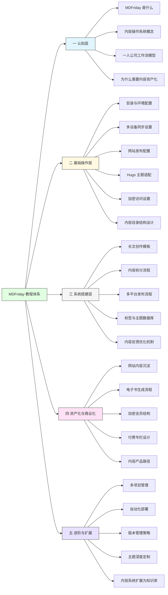

很好。  
我们现在单独为 **MDFriday 教程系列**做一次结构设计。

目标不是“功能说明书”，而是：

> 从 0 到建立内容操作系统的完整路径。

所以教程结构应该分为 4 个层级：

1. 入门认知层（为什么用）
    
2. 基础操作层（怎么用）
    
3. 系统搭建层（怎么构建工作流）
    
4. 高阶资产层（怎么商业化）
    

下面给你一个完整的系列标题规划。

---

# 一、第一阶段：认知与定位（让用户理解它是什么）

1. MDFriday 是什么？为什么它不是普通同步插件
    
2. 为什么创作者需要一个内容操作系统
    
3. 多设备写作的意义：从碎片记录到深度创作
    
4. 为什么你必须拥有自己的内容阵地
    
5. Obsidian + 发布系统 = 创作者基础设施
    

---

# 二、第二阶段：基础功能实操（从安装到可用）

6. MDFriday 安装与基础配置指南
    
7. 多设备同步完整设置流程
    
8. 如何配置内容发布到个人网站
    
9. 如何适配 Hugo 主题
    
10. 如何设置加密内容访问
    
11. 如何从笔记一键生成网站页面
    
12. 如何整理内容目录结构
    

---

# 三、第三阶段：工作流搭建（核心价值区）

13. 如何用 MDFriday 搭建一人公司内容飞轮
    
14. 长文创作的标准结构模板
    
15. 如何把一篇长文拆成多平台内容
    
16. 内容发布自动化实战
    
17. 如何建立长期主题数据库
    
18. 如何用标签系统管理内容资产
    
19. 我的完整写作与发布流程演示
    

---

# 四、第四阶段：资产化与商业化

20. 如何用 MDFriday 发布加密会员内容
    
21. 如何把长文整理成电子书
    
22. 如何用网站构建个人品牌阵地
    
23. 私域内容交付的技术结构
    
24. 如何设计付费专栏结构
    
25. 从免费内容到付费产品的路径设计
    

---

# 五、第五阶段：高阶玩法与进阶优化

26. 如何适配不同 Hugo 主题实现风格升级
    
27. 内容版本管理策略
    
28. 多项目管理结构设计
    
29. 团队协作场景下的使用方式
    
30. 如何把内容系统扩展为知识库系统
    
31. 自动化部署与持续更新策略
    

---

# 六、可以做成一个完整教程体系

如果把它打包成完整课程，可以分成：

- 入门篇（1–5）
    
- 操作篇（6–12）
    
- 系统篇（13–19）
    
- 商业篇（20–25）
    
- 进阶篇（26–31）
    

---

# 七、一个更聪明的做法

教程系列最好采用：

> 问题驱动标题，而不是功能驱动标题。

例如：

不要写：

> 如何使用同步功能

可以写：

> 如何在手机、电脑之间无缝完成长文写作

不要写：

> 如何设置加密

可以写：

> 如何发布只有会员才能阅读的内容

这样：

- SEO 更自然
    
- 视频更有吸引力
    
- 不像产品说明书
    

---

# 八、关键战略提醒

MDFriday 教程的核心目的不是：

> 教用户用插件

而是：

> 教用户建立系统，而 MDFriday 是实现工具。

如果你愿意，我可以再帮你：

- 设计一个完整的「教程知识结构图」
    
- 或给你一个 30 篇连载节奏规划
    
- 或帮你设计一套视频 + 文章联动结构
    

你更倾向做成：  
博客教程？视频教程？还是系统课程？

